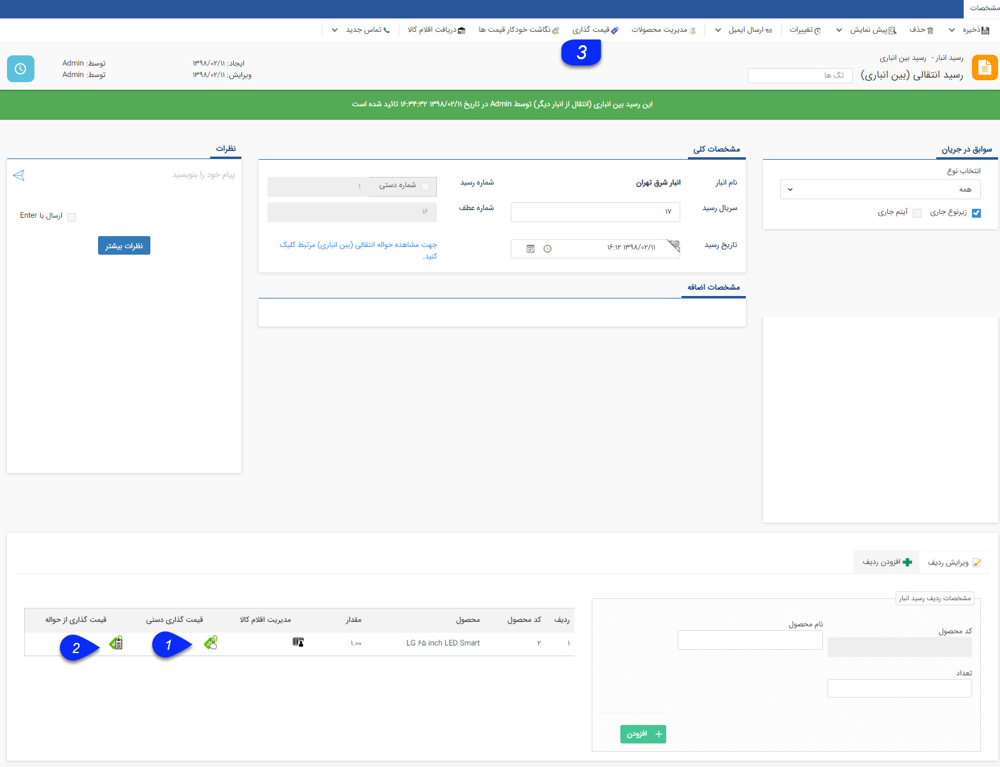
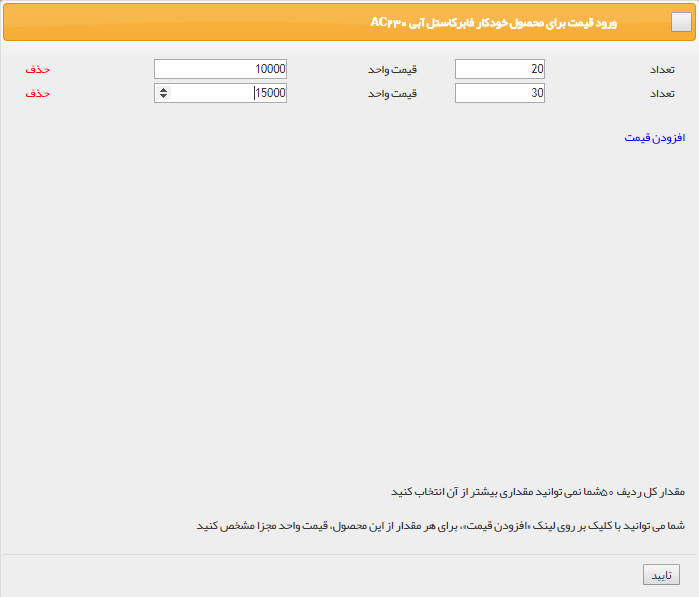
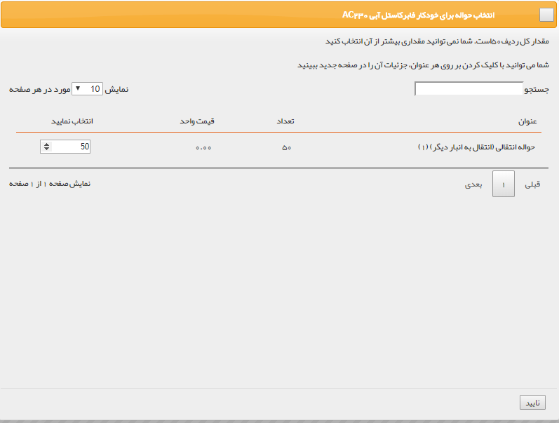

## قیمت گذاری رسید انتقالی

> مسیر دسترسی:  **خرید، فروش و انبار** >**انبارها** > **رسید انتقالی** > **قیمت گذاری رسید انتقالی** 

پس از ثبت انتقال بین انباری، سیستم یک حواله در انبار مبداء و یک رسید در انبار مقصد ثبت خواهد کرد .

قیمت گذاری: به صورت دستی یا از روی حواله انتقالی انجام می شود.

 . 1  قیمت گذاری دستی: در هر ردیف تعداد کالا و قیمت آن را تعیین کنید

 .2قیمت گذاری از حواله: می توانید از لیست حواله های انتقالی قیمت گذاری شده که شامل این محصول هستند، مشخص کنید که چه تعداد کالا از روی کدام حواله ها قیمت گذاری شوند.

3. دکمه قیمت گذاری:پس از قیمت گذاری برای تمام ردیف های کالا،با کلیک بر روی این علامت قیمت گذاری روی رسید انجام میشود.

  پس از انجام قیمت گذاری، می توانید با استفاده از دکمه لغو قیمت گذاری، تراکنش را به حالت قیمت گذاری نشده برگردانید.
  
  
  
  