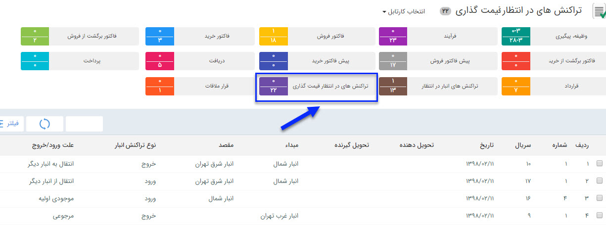

## قیمت گذاری

تمامی حواله ها و رسید ها پس از تایید به کارتابل کاربر یا کاربرانی که مجوز قیمت گذاری رسید/حواله در انبار مربوطه به آنها داده شده می روند تا عملیات قیمت گذاری بر روی آنها انجام شود. برای ویرایش مجوز قیمت گذاری کاربران در انبارها به قسمت مدیریت مجوزهای انبار در [مدیریت انبارها ](https://github.com/1stco/PayamGostarDocs/blob/master/help%202.5.4/Settings/Warehouse-management/Warehouse-management.md)مراجعه کنید.

با دوبار کلیک روی هر سطر می توان قیمت گذاری را انجام داد.

> نکته : کاربری که مجوز قیمت گذاری تراکنش ها را داشته باشد  علاوه بر کارتابل در انتظار قیمت گذاری از قسمت خرید فروش انبار در لیست تراکنش های انبار مورد نظر  هم می تواند تراکنش مورد نظر را قیمت گذاری کند .

 توجه داشته باشید که قیمت گذاری اقلام کالا ارتباطی با قیمت فروش به مشتری ندارد و صرفاً برای در اختیار داشتن موجودی ریالی کالاها در انبار و انجام عملیات انبارگردانی این کار انجام میشود. زمان ورود کالا به انبار(صدور رسید) قیمت گذاری باید توسط شما به صورت دستی یا از روی فاکتور خرید یا  اگر رسید مرجوعی بود از حواله فروش انجام شود، اما هنگام خروج کالا از انبار (صدور حواله) قیمت گذاری بر اساس فی میانگین هر کالا انجام می شود و نمی توانید آن را به صورت دستی انجام دهید.

قیمت گذاری ها انواع تراکنش های انبار به صورت زیر است:

رسید موجودی اولیه: باید  بصورت دستی قیمت گذاری  شود.

رسید انبار: قیمت گذاری بصورت دستی و یا از روی فاکتور خرید انجام می شود .

رسید مرجوعی:قیمت گذاری  بصورت دستی یا از روی حواله انجام می شود.

حواله انبار:  قیمت گذاری از روی میانگین قیمت های وارد شده در رسیدهای انبار انجام می شود. 

حواله فروش:  قیمت گذاری از روی میانگین قیمت های وارد شده در رسیدهای انبار انجام می شود. 

حواله مرجوعی:  قیمت گذاری از روی میانگین قیمت های وارد شده در رسیدهای انبار انجام می شود. 

رسید انتقالی: قیمت گذاری به صورت دستی یا از روی حواله انتقالی انجام می شود.

حواله انتقالی:  قیمت گذاری از روی میانگین قیمت های وارد شده در رسیدهای انبار انجام می شود.

