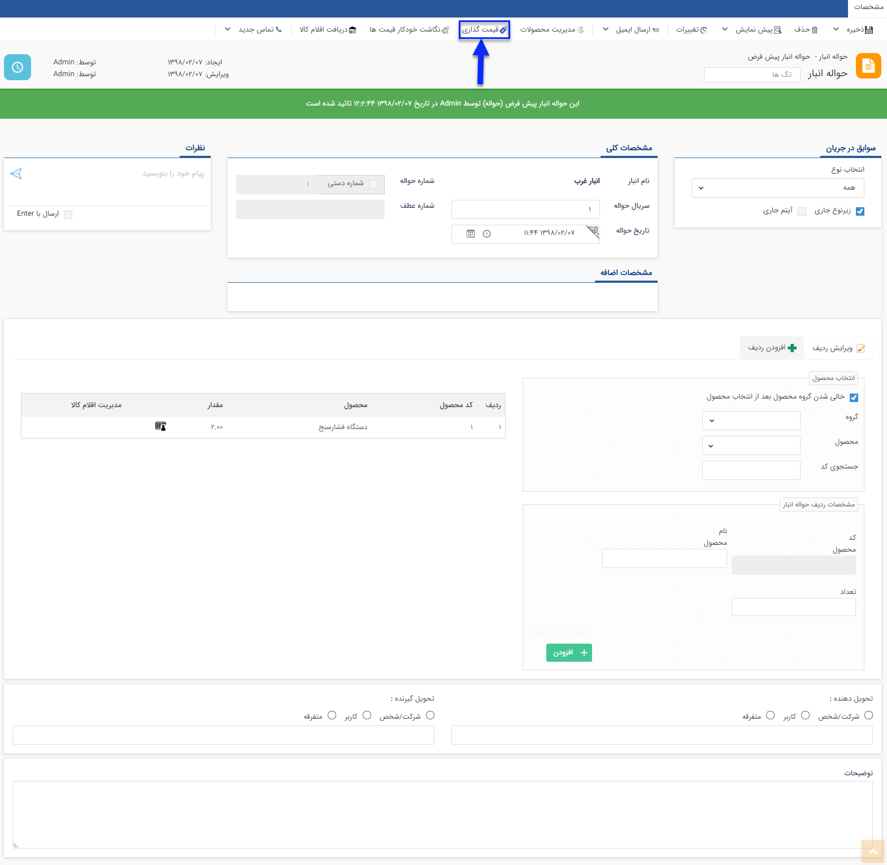
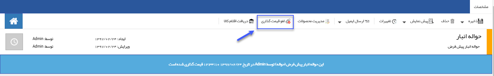

## قیمت گذاری حواله انبار

> مسیر دسترسی:  **خرید، فروش و انبار** >**انبارها** > **حواله انبار** > **قیمت گذاری حواله انبار** 

برای خارج کردن کالا از انبار از این حواله استفاده میشود.

قیمت گذاری: از روی میانگین قیمت رسیدهایی که تا کنون ثبت شده است (رسیدهای شامل محصولات این حواله) محاسبه می شود.

به طور مثال اگر خودکار فابرکاستل آبی از طریق 2 رسید انبار وارد شده باشد و در یک رسید 5 خودکار با قیمت 10000 ریال وارد شده باشد و در رسید دوم 15 خودکار با قیمت 20000 ریال وارد شده باشد، فی میانگین به صورت زیر محاسبه خواهد شد:

فی میانگین = (5*10000+ 15*20000)/20= 17500

A. دکمه قیمت گذاری: پس از قیمت گذاری برای تمام ردیف های کالا، با کلیک بر روی این علامت قیمت گذاری روی حواله انجام میشود.

پس از انجام قیمت گذاری، می توانید با استفاده از دکمه لغو قیمت گذاری، تراکنش را به حالت قیمت گذاری نشده برگردانید.

