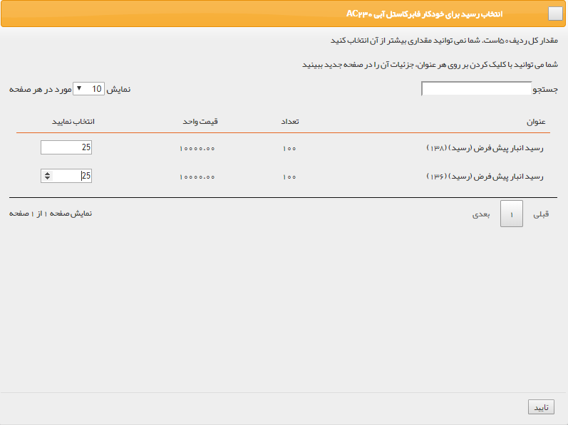

## قیمت گذاری حواله مرجوعی

> مسیر دسترسی:  **خرید، فروش و انبار** >**انبارها** > **حواله مرجوعی** 

برای بازگرداندن کالاهایی که قبلا در انبار وارد شده اند(رسید خورده اند) به تامین کننده، از این حواله استفاده میشود.

قیمت گذاری:  از آنجایی که حواله مرجوعی در صورت مرجوع کردن کالاهای وارد شده (رسید شده) به انبار استفاده می شود، می توان مشخص کرد که هرکدام از محصولات حواله مرتبط با کدام رسید انبار می باشد. برای قیمت گذاری باید ابتدا تمام محصولات را به یکی از رسیدهای انبار شامل این محصول متصل کنید.

1. اتصال به رسید: می توانید انتخاب کنید که تعداد موجود در این حواله مرجوعی مرتبط با کدام رسید ها است.

2. دکمه قیمت گذاری: پس از قیمت گذاری برای تمام ردیف های کالا، با کلیک بر روی این علامت قیمت گذاری روی حواله انجام میشود.

> نکته: توجه داشته باشید تا زمانی که تمامی ردیف های کالا به رسیدهای انبار متصل نشوند، امکان قیمت گذاری حواله مرجوعی وجود ندارد.

پس از انجام قیمت گذاری، می توانید با استفاده از دکمه لغو قیمت گذاری، تراکنش را به حالت قیمت گذاری نشده برگردانید.

