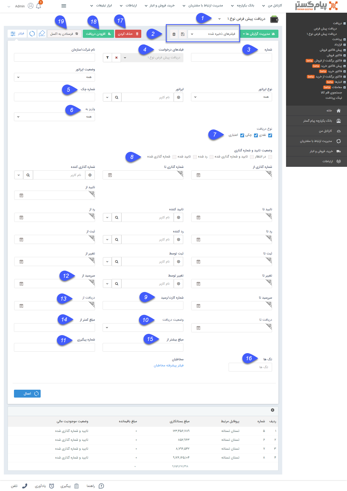

## لیست دریافت/پرداخت

> مسیر دسترسی: **خرید، فروش و انبار** > **دریافت/پرداخت** 

لیست تمام دریافت/پرداخت های ثبت شده در سیستم نمایش داده می شود و می توان اطلاعات جزئی هر کدام از دریافت ها را نیز مشاهده نمود .

> نکته: هر کاربر می تواند تنهاسوابقی (دریافت/پرداخت) که خود ثبت نموده است مشاهده نماید و تنها کاربر دارای مجوز "مشاهده لیست" مربوط به هر  آیتم می تواند کلیه سوابق (دریافت/پرداخت) ثبت شده توسط سایر کاربران سیستم را مشاهده نماید .

نکته: لطفا ابتدا قسمت [ فیلتر پیشرفته ](https://github.com/1stco/PayamGostarDocs/blob/master/help%202.5.4/Customer-relationship-management/Advanced-filter/Advanced-filter.md) را مطالعه کنید .  

1. زیرنوع آیتم: زیرنوع های دریافت/پرداخت از این قسمت قابل تغییر است.

2. نوع فیلتر: میتوانید فیلترهای اعمال شده را به عنوان یک فیلتر اختصاصی خود ذخیره کنید.

3. شماره: میتوانید شماره دریافت/پرداخت یا بخشی از شماره را وارد کنید.

4. فیلدهای دریافت/پرداخت: می توانید با استفاده از دکمه فیلتر موجود در این فیلد، روی فیلدهای اضافه شده نیز فیلتر مورد نظر خود را اعمال کنید.

5. شماره چک :  اگر نوع دریافت/پرداخت چکی باشد می توان براساس شماره چک فیلتر انجام داد . 

6. واریز به: میتوانید نام یکی از حساب هایی که در قسمت [مدیریت حساب های مالی ](https://github.com/1stco/PayamGostarDocs/blob/master/help%202.5.4/Basic-Information/Financial-account-management/Financial-account-management.md)ایجاد کرده اید، را انتخاب کنید.

7. نوع دریافت: می توانید نوع دریافت(های) مورد نظر را انتخاب کنید.

8. وضعیت تایید و شماره گذاری: می توانید وضعیت تایید و شماره گذاری دریافت های مورد نظر خود را در این قسمت انتخاب کنید.

9. شماره کارت/رسید : می توانید شماره کارت/رسید وارد شده در دریافت/پرداخت مورد نظر خود را در این قسمت وارد کنید.

10. وضعیت دریافت/پرداخت: می توانید وضعیت دریافت (دریافت شده یا نشده) را تعیین کنید.

11. شماره پیگیری: می توانید شماره پیگیری دریافت/پرداخت را درج کنید.

12. تاریخ سررسید: می توانید در این قسمت یک حد پایین و یک حد بالا برای تاریخ سررسید دریافت های چکی و اعتباری تعیین کنید.

13. تاریخ دریافت/پرداخت: می توانید در این قسمت یک حد پایین و یک حد بالا برای تاریخ دریافت وارد کنید.

14. مبلغ کمتر از: می توانید یک سقف مبلغ برای دریافت/پرداخت های مورد نظر خود برای جستجو وارد کنید.

15. مبلغ بیشتر از: می توانید یک کمینه مبلغ برای دریافت/پرداخت های مورد نظر خود برای جستجو وارد کنید.

16. تگ ها: می توانید دریافت/پرداخت ها را بر اساس تگی که روی آن ها گذاشته اید جستجو کنید.

17. حذف کردن: می توانید سابقه دریافت/پرداخت مورد نظر را حذف کنید.

18. افزودن دریافت/پرداخت: می توانید یک سابقه دریافت/پرداخت جدید ثبت کنید.

19. فرستادن به اکسل: می توانید سوابق فیلتر شده را در قالب فایل اکسل دریافت نمایید.

  مجموع بستانکاری: مجموع مبالغ تمام دریافت های فیلتر شده را نمایش می دهد .

> نکته: همانطور که قابل ملاحظه است، امکان تعیین حد پایین یا بالا برای تاریخ های شماره گذاری، تایید و رد دریافت/پرداخت و همچنین تعیین کاربر شماره گذاری کننده، تایید کننده و رد کننده نیز وجود دارد.

مدیریت گزارش ها :  با استفاده از این بخش میتوان از لیست دریافت / پرداخت با توجه به فیلتر های اعمال شده، گزارش گیری کرد. برای توضیحات بیشتر میتوانید به بخش [گزارش ساز جدید](https://github.com/1stco/PayamGostarDocs/blob/master/help%202.5.4/Management-and-reports/Report-Builder/Report-Builder.md) مراجعه کنید.

> نکته : تمامی لیست آیتم ها دو حالت نمایش Grid و Kanban دارند که حالت نمایشی کانبان در صورت تعریف مراحل در بخش شخصی سازی نمایش داده می شود ..توضیحات این بخش را میتوانید از بخش [نمایش کانبان مراحل ](https://github.com/1stco/PayamGostarDocs/blob/master/help%202.5.4/Integrated-bank/Database/Records/leveling/leveling.md)مطالعه کنید.

> نکته :  با استفاده از بخش تنظیمات جدول میتوانیم فیلد هایی برای نمایش در لیست و خروجی اکسل انتخاب کنید.

