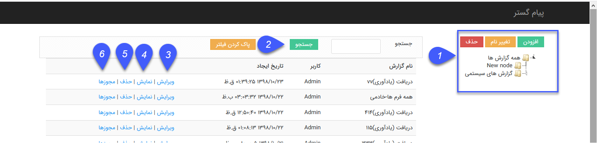
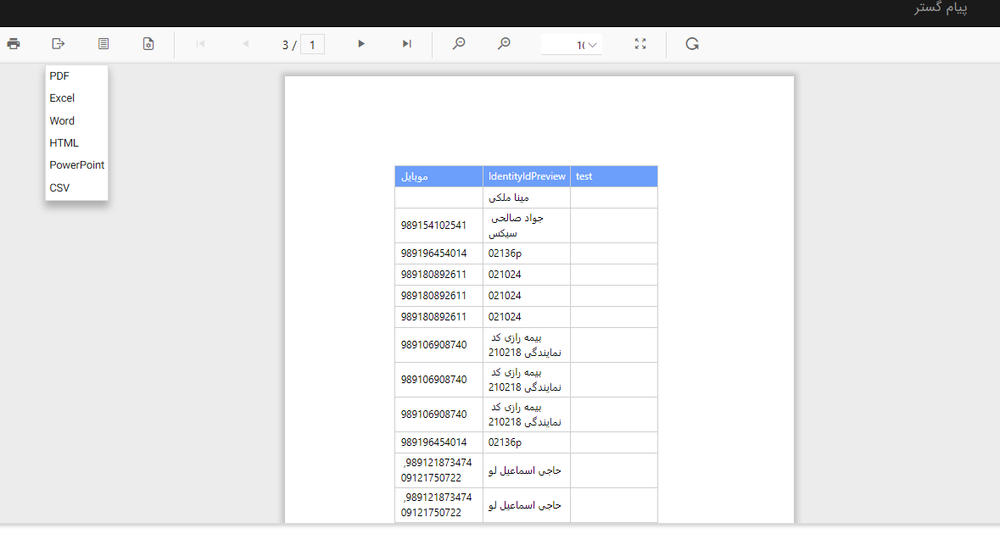

## دسته بندی گزارش ها

 .در این بخش گزارش های ساخته شده در نرم افزار نمایش داده می شود

در صورت دارا بودن مجوز مدیریت گزارشات ساخته شده، کاربر می تواند تمامی گزارشات ساخته شده را مشاهده، ویرایش و حذف کند و همچنین امکان تعیین مجوز بر روی گزارشات را دارد  

1. در این قسمت امکان ایجاد دسته بندی مورد نظر برای ذخیره گزارش ها و همچنین امکان ویرایش و حذف دسته بندی ها وجود دارد .

2. جستجو : می توان براساس نام گزارش جستجو انجام داد .

3. ویرایش : می توان گزارش ایجاد شده را ویرایش کرد  . ( کاربر در صورت داشتن مجوز مدیریت گزارش های ساخته شده و یا مجوز  طراحی بر روی هر گزارش می تواند آن گزارش را

ویرایش کند.)

4. نمایش : می توان گزارش ایجاد شده را مشاهده و خروجی مورد نظر را دریافت کرد . ( کاربر در صورت داشتن مجوز مدیریت گزارش های ساخته شده و یا مجوز  نمایش بر روی هر

 گزارش می تواند آن گزارش را ویرایش کند.)

همچنین می توانید فرمت مورد نظر را برای دریافت خروجی انتخاب کنید .

5.حذف :گزارش مورد نظر را می توان حذف کرد .

6.مجوز: در این بخش می توان برای کاربر مورد نظر دسترسی طراحی و  نمایش را تعریف کرد .

  
  