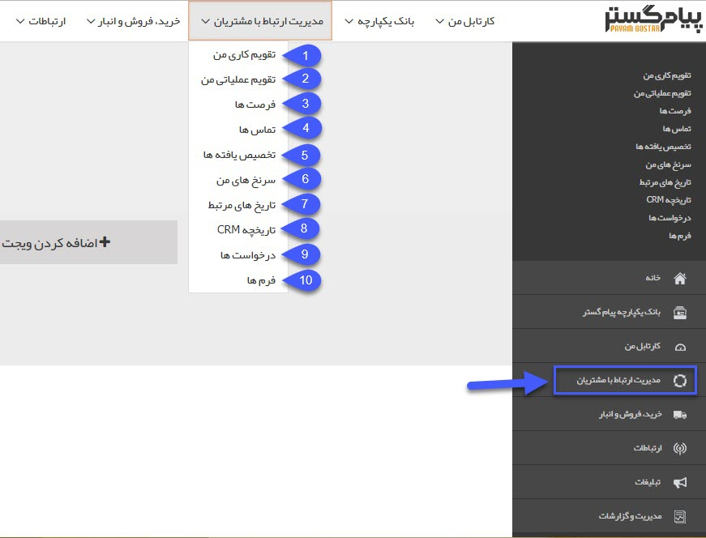

# مدیریت ارتباط با مشتریان

  در این سربرگ می توانید لیست آیتم های مرتبط با حوزه مدیریت ارتباط با مشتری را مشاهده کنید، سوابق جدید ایجاد کنید و گزارشات مختلف مورد نظر خود را با استفاده از فیلترهای جستجو تهیه کنید

  
  
  1. <a href="My-work-calendar%2FMy-work-calendar.md" target="_blank">تقویم کاری من</a>

2. <a href="actionscalender%2FMy-Operational-Calendar%20.md" target="_blank">تقویم عملیاتی من</a>

3. <a href="Opportunities%2FOpportunities.md" target="_blank">فرصت ها</a>

4. <a href="calls%2Fcalls.md" target="_blank">تماس ها</a>

5. <a href="Allocation-of-findings%2FAllocation-of-findings.md" target="_blank">تخصیص یافته ها</a>

6. <a href="My-clues%2FMy-clues.md" target="_blank">سرنخ های من</a>

7. <a href="Related-dates%2FRelated-dates.md" target="_blank">تاریخ های مرتبط</a>

8. <a href="CRM%20History%2FCRM%20History.md" target="_blank">تاریخچه CRM</a>

9. <a href="requests%2Frequests.md" target="_blank">درخواست ها</a>

10. <a href="forms%2Fforms.md" target="_blank">فرم ها</a>
