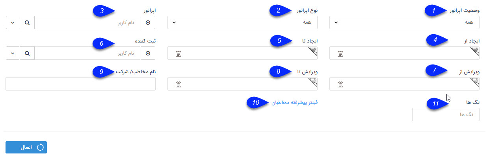

## فیلترهای پیشرفته
با استفاده از فیلترهای پیشرفته در قسمت های مختلف نرم افزار می توانید برای جستجوی سوابق مورد نظر خود پارمترهای مختلفی برای جستجو اعمال کنید و به این صورت گزارشات مورد نیاز خود را دریافت کنید. توجه داشته باشید که فیلترهای پیشرفته برای سوابق مختلف می تواند متفاوت باشد. به طور مثال فیلترهای پیشرفته فاکتورها با فرصت ها متفاوت است. فیلترهای مشترک برای تمامی موجودیت های CRM به شرح زیر می باشد:

1. وضعیت اپراتور: می توانید تعیین کنید که هویت مرتبط با سابقه مورد نظر دارای اپراتور (مسئول پشتیبانی، فروش، متفرقه) هست و یا خیر.

2. نوع اپراتور: می توانید نوع اپراتور (پشتیبانی، فروش، متفرقه) را تعیین کنید.

3. اپراتور: نام اپراتور مورد نظر را از میان لیست کاربران نرم افزار می توانید تعیین کنید.

4. ایجاد از (ثبت از): می توانید برای بازه تاریخ ایجاد یک تاریخ آغاز در نظر بگیرید. توجه داسته باشید که این فیلد به صورت خودکار با مقدار تاریخ 1 ماه گذشته پر شده است، بنابراین لیست سوابق نمایش داده شده به صورت پیشفرض سوابق 1 ماه اخیر را نشان می دهد.

5. ایجاد تا (ثبت تا): می توانید برای بازه تاریخ ایجاد یک تاریخ نهایی در نظر بگیرید.

6. ثبت کننده (ایجاد کننده، سازنده): می توانید کاربر ایجاد کننده سابقه مورد نظر را انتخاب کنید.

7. ویرایش از (تغییر از): می توانید برای بازه تاریخ ویرایش یک تاریخ آغاز در نظر بگیرید.

8. ویرایش تا (تغییر تا): می توانید برای بازه تاریخ ویرایش یک تاریخ نهایی در نظر بگیرید.

9. نام مخاطب/شرکت (نام مشتری): می توانید نام یا بخشی از نام مخاطب مورد نظر را درج نمایید.

10. فیلتر پیشرفته مخاطبان: با استفاده از این دکمه می توانید برای هویت های مرتبط با سوابق نیز فیلترهای مختلفی اعمال کنید. به طور مثال فرض کنید بخواهید لیست فرم های مرتبط با مخاطبان ساکن در شهرستان تهران که به آن ها رنگ سبز اختصاص داده ایم و به آن ها اپراتور فروش اختصاص داده ایم را داشته باشید. با استفاده از فیلتر پیشرفته مخاطبان این میتوانید این گزارش را در اختیار داشته باشید. برای آشنایی با فیلترهای موجود در این صفحه به راهنمای[ جستجوی پیشرفته  ](https://github.com/1stco/PayamGostarDocs/blob/master/help%202.5.4/Integrated-bank/Advanced-search/Advanced-search.md)مراجعه کنید.

11. تگ ها: با استفاده از تگ ها می توانید آیتم مرتبط با تگ مورد نظر خود را جستجو کنید.فیلترهای پیشرفته