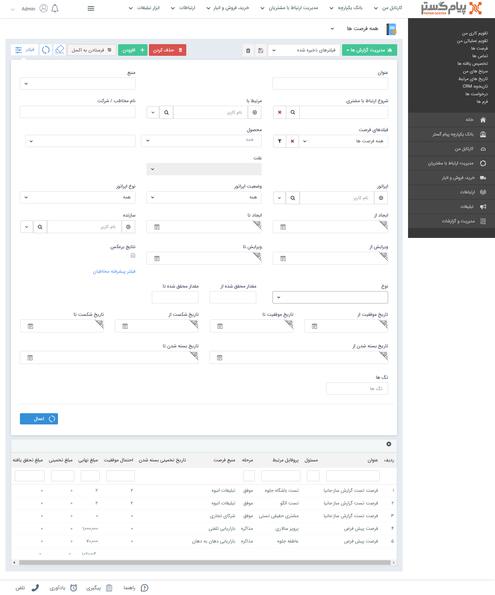

## فرصت ها
لیست تمام فرصت هایی که توسط کاربران پیام گستر برای پروفایل های مختلف ثبت شده است در این قسمت نمایش داده می شود.

> نکته: هر کاربر می تواند تنها فرصت های مربوط به خود و شخص دارنده مجوز "مشاهده لیست فرصت ها" می تواند کلیه فرصت های کاربران موجود را مشاهده و بررسی نماید.

نوع فیلتر: می توانید فیلترهای اعمال شده را به عنوان یک فیلتر اختصاصی خود ذخیره کرده و برای اخذ گزارشات بعدی از آن استفاده کنید.

عنوان: می توانید فرصت ها را بر اساس عنوان آن ها جستجو کنید.

> نکته: لطفا ابتدا قسمت[ فیلترهای پیشرفته](https://github.com/1stco/PayamGostarDocs/blob/master/help%202.5.4/Customer-relationship-management/Advanced-filter/Advanced-filter.md) را مطالعه کنید.

منبع: می توانید منبع ایجاد فرصت را مشخص کنید.

شروع ارتباط با مشتری: کمپین تبلیغاتی که فرصت از طریق آن ایجاد شده است را می توانید انتخاب کنید.

مرتبط با: کاربر مرتبط با فرصت (کاربری که در فیلد "تخصیص داده شده به"  انتخاب شده است) را می توانید انتخاب کنید.

فیلدهای فرصت: در این قسمت می توانید یکی از زیرنوع های فرصت تعریف شده در شخصی سازی را فیلتر کنید. همچنین می توانید با استفاده از دکمه فیلتر موجود در این فیلد، پس از انتخاب یکی از زیرنوع های فرصت، روی فیلدهای اضافه شده به آن نیز فیلتر مورد نظر خود را اعمال کنید.

محصول: می توانید فرصت های حاوی یک محصول یا گروه محصول خاص را انتخاب کنید.

علت: در صورتی که در پارامتر جستجوی قبلی مرحله فروش موفق یا ناموفق را انتخاب کرده باشید می توانید در این قسمت یک علت موفقیت/شکست بخصوص را انتخاب کنید . ( این مورد در این صورت اتفاق می افتاد که فیلد مرحله فروش وجود داشت در این ورژن فیلد مرحله فروش وجود ندارد و عملا این فیلد هم کار نمی کند)

نتایج برعکس: با فعال کردن این گزینه، نتایج جستجو فرصت هایی را نمایش می دهد که مشخصه های انتخاب شده را نداشته باشند.

نوع : می توانید براساس فیلد نوع در فرصت  فیلتر انجام دهید .

مقدار محقق شده: در صورتی که در سوابق فرصت فاکتور ثبت کنید در صورت تایید فاکتور ، مبلغ نهایی فاکتور به عنوان مبلغ محقق شده فرصت محسوب می شود، با استفاده از این فیلدها می توانید بازه ای برای مقدار محقق شده (میزان فروش فرصت) به عنوان پارامتر جستجو اعمال کنید.

تاریخ موفقیت و شکست و بسته شدن: می توانید فرصت ها را بر اساس تاریخ موفقیت و شکست و بسته شدن آن ها جستجو کنید.

حذف کردن: می توانید فرصت/فرصت های  انتخاب شده را حذف کنید.

اضافه کردن: می توانید یک [فرصت فروش جدید](https://github.com/1stco/PayamGostarDocs/blob/master/help%202.5.4/Integrated-bank/Database/Records/New-opportunity/New-opportunity.md) ایجاد نمایید.

فرستادن به اکسل: می توانید فرصت های انتخاب شده را به صورت خروجی اکسل دریافت نمایید.

زیرنوع فرصت: با استفاده از این فیلد کشویی می توانید زیرنوع فرصت را تغییر دهید.

> نکته: با کلیک راست بر روی یک یا چند فرصت می توانید اقدام به ویرایش گروهی یا افزودن سابقه برای آن ها کنید.

مدیریت گزارش ها :  با استفاده از این بخش میتوان از لیست فرصت با توجه به فیلتر های اعمال شده، گزارش گیری کرد. برای توضیحات بیشتر میتوانید به بخش [گزارش ساز جدید ](https://github.com/1stco/PayamGostarDocs/blob/master/help%202.5.4/Management-and-reports/Report-Builder/Report-Builder.md)مراجعه کنید.

> نکته : تمامی لیست آیتم ها دو حالت نمایش Grid و Kanban دارند که حالت نمایشی کانبان براساس مراحل تعریف شده در بخش شخصی سازی میباشد.توضیحات این بخش را میتوانید از بخش[ نمایش کانبان ](https://github.com/1stco/PayamGostarDocs/blob/master/help%202.5.4/Integrated-bank/Database/Records/leveling/leveling.md)مراحل مطالعه کنید.

> نکته :  با استفاده از بخش تنظیمات جدول میتوانیم فیلد هایی برای نمایش در لیست و خروجی اکسل انتخاب کنید.

