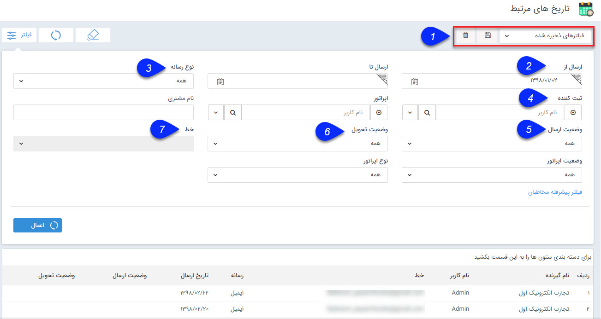

## تاریخ های مرتبط

 تمام برنامه های اجرا شده و زمانبندی شده برای اجرا از قسمت تاریخ های مهم پروفایل ها نمایش داده می شود و می توانید با استفاده از فیلترهای مختلف، برنامه مورد نظر خود را جستجو و پیدا کنید.

> نکته: کاربر دارای مجوز " مشاهده لیست تاریخ های مرتبط " می تواند کلیه برنامه ها را مشاهده نماید.

1. نوع فیلتر: میتوانید فیلترهای اعمال شده را به عنوان یک فیلتر اختصاصی خود ذخیره کنید.

> نکته: لطفا ابتدا قسمت[  فیلترهای پیشرفته](https://github.com/1stco/PayamGostarDocs/blob/master/help%202.5.4/Customer-relationship-management/Advanced-filter/Advanced-filter.md) را مطالعه کنید.

2. ارسال از: می توانید تاریخ اولین ارسال را مشخص کنید. این فیلتر به صورت پیشفرض با تاریخ 1 ماه گذشته تکمیل شده است، اما می توانید آن را تغییر دهید.

3. نوع رسانه: می توانید نوع رسانه ای (ایمیل، پیامک، فکس و یا چاپ) را انتخاب کنید. 

4. ثبت کننده: می توانید کاربر ایجاد کننده برنامه را مشخص کنید.

5. وضعیت ارسال: می توانید وضعیت ارسال پیام از نرم افزار را انتخاب کنید.

6. وضعیت تحویل: می توانید وضعیت تحویل به مخاطب را انتخاب کنید.

7. خط: در صورتی که رسانه مورد نظر (مورد 3) را مشخص کرده باشید، می توانید خطی که از طریق آن ارسال انجام شده است را انتخاب کنید. 