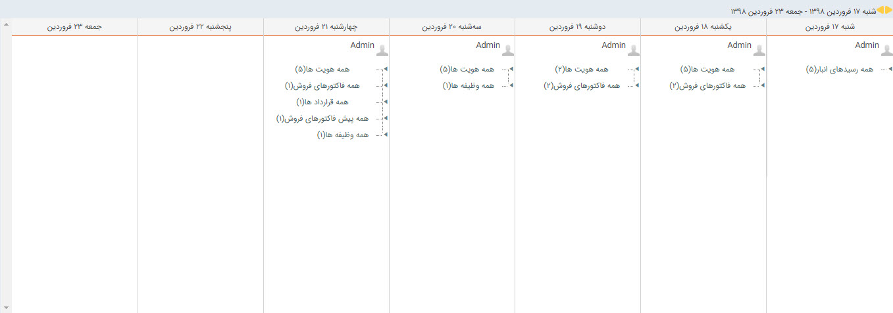

## تقویم عملیاتی من 

>  مسیر دسترسی:  **مدیریت ارتباط با مشتریان** >**تقویم عملیاتی من** 

این تقویم نشان دهنده کلیه سوابق و کلیه فعالیت هایی که است که کاربر در طول یک روز خاص ایجاد کرده و یا بر روی آن ویرایشی انجام داده است.  این تقویم برای یافتن یک سابقه ای که اخیرا ثبت شده است  (مانند پیدا کردن یک فرم که هفته پیش ذخیره شده است)  اما نام مخاطب و یا نام خود آیتم را در دسترس نداریم بسیار مناسب است.

توجه داشته باشید که این سوابق شامل ویرایش و ذخیره مخاطبان و سرنخ ها و تمامی سوابق (اعم از فایل، فرصت، فاکتور و ...) است.

> نکته: تقویم عملیاتی کاربرانی که سمت های زیرمجموعه ی شما به آن ها اختصاص داده شده است را می توانید از قسمت  مدیریت و گزارشات بخش[ تقویم عملیاتی کاربران ](https://github.com/1stco/PayamGostarDocs/blob/master/help%202.5.4/Management-and-reports/Functional-reports/User-Operating-Calendar/User-Operating-Calendar.md)مشاهده کنید.

با دوبار کلیک بر روی هر کدام ،آیتم مورد نظر باز خواهد شد .

