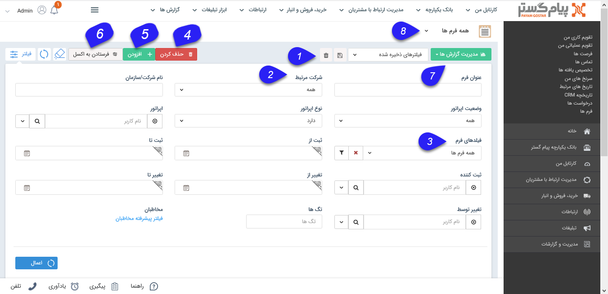
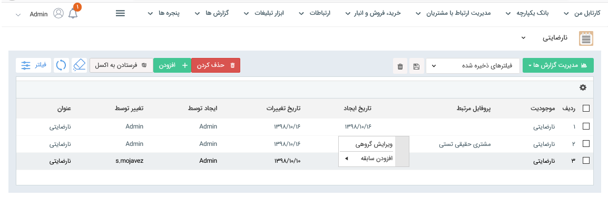

## فرم ها

>  مسیر دسترسی:  **مدیریت ارتباط با مشتریان** >**فرم‌ها** 

لیست تمام فرم هایثبت شده در سیستم نمایش داده می شود و می توان اطلاعات جزئی هر کدام از فرم ها را نیز جستجو و مشاهده نمود. با استفاده از پارامترهای تعریف شده در قسمت فیلتر می توانید به راحتی جستجو نمایید.

> نکته : هر کاربر در این لیست فرمهای ثبت شده توسط خود را مشاهده می کند و اگر مجوز مشاهده لیست فرم ها را داشته باشد می تواند فرم های ثبت شده توسط سایر کاربران  را مشاهده کند .

> نکته: لطفا ابتدا قسمت [ فیلترهای پیشرفته ](https://github.com/1stco/PayamGostarDocs/blob/master/help%202.5.4/Customer-relationship-management/Advanced-filter/Advanced-filter.md) را مطالعه کنید.  

1. نوع فیلتر: میتوانید فیلترهای اعمال شده را به عنوان یک فیلتر اختصاصی خود ذخیره کنید.

2. شرکت مرتبط: می توانید تعیین کنید که فرم مورد نظر دارای هویت مرتبط (مرتبط با ) هست یا خیر.

نکته: توجه داشته باشید فرم از سوابقی است که امکان ذخیره بدون اتصال به یکی از هویت های بانک اطلاعاتی را دارد.

3. فیلدهای فرم: می توانید بر اساس فیلدهای فرم، فیلتر دلخواه را اعمال کنید.

4. حذف کردن: می توانید فرم(های) انتخاب شده را حذف کنید .

5. اضافه کردن: می توانید یک[  فرم جدید](https://github.com/1stco/PayamGostarDocs/blob/master/help%202.5.4/Integrated-bank/Database/Records/New-form/New-form.md) ایجاد نمایید .

6. فرستادن به اکسل: می توانید فرم های انتخاب شده را به صورت خروجی اکسل دریافت نمایید .

7. مدیریت گزارش ها :  با استفاده از این بخش میتوان از لیست درخواست ها با توجه به فیلتر های اعمال شده، گزارش گیری کرد. برای توضیحات بیشتر میتوانید به بخش [گزارش ساز جدید ](https://github.com/1stco/PayamGostarDocs/blob/master/help%202.5.4/Management-and-reports/Report-Builder/Report-Builder.md)مراجعه کنید .

8.زیرنوع فرم: با استفاده از این فیلد کشویی می توانید زیرنوع  فرم را تغییر دهید (فرم مورد نظر را انتخاب نمایید ).

کلیک راست: با کلیک راست بر روی یک یا چند تا از فرم ها می توانید اقدام به ویرایش گروهی یا افزودن سابقه برای آن ها کنید.

> نکته : تمامی لیست آیتم ها دو حالت نمایش Grid وKanban دارند که حالت نمایشی کانبان براساس مراحل تعریف شده در بخش شخصی سازی میباشد.توضیحات این بخش را میتوانید از بخش [نمایش کانبان مراحل ](https://github.com/1stco/PayamGostarDocs/blob/master/help%202.5.4/Integrated-bank/Database/Records/leveling/leveling.md)مطالعه کنید.
