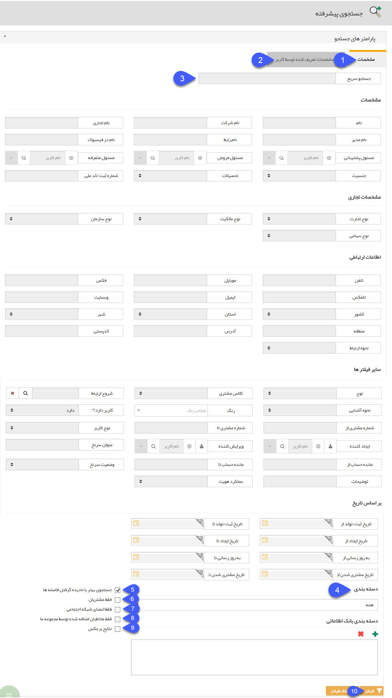
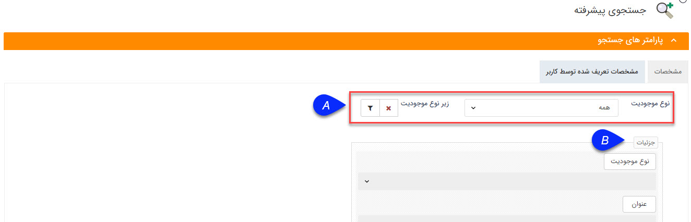
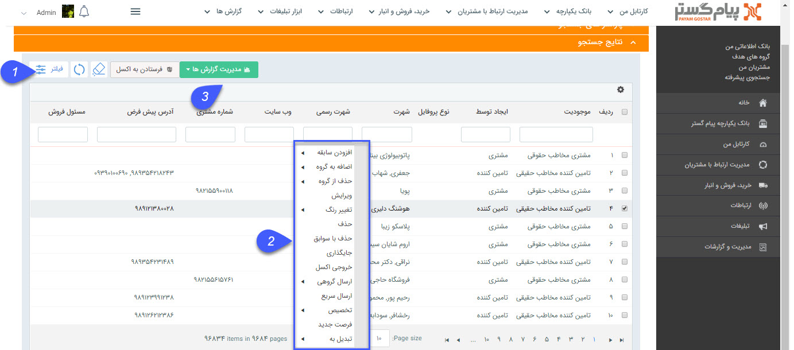

## جستجوی پیشرفته

> مسیر دسترسی:  **بانک یکپارچه**  > **جستجوی پیش‌رفته** 

در این قسمت می توانید بر حسب متغیرهای مختلف بین هویت های بانک اطلاعاتی، یک و یا چند مخاطب و سرنخ را جستجو کنید

1.  مشخصات: شامل تعدادی پارامتر جستجو است، در صورتی که مقداری را برای این پارامتر ها وارد کنید، هویت هایی را نمایش می دهد که این پارامتر  با مقدار مشخص شده را دارا هستند و در صورتی که فقط روی پارامتر مورد نظر را کلیک نمایید و مقداری را در مقابل آن وارد نکنید هویت هایی را نمایش می دهد که دارای آن پارامتر هستند (مقدار آن پارامتر برای آن ها خالی نیست)

2. مشخصات تعریف شده توسط کاربر:  

  متغیرهایی که:

 A. از قسمت تنظیمات، شخصی سازی CRM، به عنوان سوپر فیلد (بند 4 نمای کلی را مطالعه کنید.) به هویت ها اضافه نموده اید، در این قسمت به عنوان پارامتر جستجو در اختیارتان گذاشته خواهد شد تا بتوانید براساس پارامترهایی که خود برای پروفایل ها تعریف و تکمیل نموده اید نیز جستجو انجام دهید.

B. علاوه بر آن میتوانید بر اساس فیلدهایی که به انواع هویت نیز اضافه کرده اید جستجو نمایید. برای این کار ابتدا نوع موجودیت و زیر نوع آنرا انتخاب کنید و سپس روی آیکون فیلتر کلیک کنید تا بتوانید بر اساس فیلدهای زیرنوع هویت انتخاب شده جستجو انجام دهید

3. جستجوی سریع: با وارد کردن مقداری در این فیلد، جستجو بین تمامی فیلدهای هویت ها انجام خواهد شد، یه طور مثال اگر عبارت "شیراز" را در این فیلد وارد کنید تمامی هویت هایی که نام خانوادگی آن ها شامل عبارت "شیراز" باشد یا مقدار وارد شده برای آن ها در فیلدهای دیگری مانند آدرس، شهر، نام شرکت یا ... شامل این عبارت باشد را در نتایج جستجو مشاهده خواهید کرد

4. دسته بندی: با استفاده از این قسمت می توانید متغیر دسته بندی را نیز در  محدوده جستجو خود مشخص نمایید. به عبارت دیگر می توانید جستجوی خود را محدود به برخی از دسته بندی های بانک اطلاعاتی یا برخی از گروه های هدف کنید. با انتخاب " زمینه های فعالیت" جستجو در  دسته بندی هایبانک اطلاعاتی صورت می گیرد. و اگر "گروه های هدف " را انتخاب کنید، جستجو در بین مخاطبان و سرنخ های عضویت داده شده در گروه های هدف صورت می گیرد. 

همچنین می توانید در کادر پایین تر زمینه های فعالیت یا گروه های هدف مشخصی را انتخاب و جستجو را محدودتر نمایید .

5. جستجوی بهتر با نادیده گرفتن فاصله ها: با انتخاب این گزینه اهمیت فاصله ها را در جستجو از بین می برد. (به طور مثال با وارد کردن عبارت "علی زاده" در فیلد نام، هویت هایی که نام خانوادگی آن ها "علیزاده" وارد شده باشد نیز نتایج جستجو خواهند بود)

6. فقط مشتریان:  با فعال کردن این گزینه، جستجو بین هویت هایی انجام خواهد شد که شماره مشتری به آنها اختصاص داده شده است.

7. فقط اعضای شبکه اجتماعی: فقط هویت هایی را مورد جستجو قرار میدهد که عضو شبکه اجتماعی (Facebook) باشند.

8. فقط مخاطبان اضافه شده توسط مجموعه ما: تنها از بین مخاطبان و سرنخ های ایجاد شده توسط شما جستجو می کند و سرنخهایی ایجاد شده توسط بانک اطلاعاتی مشاغل اول -که به عنوان یک بانک آماده در اختیار کارفرما قرار می گیرد - را در نظر نمیگیرد.

9. نتایج برعکس: با فعال کردن این گزینه، در نتایج جستجو تمامی هویت هایی را نمایش می دهد که شاخصه های انتخاب شده را نداشته باشند. به طور مثال برای یافتن تمامی هویت هایی که به آن ها رنگ اختصاص نداده اید یا تمامی هویت هایی که ساکن شهر تهران نیستند، می توانید از این قابلیت استفاده کنید.

10. پس از انتخاب پارامترهای مورد نظر و وارد کردن مقادیر متناظر با هر کدام، روی دکمه فیلتر کلیک کنید تا جستجو انجام شود. نتیجه جستجوی خود را می توانید در قالب جدول هویت ها در قسمت نتایج جستجو مشاهده کنید

1. با استفاده از فیلترهایی که در این قسمت مشاهده می کنید می توانید روی هویت های نمایش داده شده در نتایج جستجو، فیلتر جدیدی اعمال کنید.

2. علاوه بر این می توانید با کلیک راست بر روی هویت ها از تمامی گزینه های کلیک راست بهره مند گردید، به طور مثال آن ها را به گروه هدف خاصی اضافه کنید یا سابقه ی جدید برای همه آن ها ایجاد کنید.

3. مدیریت گزارش ها :   با استفاده از این بخش میتوان از لیست درخواست ها با توجه به فیلتر های اعمال شده، گزارش گیری کرد. برای توضیحات بیشتر میتوانید به بخش[ گزارش ساز ](https://github.com/1stco/PayamGostarDocs/blob/master/help%202.5.4/Management-and-reports/Report-Builder/Report-Builder.md)جدید مراجعه کنید.