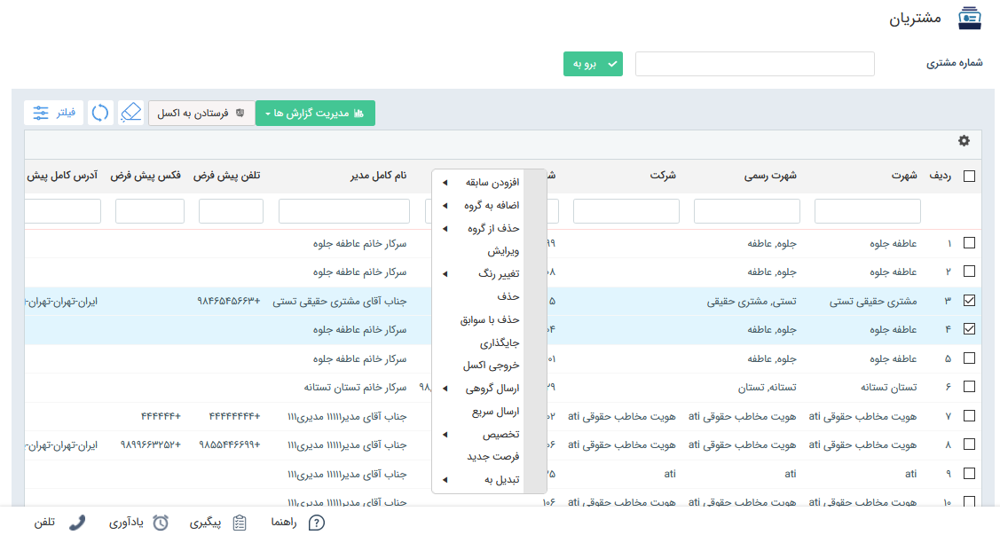
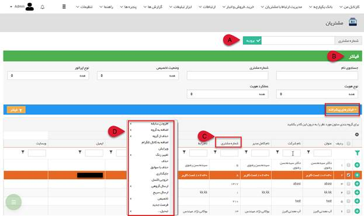

## مشتریان

  به صورت معمول به تمامی اشخاص و شرکت هایی که یکبار اقدام به خرید و معامله با ما کرده اند، مشتری می گویند. در نرم افزار پیام گستر تمام مخاطب هایی که شماره مشتری دریافت نموده اند، در قسمت مشتریان نمایش داده می شوند. در واقع مشتری از نظر نرم افزار مخاطب یا پروفایلی است که شماره مشتری به آن اختصاص داده شده است.

یک مخاطب در مراحل مختلف ممکن است دارای شماره مشتری شود. برای مثال در برخی از کسب و کارها مانند پیرایشگاه یا خشکشویی، مخاطب بلافاصله پس از مراجعه، مشتری محسوب می شود. اما در برخی کسب و کارها مخاطب پس از طی مراحل طولانی (مانند ارسال نمونه، تایید آن، مذاکره و ...) تبدیل به یک مشتری می شود. 

1. شماره مشتری : در این قسمت قابلیت دسترسی به پروفایل مشتری صرفا با واردکردن شماره مشتری مورد نظر و زدن دکمه Enter امکان پذیر است.

2. فیلتر :  می توان در این قسمت بر اساس پارامترهای مشخص شده در فیلتر و نیز فیلتر های پیشرفته ، مشتریان مورد نظر را جستجو نمود

3. با کلیک راست بر روی لیست مشتریان می توانید برای آن ها سابقه ایجاد کنید، آن ها را در گروه های هدف دلخواه عضو کنید و یا از سایر گزینه های کلیک راست استفاده کنید

>  نکته:   با دوبار کلیک بر روی هر کدام از سطرها ، پروفایل مربوط به آن مشتری باز می شود .

4. مدیریت گزارش ها : به بخش[  گزارش ها](https://github.com/1stco/PayamGostarDocs/blob/master/help%202.5.4/Management-and-reports/Report-Builder/Report-Builder.md) مراجعه کنید.  

