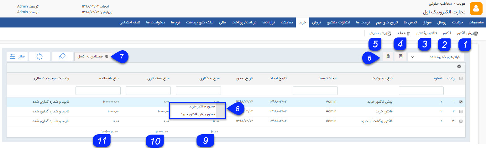

## خرید

در این قسمت تمامی پیش فاکتورها، فاکتورها و فاکتورهای برگشت از خرید ثبت شده برای مشتری را می توانید مشاهده کنید، می توانید برای جستجوی سوابق مورد نظر خود از فیلترهای مختلف استفاده کنید. همچنین می توانید سوابق خرید جدید برای مشتری ایجاد کنید.

مانند تمامی لیست ها از بخش تنظیمات روی لیست، میتوان پارامتر های مد نظر برای نمایش در این لیست انتخاب کرد و براساس آن خروجی گرفت.

1. می توانید یک پیش فاکتور خرید جدید ایجاد کنید.

2. می توانید یک فاکتور خرید جدید ایجاد کنید.

3. می توانید یک فاکتور برگشت از خرید جدید در سوابق این هویت ایجاد کنید.

4. حذف: می توانید آیتم های انتخاب شده را حذف کنید.

5. پیش نمایش : می توانید پیش نمایش چاپ فاکتور و یا پیش فاکتور انتخاب شده را مشاهده کنید.

6. فیلترهای پیشرفته : می توانید برای پیدا کردن فاکتور و یا پیش فاکتور مورد نظر از فیلتر های پیشرفته استفاده کنید.

7. فرستادن به اکسل : با استفاده از این دکمه می توانید اطلاعات پیش فاکتور و فاکتورهای انتخاب شده را در قالب یک فایل اکسل دریافت کنید.

8. راست کلیک : با راست کلیک بر روی یک پیش فاکتور خرید می توانید یک پیش فاکتور خرید یا فاکتور خرید از روی آن صادر کنید و با راست کلیک بر روی یک فاکتور خرید می توانید فاکتور برگشت از خرید ایجاد کنید.

9. مجموع بدهکاری: مجموع مبالغ فاکتورهای برگشت از خرید ثبت شده برای مشتری را محاسبه می کند.

10. مجموع بستانکاری:  مجموع مبالغ پیش فاکتورها و فاکتورهای خرید ثبت شده برای مخاطب را محاسبه می کند. می توانید با استفاده از فیلترهای پیشرفته، تمامی پیش فاکتورها یا فاکتورهای مشتری را جستجو کرده و مجموع مبالغ آن ها را با استفاده از این دکمه محاسبه کنید.

11. مجموع مبلغ: مجموع مبالغ سوابق خرید ثبت شده برای مشتری را نمایش می دهد. توجه داشته باشید که در این ستون، مبلغ فاکتورها و پیش فاکتورها با مقدار منفی و مبلغ فاکتورهای برگشت از فروش با مقدار مثبت نمایش داده می شود و محاسبه مجموع مبلغ نیز بر همین اساس می باشد.

12. مجموع باقی مانده : **حالت آزمایشی**

