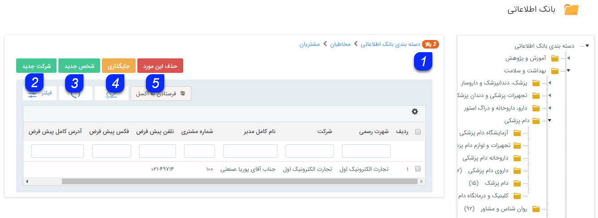
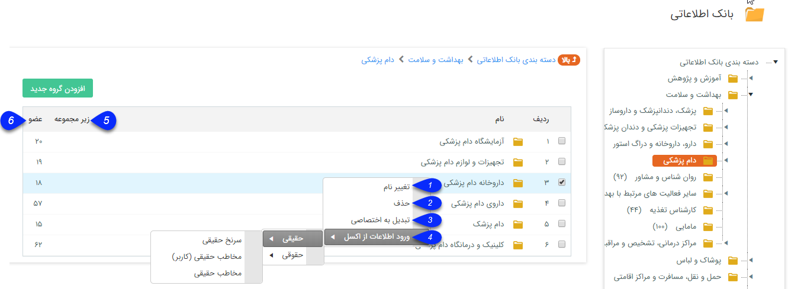
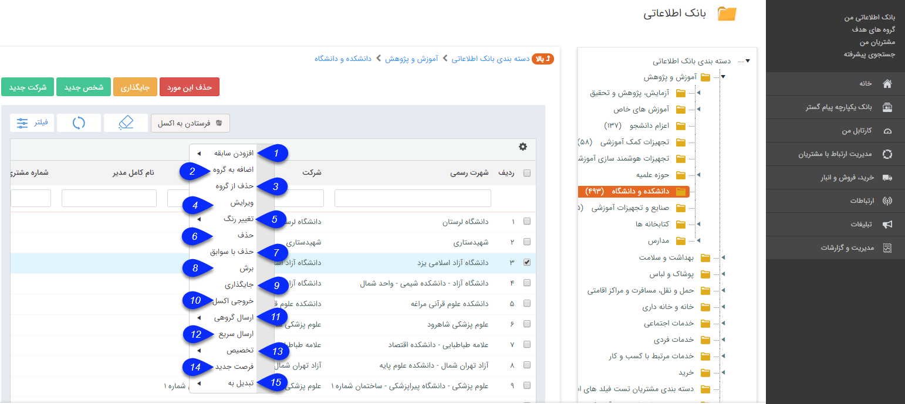

## بانک اطلاعاتی

 در این قسمت میتوانید برای انواع هویت ها ( مخاطبان و سرنخ های خود) دسته بندی های مختلفی را ایجاد کنید.

و لیست دسته بندی هایی که ایجاد کرده اید را همراه با تعداد اعضا و تعداد زیر شاخه های آن مشاهده کنید.

این دسته بندی ها می تواند بر اساس منطقه ( برای مثال تهران، کردستان و ...) یا بر اساس حوزه کاری (برای مثال تولید کننده،خدمات و ...) و یا سایر روش هایی که برای کسب و کار شما مناسب است، انجام شود.

در نظر داشته باشید که این دسته بندی ها در تمامی قسمت های نرم افزار مورد استفاده قرار می گیرند (مانند ثبت مخاطب یا سر نخ جدید، جستجو، گزارش و ...).

بهتر است که دسته بندی هایی که ایجاد می کنید از لحاظ نام گذاری و تعداد زیر دسته بندی به گونه ای باشند که برای کاربران سردرگمی ایجاد نکنند.

انواع هویت به شرح زیر می باشد:

· مشتری: به آن دسته از هویت ها گفته می شود که ماهیت مشتری دارند و با آن ها تعامل فروش برقرار می شود. (انواع هویت مشتری به دو نوع سرنخ و مخاطب تقسیم می شوند که در زیر توضیح داده شده است.)

·نماینده: به آن دسته از هویت ها گفته می شود که ماهیت نماینده شما را دارند و از نوع مخاطب وجود دارند.

·تامین کننده: به آن دسته از هویت ها گفته می شود که ماهیت تامین کننده دارند و با آن ها تعامل خرید برقرار می شود و از نوع مخاطب وجود دارند.

· اپراتور: به آن دسته از هویت ها گفته می شود که ماهیت اپراتور دارند و به عنوان کاربر سیستم تعریف می شوند و از نوع مخاطب وجود دارند.

·رقیب: به آن دسته از هویت ها گفته می شود که ماهیت رقیب برای شما را دارند و از نوع مخاطب وجود دارند.

### انواع هویت مشتری به شرح زیر است:

·سرنخ:  مرحله ای پیش از ثبت مخاطب می باشد، یک سرنخ فقط اطلاعات تماس یک شخص یا شرکت است که شما پیش تر هیچ ارتباطی با آن نداشتید ولی گمان میکنید که بتوانید در آینده با آن ها ارتباط تجاری برقرار کنید. (اگر صلاحیت سرنخ تایید شود، تبدیل به مخاطب خواهد شد) اطلاعات سرنخ ها ممکن است از روش های مختلفی مانند سمینارها و همایش ها یا بانک های اطلاعات مشاغل به دست آید

> نکته: امکان ایجاد آیتم مالی (فاکتورها، قرارداد، دریافت، پرداخت) برای هویت های از نوع سرنخ وجود ندارد.

 مخاطب: مخاطب حقیقی یا حقوقی شامل سرنخ هایی است که صلاحیت آنها تایید شده است و یا افراد و سازمان هایی است که به دلیل اینکه از قبل با آنها کار کرده ایم و یا از صلاحیت آن ها اطمینان داریم از ابتدا به عنوان مخاطب ذخیره کرده ایم.

> نکته: می توانید در قسمت [جستجوی پیشرفته](https://github.com/1stco/PayamGostarDocs/blob/master/help%202.5.4/Integrated-bank/Advanced-search/Advanced-search.md) لیست سرنخ هایی را که صلاحیت آن ها تایید شده است (تبدیل به مخاطب شده اند) را در اختیار داشته باشید. برای انجام این کار باید پارامتر "وضعیت سرنخ"
 را بر اساس گزینه "واجد شرایط" فیلتر کنید. 
 
 > نکته: در صورت نیاز می توانید ماژول بانک فهرست مشاغل اول را که در 15 دسته بندی اصلی، اطلاعات مشاغل ثبت شده در پرتال اول(1st.ir ) را برای شما نمایش می دهد و شامل بیش از 200 هزار هویت مختلف
 از مشاغل سراسر کشور است را به عنوان یک بانک کمکی تهیه کنید. این اطلاعات در قالب هویت هایی از نوع سرنخ در بانک اطلاعاتی شما نمایش داده خواهند شد.
 
 
 
 با کلیک بر روی "افزودن گروه جدید" می توانید یک دسته بندی جدید ایجاد کنید.

1)از طریق این بخش می توان  با فیلتر براساس نوع هویت، هویت ها با نوع مورد نظر را در بانک اطلاعاتی جستجو کرد.

 با دو بار کلیک بر روی هر کدام از دسته بندی ها می توانید محتوای آن دسته را مشاهده کنید و زیرشاخه های آن دسته بندی را مشاهده کنید. همچنین میتوانید دسته بندی جدیدی به زیر شاخه های این دسته بندی اضافه کنید.قابل ذکر است که در لایه اخر میتوانید لیست اعضای ان دسته بندی را مشاهده کنید.
 
 
 
 
 
 1. بالا: بازگشت به لایه قبلی.

2. شرکت جدید: می توانید یک مخاطب یا سرنخ حقوقی ایجاد کنید.

3. شخص  جدید: با کلیک بر روی این دکمه می توانید یک سرنخ یا مخاطب حقیقی ایجاد کنید.

4. جایگذاری: می توایند مخاطبانی را که از یک دسته بندی دیگر برش داده اید در این قسمت جایگذاری(paste) کنید .

5. حذف این مورد: می توانید مخاطب یا شرکت های انتخاب شده را حذف کنی

> نکته: توجه داشته باشید که برای حذف مخاطبی که دارای سوابق است، باید ابتدا سوابق آن مخاطب را حذف کنید.

> نکته: توجه داشته باشید که ایجاد هویت جدید تنها در آخرین زیرسطح(لایه آخر) ممکن است .  

### کلیک راست بر روی دسته بندی ها :

 

A. زیر مجموعه: تعداد دسته بندی های زیر مجموعه بک دسته بندی را مشخص می کند.

B. عضو: تعداد هویت موجود در یک دسته بندی را نمایش می دهد.

1. تغییر نام: می توانید نام دسته بندی مورد نظر را تغییر دهید.

2. حذف :  میتوان دسته بندی مشروط بر آن که اطلاعاتی در داخل آن وجود نداشته باشد از این طریق حذف کرد

3. تبدیل به اختصاصی: می توانید دسته بندی را شخصی نمایید. توجه داشته باشید که برای اختصاصی کردن یک دسته بندی باید خودتان آن را ایجاد کرده باشید و یا مجوز مدیر سیستم یا مدیر بانک اطلاعاتی داشته باشید. دسته بندی اختصاصی شده به رنگ قرمز تغییر پیدا میکند.

> نکته: کاربری که دسته ای را تبدیل به اختصاصی می کند فقط خود قادر است، اطلاعات داخل آن را مشاهده نماید. (البته مدیر سیستم و یا مدیر بانک اطلاعاتی از این امر مستثنی هستند و کلیه دسته بندی ها را مشاهده می نمایند.

> نکته : در صورت اینکه دسته بندی را شخصی کرده اید میتوانید با راست کلیک کردن مجدد روی دسته بندی و انتخاب تبدیل به عمومی آن دسته بندی را از حالت اختصاصی خارج کنید، در حالت عمومی همه کاربران دارای مجوز ، میتوانند اطلاعات داخل ان دسته را مشاهده کنند.

> نکته: برای اختصاصی کردن و بالعکس عمومی کردن یک دسته بندی فقط کاربر سازنده دسته بندی و البته مدیر سیستم و یا مدیر بانک اطلاعاتی میتوانند این عملیات را انجام دهند.

4. ورود اطلاعات از اکسل: به قسمت[ ورودی اکسل ](https://github.com/1stco/PayamGostarDocs/blob/master/help%202.5.4/Integrated-bank/Excel-input/Excel-input.md) مراجعه کنید .

###   کلیک راست بر روی لیست هویت ها:

کلیک راست بر روی هویت ها، همانطور که در تصویر مشاهده می نمایید امکاناتی برای شما فراهم می نماید.

1. افزودن سابقه: برای هویت یا هویت های انتخاب شده می توانید سابقه جدیدی ( از انواع فاکتور جدید، قرارداد و .. ) را ایجاد کنید .

2. اضافه به گروه هدف:  هویت های انتخاب شده را می توانید به یک گروه هدف (مانند دعوت به نمایشگاه) اضافه کنید.

3.  حذف از گروه هدف:  هویت های انتخاب شده را می توانید از یک گروه هدف (مانند دعوت به نمایشگاه) حذف کنید.

4. ویرایش: هویت انتخاب شده را می توانید ویرایش کنید.

5. تغییر رنگ: با استفاده از این منو می توانید برای هویت های انتخاب شده رنگ از لیست رنگ های موجود تعیین کنید.

> نکته: برای اضافه یا حذف کردن رنگ ها به قسمت[ مدیریت رنگ ها ](https://github.com/1stco/PayamGostarDocs/blob/master/help%202.5.4/Basic-Information/Color-management/Color-management.md)مراجعه کنید.

6. حذف: هویت(های) مورد نظر را حذف می کند.

7. حذف با سوابق: میتوانید با استفاده از این گزینه هویت یا هویت های انتخاب شده را به همراه سوابق ثبت شده برای آن/آنها حذف نمایید.

> نکته : اگر یک هویت در فیلد یا فیلد هایی از نوع شخص/ شرکت استفاده شده باشد، امکان حذف با سوابق، برای آن هویت وجود ندارد.

8. برش: می توانید هویت یا هویت های انتخاب شده را برش زده (Cut) و در دسته بندی دیگری جایگذاری (Paste) کنید.

9. جایگذاری: هویت های برش زده شده را در این دسته بندی جایگذاری می کند.

10. خروجی اکسل: از اطلاعات هویت های انتخاب شده می توانید خروجی اکسل تهیه کنید.

11. ارسال گروهی: می توانید برای هویت های انتخاب شده، پیام گروهی (پیامک، ایمیل، فکس یا چاپ) تنظیم کنید.

12. ارسال سریع: می توانید یک پیام از طریق رسانه های مختلف، در لحظه برای مخاطبان انتخاب شده ارسال کنید.

13. تخصیص: میتوانید به هویت های انتخاب شده، مسئول ( کارشناس فروش، پشتیبانی و یا متفرقه ) تخصیص دهید.

14. فرصت جدید: برای هویت یا هویت های انتخاب شده می توانید یک [فرصت فروش جدید ](https://github.com/1stco/PayamGostarDocs/blob/master/help%202.5.4/Integrated-bank/Database/Records/New-opportunity/New-opportunity.md)ایجاد نمایید.

15. تبدیل به : در این بخش دو قابلیت تبدیل نوع هویت و تبدیل سرنخ به مخاطب وجود دارد :

در خصوص تبدیل هویت، نکات زیر وجود دارد:

1.  در این تبدیل تنها امکان تغییر نوع عملکرد هویت وجود دارد یعنی شما میتوانید هویت حقیقی را به حقوقی و حقوقی را به حقیقی تبدیل کنید.

2. لازم به ذکر است که بایستی نوع هویت انتخاب شده برای تغییر با نوع هویت های انتخاب شده یکسان باشند یعنی هر دو سرنخ یا هر دو مخاطب باشند.

در خصوص تبدیل سرنخ به مخاطب نکات زیر وجود دارد :

هویت( های) انتخاب شده تماما بایستی از نوع سرنخ باشند.

سرنخ های حقیقی تنها میتوانند به مخاطبان حقیقی و سرنخ های حقوقی تنها میتوانند به مخاطبان حقوقی تبدیل گردند.

### شخصی سازی جدول هویت ها :

برای تعیین ستون هاي مجاز به نمايش در لیست هویت(Gridview)میتوان از طریق بخش شخصی سازی crm از طریق[ تنظیمات نمایشی ](https://github.com/1stco/PayamGostarDocs/blob/master/help%202.5.4/Settings/Personalization-crm/Overview/General-information/Shared-information-of-system%20items/Shared-information-of-system%20items.md)روی موجودیت هویت فیلد های مورد نظر جهت نمایش در لیست هویت را تعیین کرد . اين ستون ها به عنوان پیش فرض در جدول مخاطبان نمايش داده مي شود و کاربران از ميان گزينه هاي فعال اين قسمت میتوانند براي خود ستون هاي مورد نياز را انتخاب کنند.

هر کاربر در قسمت  با کليک بر روي آيکون تنظيمات در لیست هویت ها مي تواند از بين ستون هاي مجاز تعيين شده در اين قسمت، برخي از آن ها را براي خود فعال/غيرفعال کند.

1. فيلدهاي اصلي: مي توانيد تعيين کنيد که کداميک از خصوصيات پيش فرض هویت ها در ليست هویت ها نمايش داده شود.

2. خصوصيات اضافه شده: علاوه بر فيلدهاي اصلي، فيلدهايي که از طريق [شخصی سازی-افزودن مشخصه](https://github.com/1stco/PayamGostarDocs/blob/master/help%202.5.4/Settings/Personalization-crm/Overview/General-information/Add-features/Add-features.md) به  فیلد های انواع هویت اضافه شده اند را نيز مي توانيد به عنوان ستون هاي نمايش لیست هویت انتخاب کنيد.

