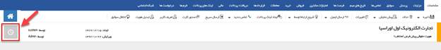
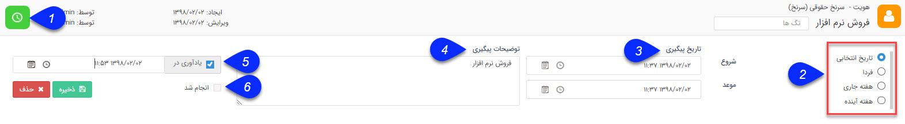
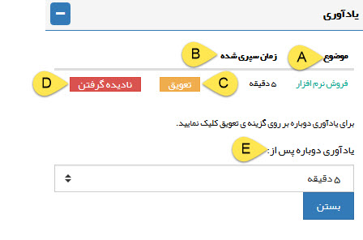

## یادآور و پیگیری

در صورتی که می خواهید در ارتباط با یکی از آیتم های سیستم یک پیگیری برای کاربری خودتان ایجاد کنید (به طور مثال پیگیری برای برقراری تماس) می توانید از قابلیت ایجاد پیگیری استفاده کنید، این قابلیت برای تمامی آیتم های crm اعم از پروفایل هویت ها و تمامی انواع سوابق وجود دارد. لیست پیگیری های خود را می توانید در[  ویجت پیگیری](https://github.com/1stco/PayamGostarDocs/blob/master/help%202.5.4/home/widget/Follow-up-today/Follow-up-today.md)  و همچنین از قسمت  وظیفه-پیگیری در[ کارتابل ](https://github.com/1stco/PayamGostarDocs/blob/master/help%202.5.4/home/widget/Cardboard/Task-tracking/Task-tracking.md)مشاهده نمایید.

برای دسترسی به این قسمت کافیست بر روی آیکن یادآور و پیگیری در زیر نوار ابزار مشخصات کلیک کنید.

همانطور که در عکس ملاحظه می کنید، می توانید در این قسمت تنظیمات مرتبط با یادآور و پیگیری مورد نظر خود را تعیین نمائید.

1.  آیکون ساعت: با کلیک بر روی این آیکون تنظیمات مرتبط با پیگیری و یادآور نمایش داده خواهد شد. در صورتی که پیگیری روی این آیتم تنظیم شده باشد، آیکون ساعت سبزرنگ خواهد شد

2. نوع انتخاب تاریخ: تاریخ پیگیری را مشخص کنید.

3. تاریخ پیگیری: بازه زمانی پیگیری را تعیین کنید. توجه کنید که نحوه نمایش پیگیری های ثبت شده در لیست پیگیری ها و وظایف بر اساس تاریخ موعد می باشد.

4. توضیحات پیگیری: عنوان و یا هر توضیح مرتبط با پیگیری مورد نظر را تعیین کنید.

5. یادآوری در: در صورتی که تمایل دارید این پیگیری در تاریخ و ساعت خاصی به شما یادآوری شود، این گزینه را فعال کرده و زمان مورد نظر خود برای نمایش یادآوری را وارد کنید.

پنجره یادآور: پیگیری هایی که برای آن ها یادآوری تنظیم کرده باشید به صورت زیر در تاریخ و ساعت وارد شده هرکدام نمایش داده خواهند شد. پنجره یادآوری تا زمانی که به تمامی آیتم های درون آن رسیدگی نشده باشد، به صورت مکرر ظاهر خواهد شد .

A. موضوع:  عنوان یادآوری را که تعیین کرده اید نمایش می دهد در صورتی که عنوانی تعیین نشده باشد، عنوان آیتمی (مانند مخاطب، فاکتور، یادداشت و .... )  که در سیستم بر آن یادآور گذاشته شده نشان داده می شود و با کلیک بر روی آن می توانید آن را مشاهده کنید.

B. زمان سپری شده: زمانی که از یادآور تنظیم شده گذشته است.

C. تعویق: می توانید یادآوری آیتم را به اندازه ای که در پایین پنجره یادآوری تعیین کرده اید به تعویق بیاندازید.

D. نادیده گرفتن: یادآور را حذف کرده و دیگر در خصوص این آیتم یادآوری نمایش داده نخواهد شد.

E. یادآوری دوباره پس از: زمان یادآوری بعدی را برای تعویق تعیین کنید.

6. انجام شد: با فعال کردن این گزینه پیگیری ثبت شده روی این آیتم غیر فعال می شود.