## نوار ابزار مشخصات

در  این نوار ابزار، می توانید از امکانات زیر استفاده نمایید.

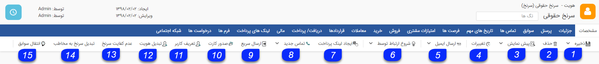

1. ذخیره/ذخیره و خروج: اطلاعات وارد شده را ذخیره می کند. اگر روی ذخیره و خروج کلیک کنید پس از ذخیره تغییرات، صفحه نیز بسته خواهد شد.

2. حذف:  هویت را حذف میکند. لازم به ذکر است در صورت وجود سوابق برای ان هویت ابتدا باید سوابق ان حذف گردد و مجددا برای حذف هویت اقدام کرد.

3. پیش نمایش/چاپ: قالب نمایش چاپی آیتم را نمایش می دهد و یا می توانید مستقیما آن را چاپ کنید.

> نکته: برای تنظیم این قالب به تنظیم قالب چاپ مراجعه کنید.

4. تغییرات: در این قسمت می توانید تاریخچه تمامی تغییراتی که از ذخیره اولیه این پروفایل تا کنون رخ داده است را مشاهده کنید. این تغییرات شامل ایجاد، ویرایش و مشاهده آیتم و همچنین افزودن یا حذف سابقه برای این هویت می باشد.

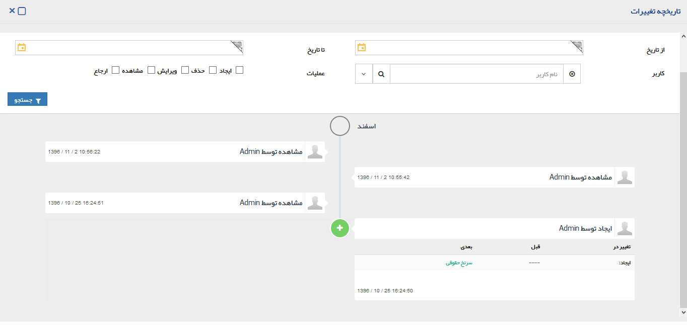

5.  ارسال ایمیل/ارسال فکس: می توانید به این هویت یک ایمیل یا فکس ارسال کنید. برای ارسال ایمیل از این قسمت نیاز به ماژول مدیریت صندوق های پستی است. می توانید فایلی را نیز به ایمیل مورد نظر خود پیوست نمایید.

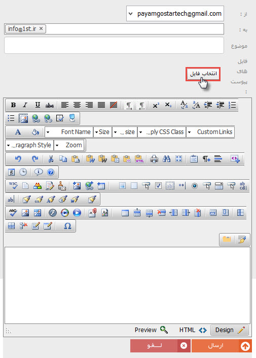

6. شروع ارتباط  توسط :

در صورتی که این هویت از طریق یکی از کمپین های اجرا شده شده جذب شده باشد،میتوانید این هویت را به ان کمپین از این طریق متصل کنید. با کلیک روی ذره بین میتوانید لیست کمپین های تبلیغاتی که در پیامگستر تعریف شده است را مشاهده کنید و کمپین مورد نظرتان را انتخاب کنید.

با مرتبط کردن هویت ها به کمپین های تبلیغاتی میتوانید گزارش های دقیق تری از میزان جذب مخاطبان از هریک از کمپین ها در بخش گزارشات تحلیلی نرم افزار دریافت کنید.

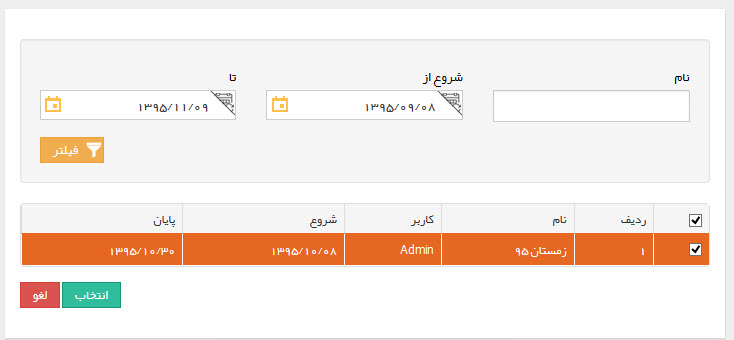

> نکته:  ممکن است یک هویت در بیشتر از یک گروه قرار گرفته باشد .

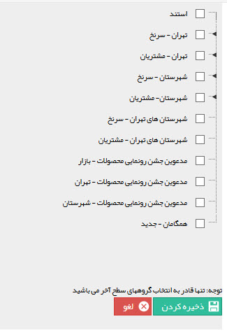

ایجاد لینک پرداخت : با استفاده از این دکمه می توانید لینک پرداختی برای مخاطب ایجاد و ارسال کنید. مخاطب با استفاده از لینک مزبور به درگاه پرداخت واسط هدایت ‌می شود تا عملیات پرداخت را به آسانی انجام دهد. برای مطالعه جزئیات بیشتر در این رابطه به صفحه " ایجاد لینک پرداخت " مراجعه کنید 

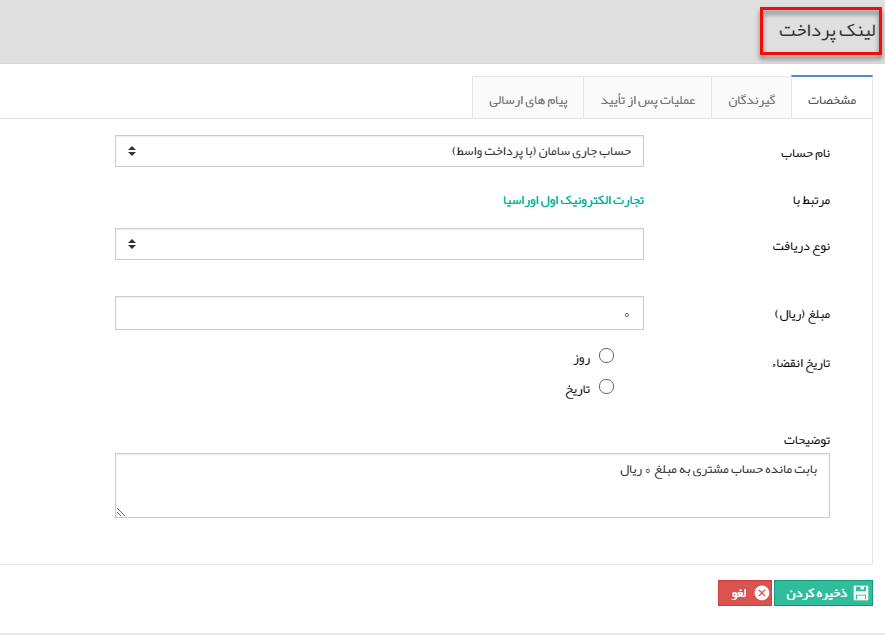

8. تماس جدید: با کلیک بر روی این دکمه می توانید یک تماس جدید ثبت کنید. همانطور که در شکل مشاهده می نمائید با کلیک برروی مثلث کنار آیتم "تماس جدید"  این قابلیت را در دسترس شما قرار می دهد که بتوانید تمامی سوابق دیگر را نیز برای این هویت ثبت کنید

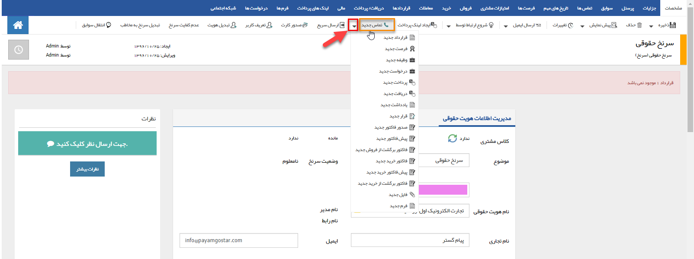

9. ارسال سریع:   از این طریق میتوان تنظیمات ارسال پیام به هویت مورد نظر را انجام داد .با کلیک کردن بر روی دکمه ارسال سریع در این بخش، پنجره زیر نمایش داده می شود. در این پنجره هویت انتخاب شده برای این ارسال در سمت راست، قسمت کادر گیرندگان نمایش داده می شود و پس از انتخاب رسانه ( پیامک، ایمیل، فکس و پیام در شبکه های اجتماعی) و تنظیم متن می توانید ارسال پیام را انجام دهید.

برای اطلاعات بیشتر به قسمت تبلیغات  مراجعه کنید.

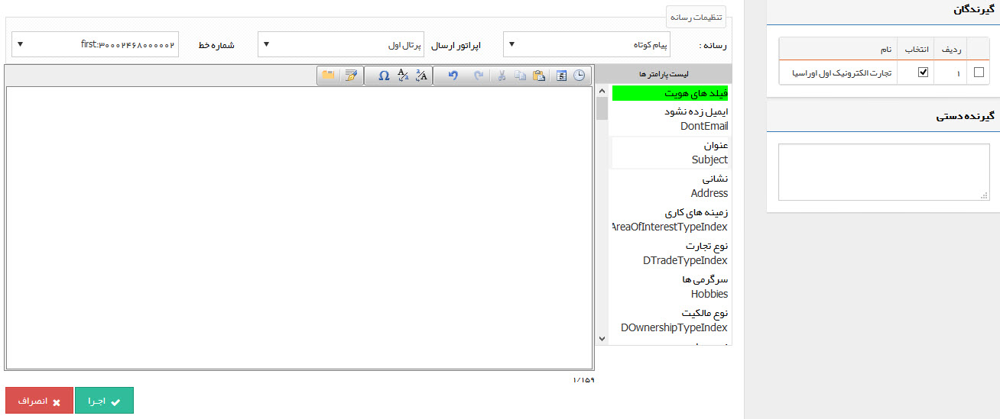

> نکته: همچنین شما می توانید چند شرکت در یک گروه و یا دسته بندی انتخاب کرده ، سپس با کلیک راست بر روی یکی از شرکت های انتخاب شده و در نهایت با انتخاب گزینه ارسال سریع به این پنجره دسترسی داشته باشید. برای اطلاعات بیشتر در خصوص نحوه ارسال پیام به  اطلاعات مشترک ابزارها مراجعه کنید .

10. صدور کارت: با کلیک کردن بر روی دکمه صدور کارت (در صورتی که ماژول صدور کارت برای مشتری را خریداری کرده باشید) پنجره ای به شکل زیر باز می شود و می توانید نمونه رو و یا پشت کارت را مشاهده و سپس چاپ نمایید. برای تنظیم قالب کارت مشتری به تنظیمات کارت مشتری مراجعه کنید

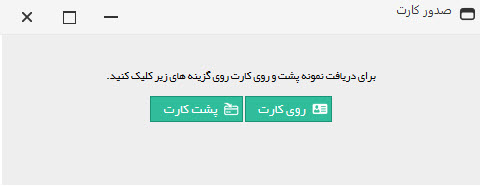

11. تعریف کاربر: در صورتی که ماژول باشگاه مشتریان را تهیه کرده باشید. می توانید به هر کدام از مشتریان خود از این روش نام کاربری و گذرواژه ای اختصاص دهید. مشتریان شما می توانند با این نام کاربری وارد داشبورد خود در قسمت باشگاه مشتریان نرم افزار شوند و لیست سوابق خود را مشاهده نمایند. به طور مثال فاکتورها، پرداخت ها و دیگر سوابق مربوط به خودشان را مشاهده کنند.

پس از ذخیره نام کاربری و رمز عبور برای مشتری، میتوانید در دفعات بعدی از این بخش اطلاعات کاربری را برای آن هویت ارسال نمایید.

> نکته : لازم به ذکر است که مشتریان که از این طریق برایشان نام کاربری و رمز عبور ایجاد کرده اید به صورت پیش فرض فعال هستند و حتی در صورت داشتن قالب پیام فعالسازی پیام فعالسازی برای انها ارسال نمیگردد.

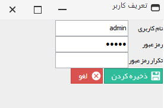

12. تبدیل هویت: می توانید با استفاده از این دکمه، هویت را تبدیل به نوع دیگری کنید. ( برای مثال سرنخ حقیقی را به حقوقی تبدیل کنید .)

13. عدم کفایت سرنخ: زمانی که سرنخ صلاحیت لازم برای تبدیل شدن به مخاطب را نداشته باشد از این دکمه استفاده کنید (سرنخ موفقیت آمیز نبوده است.)

> نکته: با کلیک بر روی این دکمه وضعیت سرنخ از نامعلوم به عدم کفایت تغییر می کند.

14. تبدیل سر نخ به مخاطب: سر نخ مورد نظر را به یک مخاطب تبدیل می کند. (سرنخ موفقیت آمیز بوده است .)

15. انتقال سوابق: می توانید با استفاده از این آیتم، سوابق ثبت شده برای هویت/هویت های دیگری را به این هویت منتقل کنید .

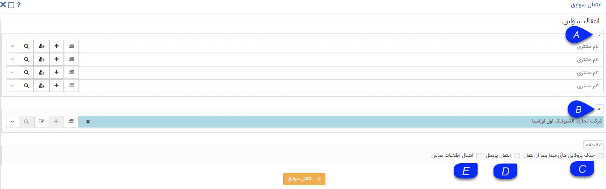

A. از: می توانید همزمان تا چهار هویت را انتخاب کنید تا سوابقشان به این هویت منتقل شود.

B. به: هویتی که به آن سوابق منتقل خواهد شد را نشان می دهد.

C. حذف پروفایل های مبدا بعد از انتقال: پس از انتقال موفقیت آمیز سوابق، هویت های مبدا را حذف می کند.

D. انتقال پرسنل: در صورتی که هویت های مقصد و مبدا حقوقی باشند، می توان پرسنل را نیز به این هویت انتقال داد.

E. انتقال اطلاعات تماس: علاوه بر سوابق میتوانید، اطلاعات تماس هویت های مبدا (تلفن، موبایل و ...) را به این هویت منتقل کنید.

 

16. خانه: به صفحه خانه نرم افزار باز می گردید.