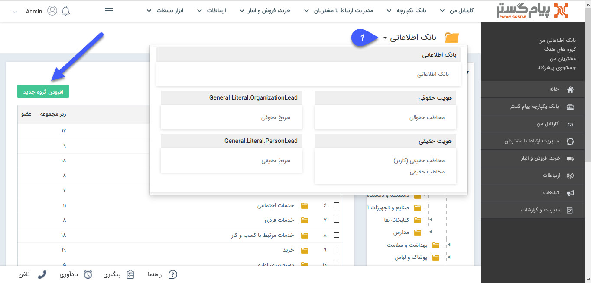
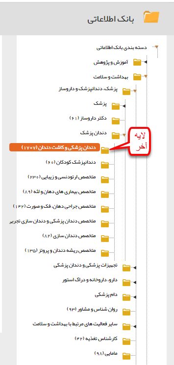

## تعریف دسته بندی بانک اطلاعاتی 

> مسیر دسترسی:  **بانک یکپارچه** >**بانک اطلاعاتی** > **افزودن گروه** 

در این قسمت میتوانید برای انواع هویت ها ( مخاطبان و سرنخ های خود) دسته بندی های مختلفی را ایجاد کنید.

و لیست دسته بندی هایی که ایجاد کرده اید را همراه با تعداد اعضا و تعداد زیر شاخه های آن مشاهده کنید.

این دسته بندی ها می تواند بر اساس منطقه ( برای مثال تهران، کردستان و ...) یا بر اساس حوزه کاری (برای مثال تولید کننده،خدمات و ...) و یا سایر روش هایی که برای کسب و کار شما مناسب است، انجام شود.

در نظر داشته باشید که این دسته بندی ها در تمامی قسمت های نرم افزار مورد استفاده قرار می گیرند (مانند ثبت مخاطب یا سر نخ جدید، جستجو، گزارش و ...).

بهتر است که دسته بندی هایی که ایجاد می کنید از لحاظ نام گذاری و تعداد زیر دسته بندی به گونه ای باشند که برای کاربران سردرگمی ایجاد نکنند.

> **نکته:** در صورت نیاز می توانید ماژول بانک فهرست مشاغل اول را که در 15 دسته بندی اصلی، اطلاعات مشاغل ثبت شده در پرتال اول(1st.ir ) را برای شما نمایش می دهد و شامل بیش از 200 هزار هویت مختلف
از مشاغل سراسر کشور است را به عنوان یک بانک کمکی تهیه کنید. این اطلاعات در قالب هویت هایی از نوع سرنخ در بانک اطلاعاتی شما نمایش داده خواهند شد

با کلیک بر روی "افزودن گروه جدید" می توانید یک دسته بندی جدید ایجاد کنید.

1)از طریق این بخش می توان  با فیلتر براساس نوع هویت، هویت ها با نوع مورد نظر را در بانک اطلاعاتی جستجو کرد.

 با دو بار کلیک بر روی هر کدام از دسته بندی ها می توانید محتوای آن دسته را مشاهده کنید و زیرشاخه های آن دسته بندی را مشاهده کنید. همچنین میتوانید دسته بندی جدیدی به زیر شاخه های این دسته بندی اضافه کنید.قابل ذکر است که در لایه اخر میتوانید لیست اعضای ان دسته بندی را مشاهده کنید.
 
 
 
 