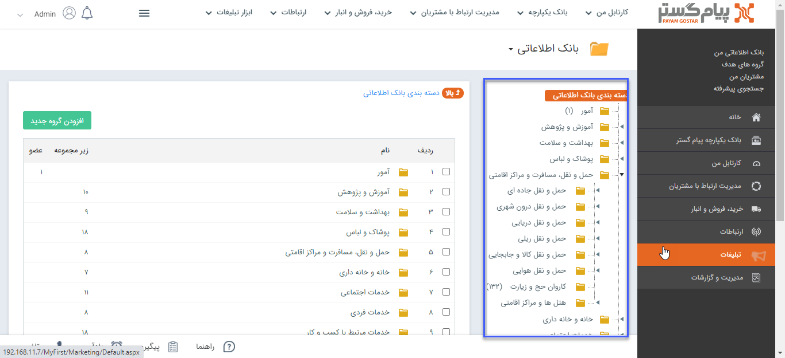

## مفهوم دسته بندی هویت ها

هویت‌ها را در بانک اطلاعاتی می‌توان  بر اساس حوزه کاری (برای مثال تولید کننده،خدمات و ...)، منطقه ( برای مثال تهران، کردستان و ...) و سایر روش هایی که برای کسب و کار شما مناسب است، دسته بندی کرد. 

در نظر داشته باشید که این دسته بندی ها در تمامی قسمت های نرم افزار مورد استفاده قرار می گیرند (مانند ثبت مخاطب یا سرنخ جدید، جستجو، گزارش و ...).

> **نکته:** لازم به ذکر است تعریف دسته بندی‌ها باید به گونه ای باشد که اشتراک هویت‌ها در آن ها حداقل باشد، به این معنی که هویت تکراری در دسته بندی‌ها وجود نداشته باشد.

