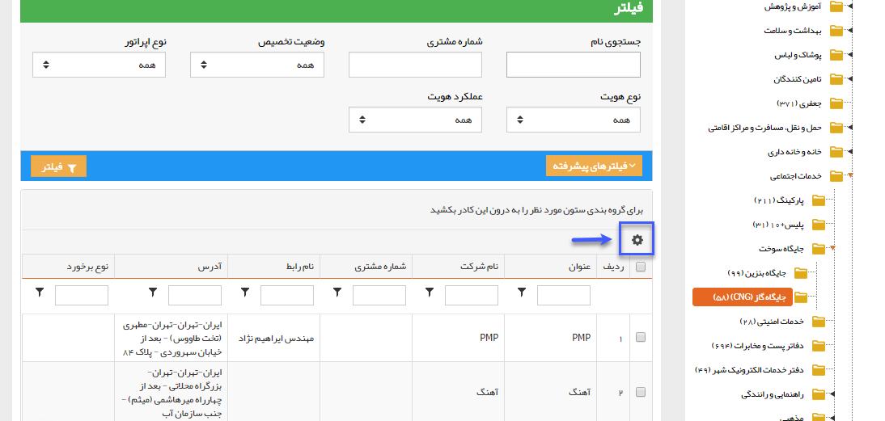

## شخصی سازی جدول هویت‌ها

برای تعیین ستون هاي مجاز به نمايش در لیست هویت(Gridview)میتوان از طریق بخش شخصی سازی crm از طریق تنظیمات نمایشی روی موجودیت هویت فیلد های مورد نظر جهت نمایش در لیست هویت را تعیین کرد . اين ستون ها به عنوان پیش فرض در جدول مخاطبان نمايش داده مي شود و کاربران از ميان گزينه هاي فعال اين قسمت میتوانند براي خود ستون هاي مورد نياز را انتخاب کنند.

هر کاربر در قسمت  با کليک بر روي آيکون تنظيمات در لیست هویت ها مي تواند از بين ستون هاي مجاز تعيين شده در اين قسمت، برخي از آن ها را براي خود فعال/غيرفعال کند.

1. فيلدهاي اصلي: مي توانيد تعيين کنيد که کداميک از خصوصيات پيش فرض هویت ها در ليست هویت ها نمايش داده شود.

2. خصوصيات اضافه شده: علاوه بر فيلدهاي اصلي، فيلدهايي که از طريق [شخصی سازی-افزودن مشخصه](https://github.com/1stco/PayamGostarDocs/blob/master/help%202.5.4/Settings/Personalization-crm/Overview/General-information/Add-features/Add-features.md) به  فیلد های انواع هویت اضافه شده اند را نيز مي توانيد به عنوان ستون هاي نمايش لیست هویت انتخاب کنيد.

