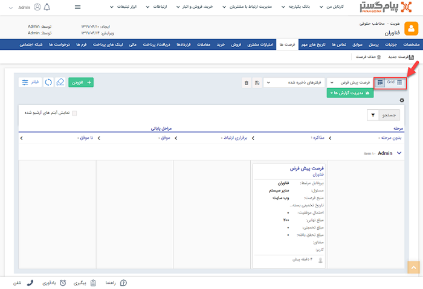
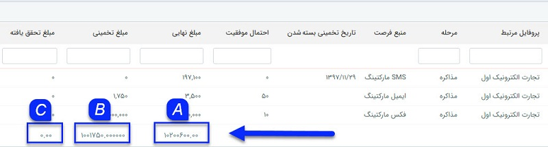

## فرصت ها

> مسیر دسترسی:  **صفحه‌ی هویت** >**فرصت‌ها** 

در این قسمت می توانید تمامی فرصت های ثبت شده برای این هویت را مشاهده کنید، همچنین می توانید یک فرصت جدید ایجاد کنید و یا فرصت های ایجاد شده را حذف کنید.

در این بخش لیست فرصت‌های ثبت شده برای هویت به دو حالت نمایش کانبان و لیستی قابل مشاهده می‌باشد.

در حالت کانبان فرصت‌ها براساس مراحلی که در آن قرار دارند نمایش داده می‌شود. (برای مطالعه بیشتر به بخش[ مرحله‌بندی](file%3A%2F%2F%2FC%3A%5CUsers%5CH.abasi%5CDocuments%5CGitHub%5CPayamGostarDocs%5Chelp%202.5.4%5CIntegrated-bank%5CDatabase%5CRecords%5Cleveling%5Cleveling.md) مراجعه کنید.)

با تغییر حالت نمایش از کانبان به GRID   نمایش فرصت‌ها بصورت لیستی خواهد بود 

1.  فرصت جدید : می توانید یک فرصت جدید برای ان هویت ایجاد کنید.

2.  حذف: می توانید یک فرصت را حذف کنید .

3. فیلترهای پیشرفته: با کلیک بر روی دکمه فیلترهای پیشرفته می توانید فیلترهای مختلفی برای جستجوی فرصت یا فرصت های مورد نظر خود داشته باشید

4. نوع فیلتر : می توانید فیلترهای انتخاب شده را با یک نام مشخص ذخیره کرد تا بتوان به سرعت از آن استفاده کرد .

5. جدول فرصت ها: در این جدول می توانید تمامی فرصت های ثبت شده برای این هویت را بر اساس فیلدهای فرصت (فیلد هایی که در بخش شخصی سازی برای نمایش در لیست فرصت انتخاب شده اند) را مشاهده کنید، برای آشنایی با هرکدام از این فیلدها به صفحه راهنمای[ فرصت جدید ](https://github.com/1stco/PayamGostarDocs/blob/master/help%202.5.4/Integrated-bank/Database/Records/New-opportunity/New-opportunity.md) مراجعه کنید. در واقع مزیت استفاده از این جدول در اینست که می توان در یک نگاه مشاهده نمود که فرصت های ثبت شده برای مشتری از چه منابعی شکل گرفته اند و یا اینکه در کدام مرحله قرار دارند. شما در این لیست امکان گزارش گیری از فرصت های ثبت شده برای این مخاطب را دارید .  برای آشنایی بیشتر با نحوه گزارش گیری به بخش[ گزارش ساز جدید ](https://github.com/1stco/PayamGostarDocs/blob/master/help%202.5.4/Management-and-reports/Report-Builder/Report-Builder.md)مراجعه کنید

A . مجموع نهایی : مجموع مبلغ نهایی وارد شده در هرکدام از فرصت ها را محاسبه می کند، این مبلغ برآوردی بر اساس محصولات وارد شده در فرصت به صورت خودکار تکمیل می گردد، اما می توانید به صورت دستی آن را تغییر دهید.

B. مجموع تخمینی : حاصل ضرب مبلغ برآوردی در درصد احتمال برابر با مبلغ مورد انتظار فرصت می باشد. با استفاده از این دکمه می توانید مجموع مبلغ تخمینی فرصت های ثبت شده برای هویت را در اختیار داشته باشید.

C. مجموع تحقق یافته: مبلغ تحقق یافته برابر با مبلغ نهایی فاکتورهای ثبت شده در سوابق فرصت می باشد. از این طریق می توانید مجموع مبالغ تحقق یافته یا  در واقع میزان فروش محقق شده از فرصت های مخاطب را در اختیار داشته باشید.

6 . راست کلیک: با راست کلیک بر روی یک فرصت می توان اقدام به صدور پیش فاکتور و یا فاکتور از روی آن کرد. و یا در سوابق این فرصت هر سابقه دیگری (تماس، فرم، یادداشت و ...) ثبت نمود و یا با انتخاب چند فرصت و راست کلیک کردن بر روی ان اقدام به ویرایش گروهی آنها کرد.
