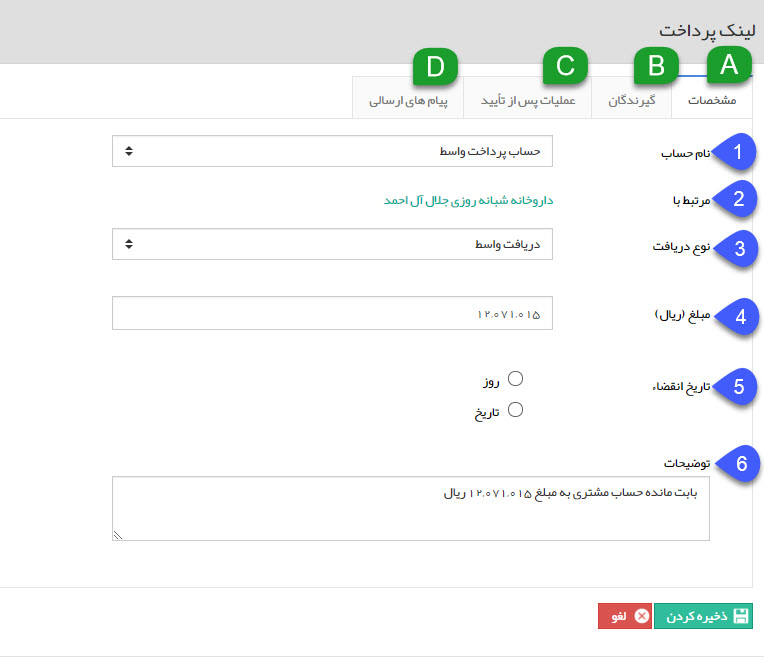
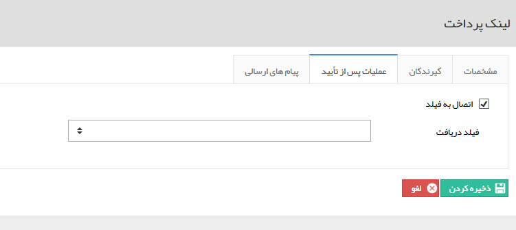

## ایجاد لینک پرداخت

> مسیر دسترسی:  **صفحه‌ی هویت** >**لینک‌های پرداخت** > **ایجاد لینک پرداخت** 

برای مدیریت پرداخت هایی که مخاطبان باید انجام دهند می توانید از قابلیت لینک پرداخت استفاده کنید. برای استفاده از این قابلیت ابتدا باید در قسمت مدیریت حساب های مالی برای حداقل یکی از حساب های تعریف شده، قابلیت پرداخت واسط را فعال کرده باشید. سپس می توانید یک لینک پرداخت برای مخاطب ایجاد کرده و پیامی حاوی این لینک از طریق رسانه های مختلف (پیام کوتاه، ایمیل یا شبکه اجتماعی) برای او ارسال کنید. مخاطب با استفاده از این لینک به صفحه درگاه پرداخت آنلاین هدایت می شود تا عملیات پرداخت را انجام دهد، پس از پرداخت مبلغ توسط مشتری، یک دریافت در سوابق این مخاطب به صورت خودکار ثبت خواهد شد. برای ایجاد یک لینک پرداخت باید چهار گام را طی کنید که در زیر شرح داده شده است.

A. مشخصات

1. نام حساب: می توانید از بین حساب های مالی تعریف شده در قسمت مدیریت حساب های مالی که قابلیت پرداخت واسط برای آن ها فعال شده است، یک حساب را انتخاب کنید تا مبلغ به آن واریز گردد.

2. مرتبط با: نام و لینک مشاهده مشخصات مخاطب مرتبط با لینک پرداخت در این قسمت نمایش داده می شود.

3. نوع دریافت:در صورت فعال کردن گزینه ثبت دریافت پس از تایید، میتوانید از بین انواع دریافت های تعریف شده در شخصی سازی، یک زیر نوع برای ثبت این دریافت انتخاب کنید. دریافت متناظر با این لینک که پس از پرداخت ایجاد می شود از این نوع خواهد بود.

4. مبلغ: مبلغی که مخاطب باید پرداخت کند را وارد کنید. این قسمت به صورت پیشفرض بر اساس مانده حساب مشتری تکمیل خواهد شد، اما می توانید آن را تغییر دهید.

نکته: در صورتی که در آیتم های مالی مانند فاکتور، دکمه ایجاد لینک پرداخت را بزنید، فیلد مبلغ بر اساس مبلغ فاکتور(یا آیتم های مالی دیگر) تکمیل خواهد شد.

5. تاریخ انقضا: در این قسمت مشخص کنید که لینک پرداخت ایجاد شده تا چه زمانی اعتبار دارد. این مدت زمان می تواند بر اساس تاریخ یا تعداد روز باشد. پس از گذشتن تاریخ انقضا لینک، امکان پرداخت از طریق آن وجود ندارد.

6. توضیحات: توضیحات مرتبط با این لینک پرداخت را در این قسمت وارد کنید. می توانید از مقدار وارد شده در این فیلد به عنوان یک پارامتر هوشمند در متن پیام ارسالی برای مشتری استفاده کنید.

در این قسمت مشخص می کنید که پیام ارسالی حاوی لینک پرداخت به چه شخصی ارسال گردد. همانطور که ملاحظه می کنید این پیام می تواند به مدیر، رابط یا هر سمت انتخابی دیگری ارسال گردد. علاوه بر این می توانید یک شماره موبایل یا ایمیل به صورت دستی در این قسمت به عنوان گیرنده پیام وارد کنید. توجه داشته باشید که این گزینه ها به صورت چک باکس هستند، بنابراین امکان انتخاب بیش از یک گزینه نیز وجود دارد.

عملیات پس از تایید .C

در صورتی که لینک پرداخت را روی یکی از آیتم ها مانند فاکتور، فرم یا ... ایجاد کنید و به این آیتم یک فیلد از نوع دریافت اضافه کرده باشید، می توانید در این قسمت تنظیماتی اعمال کنید که دریافت ثبت شده پس از پرداخت توسط مشتری به فیلد دریافت اضافه شده به آیتم متصل گردد. برای این منظور ابتدا چک باکس اتصال به فیلد را فعال کرده و سپس فیلد مورد نظر خود را انتخاب کنید

پیام های ارسالی.D

در این گام پیام ارسالی برای مشتری را تنظیم کنید

1. پیام پیش فرض: در صورتی که این گزینه را انتخاب کنید، پیام تنظیم شده در قسمت مدیریت پیام های سیستم برای درگاه پرداخت واسط برای مشتری ارسال خواهد شد.

2. پیام سفارشی: در صورت انتخاب این گزینه می توانید یک پیام سفارشی برای این لینک پرداخت برای مشتری تنظیم و ارسال کنید. رسانه یا رسانه های مورد نظر خود را انتخاب کرده و سپس متن پیام را تنظیم کنید.