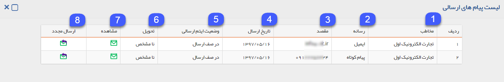
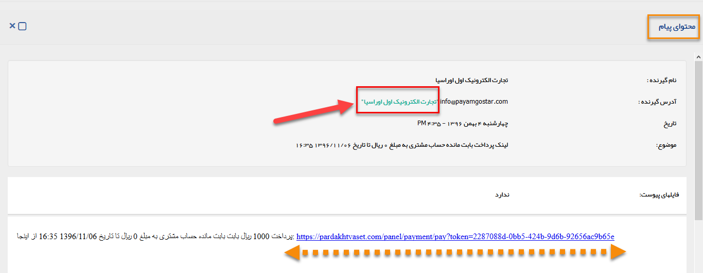
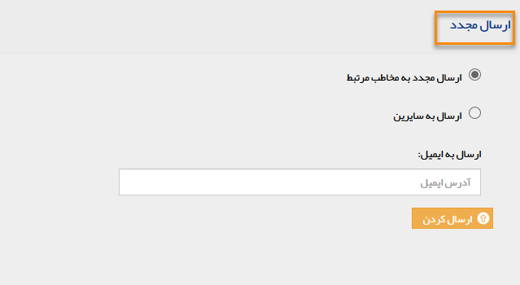

## لیست پیام های ارسالی

لیست پیام های ارسالی لینک های پرداخت به همراه جزئیات آن در این قسمت قابل مشاهده است.

1. مخاطب: نام مخاطب دریافت کننده پیام حاوی لینک پرداخت در این قسمت نمایش داده می شود.

> نکته: چنانچه درقسمت ارسال مجدد، انتخاب گردد که این پیام، به ایمیل دیگری نیز ارسال شود، نام مخاطب در این ستون درج نخواهد شد.

2. رسانه: نوع رسانه پیام های ارسال شده را نشان می دهد.

3. مقصد: با توجه به نوع رسانه، مقصدی که پیام ها به آن ارسال شده اند را نشان می دهد.

4. تاریخ ارسال: تاریخی که پیام ها در آن ارسال شده اند را نشان می دهد.

5. وضعیت آیتم ارسالی: وضعیت ارسال پیام های ارسالی، در این ستون نمایش داده می شود .

6. تحویل: وضعیت تحویل پیام های ارسالی، در این ستون نمایش داده می شود.

> نکته: برای اطلاع از انواع وضعیت ارسال و تحویل  می توانید به صفحه اطلاعات مشترک لیست ارسال پیام مراجعه کنید.

7. مشاهده: برای مشاهده ی محتوای پیام های ارسالی و لینک پرداخت ایجاد شده بر روی این دکمه کلیک کنید. 

> نکته: چنانچه درقسمت آدرس گیرنده، بر روی نام مخاطب کلیک کنید،می توانید به پروفایل مخاطب وارد شوید.

> نکته: با کلیک بر روی لینک پرداخت ایجاد شده به درگاه پرداخت واسط وارد شده و می توانید پرداخت مرتبط را به صورت آنلاین انجام دهید.

8. ارسال مجدد: برای ارسال مجدد پیام های حاوی لینک پرداخت ایجاد شده می توانید بر روی این دکمه کلیک کنید.  برای ارسال مجدد میتوانید ارسال به مخاطب مرتبط و یا ارسال به سایرین را انتخاب نمائید.

> نکته: در نظر داشته باشید در ارسال مجدد برای ارسال به سایرین، باید آدرس ایمیل گیرنده یا مقصد مورد نظر را وارد نمائید.  

