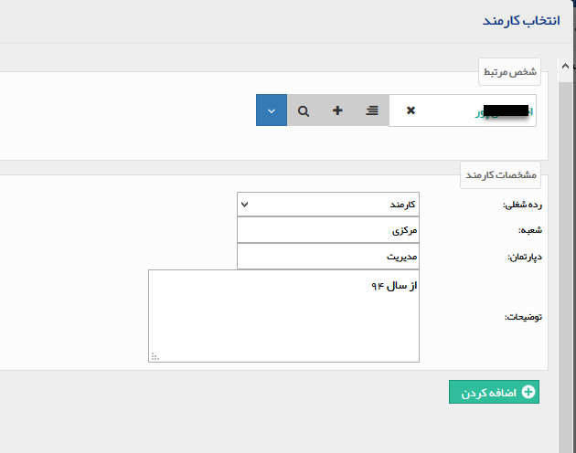

## پرسنل/شرکت ها

قابلیت ارتباط دادن هویت های حقیقی و حقوقی به یکدیگر از طریق این صفحه وجود دارد. این تب برای هویت های حقوقی با نام پرسنل و برای هویت های حقیقی با نام شرکت ها مشاهده می شود و در صورتی که در هر کدام از انواع هویت ارتباطی تعریف گردد، در هویت متناظر نیز به صورت خودکار نمایش داده می شود ( به طور مثال اگر برای یکی از شرکت ها، پرسنل تعریف کنید در پروفایل پرسنل تعریف شده نیز در تب شرکت ها، این ارتباط را مشاهده خواهید نمود)

پرسنل

در این بخش امکان اضافه نمودن، حذف و ویرایش اطلاعات پرسنلی هر کدام از شرکت ها وجود دارد.

> نکته:توجه داشته باشید که این قسمت تنها برای مخاطبان و سرنخ های حقوقی وجود دارد.

1. انتخاب کارمند : می توانید یک مخاطب یا سرنخ حقیقی که قبلا در بانک اطلاعاتی ذخیره شده است را در این قسمت برای اضافه شدن به پرسنل این شرکت انتخاب کنید. نام هویت مورد نظر را وارد کرده و سپس رده شغلی این شخص را در سازمان مشخص کنید، در صورت تمایل می توانید فیلدهای شعبه، دپارتمان و توضیحات را نیز تکمیل نمایید.

کارمند جدید: می توانید یک هویت حقیقی جدید تعریف کرده و این هویت را به عنوان پرسنل این شرکت تعیین کنید.

2. انتخاب به عنوان رابط: در صورتی که با فرد خاصی در شرکت مورد نظر در ارتباط هستید می توانید پس از اضافه کردن آن کارمند با انتخاب گزینه " انتخاب به عنوان رابط" آن فرد را از سایر پرسنل متمایز نمایید زیرا ارتباط با هویت های حقوقی بصورت پیش فرض با رابط انجام می شود. همچنین میتوانید با انتخاب حذف از رابط  آن پرسنل را از سمت رابط بودن خارج کرد . هر کدام از پرسنل که به عنوان رابط انتخاب شود در صفحه مشخصات عمومی به جای نام رابط نمایش داده می شود.

> نکته: توجه داشته باشید که تعیین کردن رابط از آن جهت اهمیت دارد که در بیشتر ارتباطات خودکار سیستم (مانند پیامک هایی که برای آن شرکت ارسال می شود) رابط مورد خطاب قرار می گیرد.

3. انتخاب به عنوان مدیر: می توانید مدیر شرکت مورد نظر را نیز با استفاده از این گزینه تعیین نمایید پس از انتساب این شخص به این سمت امکان حذف از این سمت با گزینه حذف از مدیر وجود دارد.

> نکته: شما می توانید پرسنل داخل یک پروفایل را به تنهایی عضو یک گروه خاص کنید و از پروفایل شرکت جدا نمایید. همچنین می توانید به هر پرسنل شماره مشتری جداگانه ای اختصاص دهید. در واقع پرسنل تعریف شده هویت های حقیقی جداگانه ای هستند که تمامی امکانات یک هویت را دارا هستند.

### 
شرکت ها

> نکته:  توجه داشته باشید گزینه شرکت ها به جای  تب پرسنل در مخاطبان و سرنخ های حقیقی وجود دارد .

در این بخش نیز امکان اضافه نمودن، حذف و ویرایش اطلاعات شرکت ها برای هر کدام از مخاطبان حقیقی وجود دارد.

