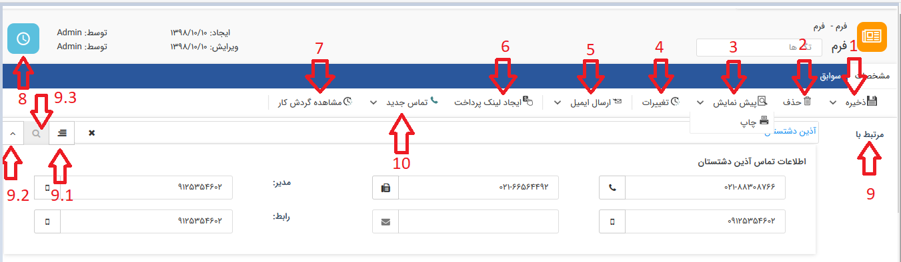
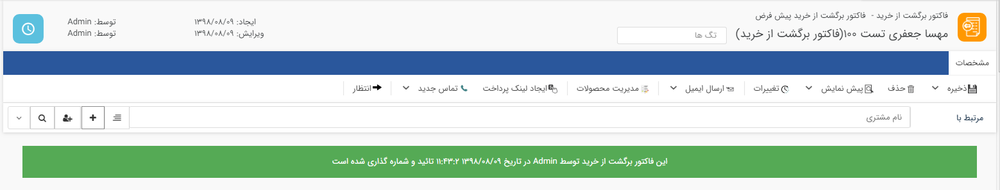
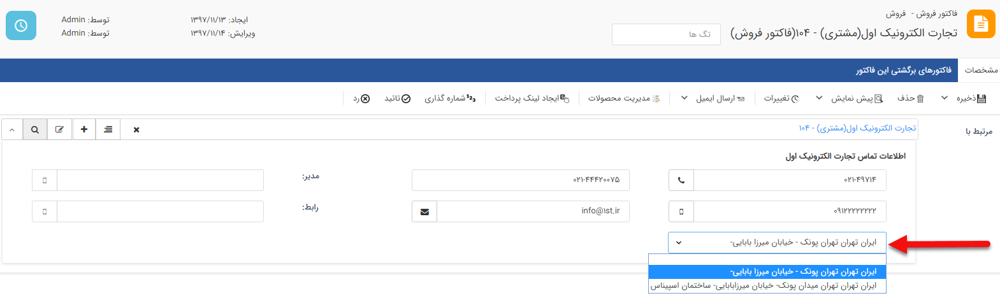
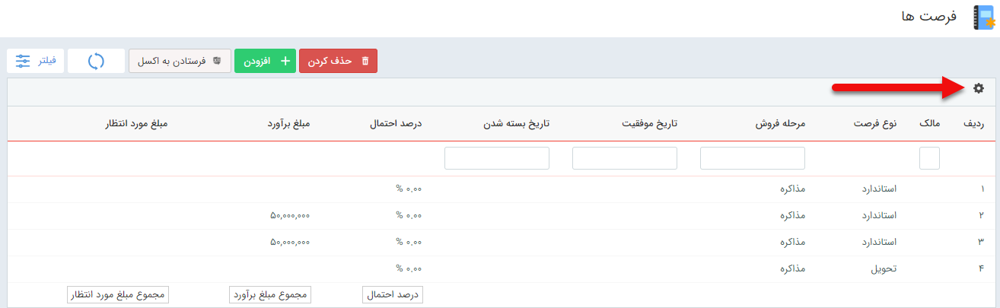

## اطلاعات مشترک سوابق

در تمامی انواع سوابق (تماس تلفنی، یادداشت، فایل، فاکتور، فرم و ...) تنظیمات مشترکی وجود دارد که به شرح زیر است.

1. ذخیره/ذخیره خروج: آیتم مورد نظر را ذخیره می کند، آیتم مورد نظر را ذخیره میکند و صفحه ویرایش آن را می بندد.

2. حذف: در صورت داشتن مجوز حذف می توانید این آیتم را حذف نمایید.

3. پیش نمایش/چاپ: در صورتی که برای آیتم مورد نظر قالب چاپ تنظیم شده باشد، می توانید قالب چاپی را مشاهده کنید. (برای مشاهده و ویرایش قالب چاپ آیتم ها به[ اطلاعات کلی ](https://github.com/1stco/PayamGostarDocs/blob/master/help%202.5.4/Settings/Personalization-crm/Overview/General-information%2FGeneral-information.md)مراجعه کنید.) می توانید قالب چاپی این آیتم را برای چاپ شدن به چاپگر تنظیم شده بر روی نرم افزار ارسال کنید.

4. تغییرات: لیست تغییرات (ایجاد، ویرایش و مشاهده) انجام شده بر روی این آیتم را نمایش می دهد.

5. ارسال ایمیل/ارسال فکس: می توانید قالب چاپی که برای این آیتم تعیین کرده اید را مستقیما ایمیل کنید. (برای استفاده از این امکان نیاز به ماژول مدیریت صندوق های پست الکترونیک است.) می توانید قالب چاپی این آیتم را به صورت فکس برای مخاطب مورد نظر ارسال نمایید.

6. ایجاد لینک پرداخت: می توانید از طریق این گزینه برای مشتری لینک پرداخت ارسال کنید. (برای استفاده از این امکان به ایجاد [لینک پرداخت](https://github.com/1stco/PayamGostarDocs/tree/master/help%202.5.4/Integrated-bank/Database/Payment-links/Create-payment-link) مراجعه کنید)

7. مشاهده گردش کار: در صورت چرخه کاری بر روی آن آیتم فعال باشد،با استفاده از  این دکمه می توانید چرخه طی شده این آیتم را مشاهده و ویرایش نمایید. (ویرایش چرخه کاری مرتبط با هر آیتم توسط مدیر سیستم و همچنین مالک مشخص شده برای آن آیتم وجود دارد. برای اطلاعات بیشتر در این خصوص به [مالک آیتم](https://github.com/1stco/PayamGostarDocs/blob/master/help%202.5.4/Settings/Personalization-crm/Overview/General-information/Item-owner/Item-owner.md) مراجعه کنید.)

8. پیگیری: می توانید برای این آیتم پیگیری و یادآور تنظیم نمایید. (برای اطلاعات بیشتر در این خصوص  به[ یادآوری و پیگیری  ](https://github.com/1stco/PayamGostarDocs/blob/master/help%202.5.4/Integrated-bank/Database/General-specifications/Reminder-and-follow-up/Reminder-and-follow-up.md)مراجعه کنید.)

9. مرتبط با: دراین بخش نام  هویت و همچنین نام ایتمی که این ایتم در در سوابق آن ذخیره می شود را نشان می دهد ( به طور مثال اگر یک سابقه از نوع تماس تلفنی در سوابق آیتم فرصت ثبت کنید در این قسمت نام هویت مرتبط به همراه عنوان فرصت نمایش داده خواهد شد). می توانید با کلیک کردن بر روی آیکون حذف، هویت و یا آیتم دیگری را برای ذخیره این سابقه انتخاب کنید. توجه داشته باشید که اگر به هویت مرتبط با این آیتم، رنگ اختصاص داده باشید، این رنگ در این قسمت نمود پیدا خواهد کرد.

9.1. مشاهده و انتخاب سوابق : اگر هویت انتخاب شده باشد، با استفاده از این آیکون می توانید سوابق او را مشاهده کنید یا در صورت نیاز این آیتم را به یک سابقه خاص آن (مثلا فرم را به یک قرارداد) وصل کنید.

9.2. اگر هویت انتخاب شده باشد از این بخش میتوانید اطلاعات تماس هویت را مشاهده کنید.

> نکته : برای مشاهده اطلاعات تماس هویت مورد نظر از طریق این کنترل ها، بایستی دارای مجوز مشاهده هویت انتخاب شده باشید در غیر این صورت امکان مشاهده اطلاعات تماس هویت وجود ندارد.

9.2.1. در این قسمت شماره تلفن پیش فرض هویت نمایش داده می شود.

در صورتی که از سیستم VOIP استفاده می کنید با کلیک بر روی این گزینه نرم افزار به صورت خودکار با مخاطبی که انتخاب شده تماس برقرار

> نکته: توجه داشته باشید که این قابلیت در تمامی سیستم های VOIP قابل اجرا نیست. (برای اطمینان با پشتیبانی تماس بگیرید.)

9.2.2. در این قسمت شماره موبایل پیش فرض هویت نمایش داده می شود.

در صورتی که از سیستم VOIP استفاده می کنید با کلیک بر روی این گزینه نرم افزار به صورت خودکار با مخاطبی که انتخاب شده تماس برقرار می کند.

9.3.3. در این قسمت شماره فکس پیش فرض هویت نمایش داده می شود.

با کلیک روی این گزینه می توانید یک فکس به مخاطب انتخاب شده ارسال کنید.

9.2.4. در این قسمت آدرس ایمیل هویت نمایش داده می شود.

با کلیک روی این گزینه می توانید یک ایمیل به مخاطب انتخاب شده ارسال کنید.

9.2.5. در این قسمت اگر هویت حقوقی باشد نام مدیر مجموعه نمایش داده می شود.

9.2.6. در این قسمت اگر هویت حقوقی باشد نام رابط هویت حقوقی نمایش داده می شود.

توجه: بعد از ذخیره آیتم های فرم، فرصت، وظیفه، درخواست پشتیبانی و قرارداد در پیام گستر، گزینه (تب) سوابق نیز ظاهر می شود. امکان ثبت تمام سوابق و پیگیری های مربوط به هریک از این انواع سوابق در داخلشان امکان پذیر است.

> نکته:  در صورتی که کاربر مجوز مشاهده آیتم هویت را نداشته باشد هیچ یک از اطلاعات تماسی هویت به کاربر نمایش داده نمی شود

> نکته: در صورتی که ماژول شخصی سازی CRM فعال باشد، می توانید از بخش شخصی سازی CRM پارامترهای مورد نیاز (فیلدها) خود را به آیتم اضافه کنید. طبیعتا در صورت اضافه کردن فیلدهای دیگر، صفحه مربوط به این آیتم تغییر پیدا می کند.

9.3. از این بخش میتوانید هویت مورد نظر را بعنوان مرتبط با، از بانک اطلاعاتی انتخاب کنید .

> نکته : هنگام انتخاب مرتبط با در صورت تایپ نام و یا قسمتی از نام هویت مورد نظر، اگر هویت مورد نظر در لیست هویت ها یافت نشد می توانید با استفاده از کلید افزودن، هویت جدید ایجاد کنید .

نوع پیش فرض هویت در شخصی سازی هر آیتم روی فیلد "هویت مرتبط پیش فرض" به صورت جدا مشخص می شود و زمان ایجاد نمایش داده می شود.

دسته بندی هویت در تنظیمات کلی قسمت دسته بندی کاربران تعریف می شود. (برای اطلاعات بیشتر به دسته بندی کاربران مراجعه کنید.)

هویت ایجاد شده در بانک اطلاعاتی ایجاد شده و به عنوان مرتبط با آیتم ثبت می شود.

 10. با استفاده از این قسمت امکان ثبت سابقه بر روی این ایتم فراهم می شود .
 
### اطلاعات مشترک فاکتورها و پیش فاکتورها

 در صورتی که آیتم یکی از انواع فاکتورها (فروش و خرید و برگشت از فروش) یا پیش فاکتور (فروش و خرید و برگشت از فروش) باشد، در قسمت سوابق، علاوه بر فیلدهایی که در بالا توضیح داده شد، فیلد آدرس نیز وجود دارد.
 
 
 
 زمانی که هویت مرتبط با فاکتور و یا پیش فاکتور بیش از یک آدرس داشته باشد، امکان انتخاب آدرس مورد نظر هویت در سابقه آیتم توسط کاربر وجود دارد.

> نکته: مقدار پیش فرض این فیلد، آدرس پیش فرض انتخاب شده در اطلاعات ارتباطی هویت است.

در پیش نمایش فاکتور ها، پارامتری به نام "آدرس فاکتور" موجود است که آدرس انتخاب شده در این فیلد را به خود اختصاص می دهد.

> نکته: در صورتی که کاربر مجوز مشاهده آیتم هویت را نداشته باشد هیچ یک از اطلاعات تماسی هویت به کاربر نمایش داده نمی شود.

### شخصی سازی جدول سوابق

کاربر از این بخش انتخاب می کند که چه فیلدهایی در ستون جدول نمایش داده شود و از این طریق امکان شخصی سازی جداول لیست ایتم ها وجود دارد.

برای مثال در لیست فرصت ها که در زیر مشاهده می کنید فیلدهای مالک، نوع فرصت، مرحله فروش، تاریخ موفقیت، تاریخ بسته شدن، درصد احتمال، مبلغ برآورد و مبلغ مورد انتظار در جدول نمایش داده شده است.

برای تغییر این ستون ها، طبق شکل روی علامت تنظیمات کلیک کنید.

با باز شدن تنظیمات مربوط به شخصی سازی جدول لیستی از فیلدهای مرتبط با آیتم را مشاهده می کنید.

فیلدهایی که در این قسمت نمایش داده می شوند فقط شامل فیلدهای ثابت و فیلدهای اضافه شده روی نوع اصلی آیتم که در بخش شخصی سازی آیتم برای نمایش در لیست تعیین شده اند.

1. فیلدهای اصلی:  فیلدهای اصلی شامل فیلدهای ثابت آیتم می شوند. برای مثال فیلد مرحله فروش و تاریخ موفقیت و نوع فرصت جزو فیلدهای ثابت فرصت هستند.

2. فیلدهای اضافه شده: فیلدهای اضافه شده شامل فیلدهای اضافه شده توسط کاربر روی نوع آیتم اصلی می شوند. برای مثال فیلد تاریخ بازرسی و تعداد بازرسان توسط کاربر به آیتم فرصت اضافه شده است.

با فعال کردن هر گزینه، فیلد انتخاب شده به جدول اضافه می شود و مقدار آن نمایش داده می شود.

برای مثال با انتخاب فیلد "تاریخ بازرسی" و غیرفعال کردن فیلدهای "مبلغ مورد انتظار" و "تاریخ بسته شدن" و "مالک" ، جدول فرصت به شکل زیر درمی آید.

 