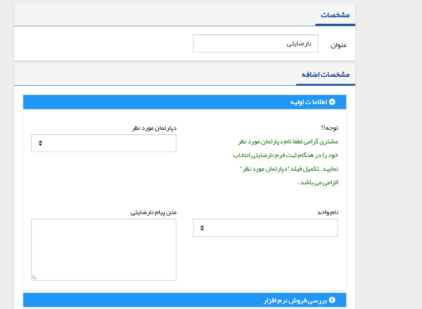

## فرم جدید

با کلیک بر روی دکمه فرم جدید می توانید، یک فرم ها  از انواع فرم های تعریف شده در قسمت شخصی سازی، مدیریت فرم ها را برای این هویت ایجاد کنید. به طور مثال فرم نظرسنجی، نارضایتی و ... .

 فرم تنها سابقه ای است که هیچ فیلد پیش فرضی ندارد و تمامی فیلدهای آن توسط شما تعریف می شود.

برای ساخت یک فرم به قسمت[ مدیریت فرم ها](https://github.com/1stco/PayamGostarDocs/blob/master/help%202.5.4/Settings/Personalization-crm/Form-management/Form-management.md) مراجعه کنید.

به طور مثال در تصویر زیر یک فرم نارضایتی را مشاهده میکنید.

> نکته: توجه داشته باشید فرم از سوابقی است که می تواند به پروفایل هیچ هویتی متصل نگردد و با خالی بودن قسمت "مرتبط با" قابل ذخیره کردن است.

> نکته مهم: لطفا ابتدا قسمت [ اطلاعات مشترک سوابق ](https://github.com/1stco/PayamGostarDocs/blob/master/help%202.5.4/Integrated-bank/Database/Records/Joint-record-information/Joint-record-information.md)را مطالعه کنید.

