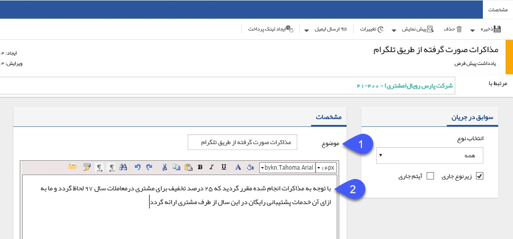

## یادداشت

می توانید برای ذخیره اطلاعات و توضیحات به خصوصی در مورد مخاطب از قابلیت یادداشت گذاری استفاده نمایید.

> نکته مهم: لطفا ابتدا قسمت[  اطلاعات مشترک سوابق](https://github.com/1stco/PayamGostarDocs/blob/master/help%202.5.4/Integrated-bank/Database/Records/Joint-record-information/Joint-record-information.md) را مطالعه کنید.

1. موضوع: موضوع یادداشت را تعیین کنید.

2. توضیحات: متن یادداشت خود را در این قسمت وارد نمایید.
