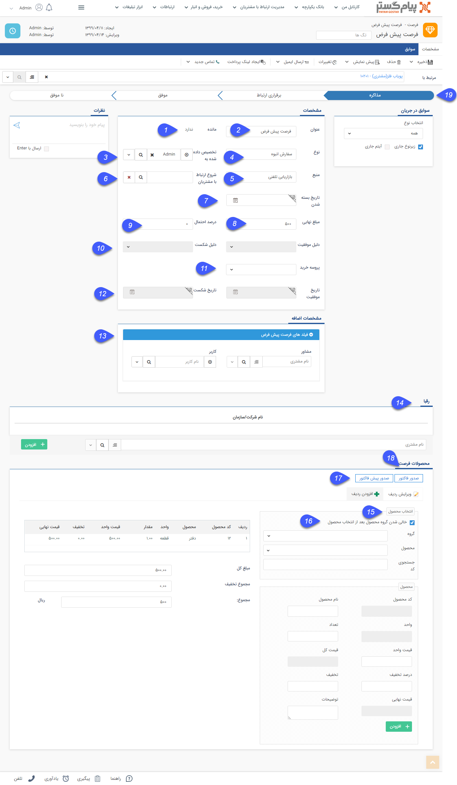

## فرصت جدید

> مسیر دسترسی:  **صفحه‌ی هویت** >**تب سوابق** > **فرصت جدید** 

با استفاده از این آیتم می توانید مراحل فروش مجموعه خود را منظم کرده و دلایل شکست و یا موفقیت فرصت های فروش خود را مورد ارزیابی قرار دهید. این گزارشات بعدها می تواند به عنوان یک وزنه اساسی در تعیین راهبردهای فروش مورد استفاده قرار گیرد تا از طریق آن بتوان دلایل به هدر رفتن فرصت های فروش را شناسایی و برطرف کرد و یا دلایل موفقیت فروش را تقویت و تثبیت کرد. 

> نکته مهم: لطفا ابتدا قسمت[ اطلاعات مشترک سوابق ](https://github.com/1stco/PayamGostarDocs/blob/master/help%202.5.4/Integrated-bank/Database/Records/Joint-record-information/Joint-record-information.md)را مطالعه کنید.

1. مانده: مانده حساب مرتبط با این فرصت را نمایش می دهد، در واقع اگر در سوابق این فرصت آیتم هایی ایجاد کنید که مشتری را بدهکار یا بستانکار می کند (آیتم های فاکتور، دریافت/پرداخت و قرارداد) میزان بدهکاری یا بستانکاری مشتری که مرتبط با این فروش است را می توانید در این قسمت مشاهده کنی

> نکته: توجه داشته باشید که این مانده حساب ممکن است با مانده حساب اصلی مشتری که در صفحه مشخصات پروفایل نمایش داده می شود، متفاوت باشد. در واقع یکی از فواید آیتم فرصت فروش، در اختیار داشتن تمامی فعالیت های انجام شده در پروسه فروش به صورت یکپارچه می باشد و اگر زمانی که فرصت به نتیجه رسید، آیتم های فاکتور، قرارداد، دریافت و فاکتور برگشت از فروش را در سوابق فرصت ایجاد کنید، در هر مرحله از فروش می توانید وضعیت بدهکاری یا بستانکاری مشتری که مرتبط با این فروش است را در این قسمت مشاهده کنید.2.  عنوان: عنوان مناسبی برای فرصت برگزینید. ( این عنوان نشان دهنده عنوان پروژه فروش می تواند باشد.)

3. تخصیص داده شده به: کاربر مرتبط با این فرصت فروش را مشخص نمایید. ( این کاربر مسئولیت به ثمر رساندن این فرصت را بر عهده دارد.)

4. نوع: نوع این فرصت را مشخص کنید. این انواع اگر به مجموعه شما مرتبط نیست می توانید با توجه به زمینه فعالیت شرکت آیتم هایی را در این قسمت اضافه نمایید. ( به قسمت [مدیریت آیتم های سیستم ](https://github.com/1stco/PayamGostarDocs/blob/master/help%202.5.4/Basic-Information/Management-of-system-items/Management-of-system-items.md)مراجعه کنید.)

5. منبع: نشان دهنده روش جذب مشتری است و می توان آیتم های مختلفی را به آن اضافه نمود. [(مدیریت آیتم های سیستم ) ](https://github.com/1stco/PayamGostarDocs/blob/master/help%202.5.4/Basic-Information/Management-of-system-items/Management-of-system-items.md)به طور مثال : تماس تلفنی، تبلیغات، نمایشگاه، معرفی همکار یا دوست و ...

6. شروع ارتباط با مشتریان: با استفاده از این فیلد می توانید این فرصت فروش را به یکی از کمپین های تبلیغاتی تعریف شده در نرم افزار متصل کنید (مدیریت کمپین های تبلیغاتی ). با تعریف ارتباط فرصت ها و کمپین های تبلیغاتی، گزارشات دقیق تری از تعداد فرصت های بوجود آمده از کمپین های تبلیغاتی و میزان فروش مرتبط با کمپین ها در گزارشات تحلیلی ساختاریافته خواهید داشت.

7. تاریخ بسته شدن: هر فرصت فروش برای به نتیجه رسیدن نیاز به پیگیری از طرف کارشناسان فروش دارد. با استفاده از این فیلد می توانید تاریخ بسته شدن این فرصت و در واقع بیشینه زمان ممکن برای پیگیری این فرصت را تعیین کنید. توجه داشته باشید که پس از گذشتن این تاریخ، نرم افزار ممانعتی از پیگیری دوباره و ویرایش این فرصت به عمل نمی آورد و وارد کردن این تاریخ صرفا جهت اطلاع رسانی زمان موعد پروسه فروش می باشد.

8. مبلغ برآورد: مبلغ برآورد فروش خود را می توانید تعیین کنید تا میزان اهمیت یک فرصت را از لحاظ میزان احتمالی سود دریابید. توجه داشته باشید که اگر محصولات مرتبط با این فرصت را وارد کنید، مبلغ برآوردی به صورت خودکار و بر اساس قیمت های تعریف شده در مدیریت محصولات درج خواهد شد.

9. احتمال: احتمال خرید از جانب مشتری و در واقع احتمال موفق شدن این فرصت فروش را نشان می دهد.

10. دلیل موفقیت/شکست: پس از به نتیجه رسیدن فرصت که ممکن است موفق یا ناموفق باشد، می توانید دلیل موفقیت یا شکست را وارد کنید تا بتوانید تحلیل دقیق تری از نقاط قوت و ضعف سازمان خود در بخش فروش داشته باشید. با توجه به شناخت خود از دلایل موفقیت و شکست فرصت های فروش،گزینه های مرتبط با این لیست ها را در قسمت مدیریت آیتم های سیستم تعریف کنید. (این لیست ها را می توانید با عناوین "علت به دست آوردن فرصت" و "علت از دست دادن فرصت" در مدیریت آیتم های سیستم بیابید)

11. پروسه خرید: نوع تصمیم گیری مشتری برای خرید را تعیین می کند. (اینکه مشتری به صورت فردی برای خرید تصمیم می گیرد یا خرید او از ما نیاز به تصمیم گیری یک گروه دارد)

12. تاریخ موفقیت/شکست: پس از به نتیجه رسیدن فرصت (موفق یا ناموفق شدن مرحله فروش) فیلد تاریخ موفقیت یا تاریخ شکست به صورت خودکار درج خواهد شد و امکان تغییر آن به صورت دستی وجود ندارد. با در اختیار داشتن این تاریخ و مقایسه آن با تاریخ ایجاد فرصت، می توانید بازه زمانی پیگیری این فرصت را تحلیل کنید.

13. مشخصات اضافه: می توانید در قسمت [شخصی سازی،](https://github.com/1stco/PayamGostarDocs/blob/master/help%202.5.4/Settings/Personalization-crm/Overview/General-information/Add-features/Add-features.md) فیلدهای مورد نیاز خود را به آیتم فرصت اضافه کنید تا بتوانید اطلاعات کامل تری از پروسه فروش خود داشته باشید (به طور مثال نحوه ارسال بار برای مشتری یا مذاکرات مرتبط با شرایط پرداخت). فیلدهای اضافه شده در این قسمت نمایش داده خواهند شد.

14. رقبا: نام رقبایی که در این فرصت ممکن است به دلیل وجود آنها فرصت به حالت ناموفق و شکست خورده در آید را وارد کنید تا بتوانید آنالیز دقیق تری از رقبای خود داشته باشید.

15. انتخاب محصول: خدمات و یا محصولاتی که قصد فروش آن ها را در این فرصت دارید، وارد کنید. مزیت وارد کردن محصولات در فرصت این است که مبلغ برآوردی به صورت خودکار درج خواهد شد و همچنین می توانید به راحتی و با کلیک بر روی یک دکمه از این محصولات پیش فاکتور یا فاکتور صادر کنید

16. در صورت غیر فعال کردن این گزینه، پس از انتخاب یک محصول، دسته بندی محصول انتخاب شده باز می ماند تا بتوانید از همان دسته بندی یک یا چند محصول دیگر را انتخاب کنید.

17. صدور پیش فاکتور: می توانید از روی این فرصت یک پیش فاکتور ایجاد نمایید که در محتوای آن محصولات تعریف شده در این فرصت به عنوان کالا درج شده اند.

18. صدور فاکتور: می توانید از روی این فرصت یک فاکتور ایجاد نمایید که در محتوای این فاکتور محصولات تعریف شده در این فرصت به عنوان کالا درج شده اند.

19. مرحله فروش: نشان دهنده مراحل فروش به مشتری است و می تواند یکی از گزینه های برقراری ارتباط، مذاکره و ... باشد. (البته شما می توانید در شخصی سازی فرصت مراحل مورد نظر خود را تعریف کنید، برای مطالعه بیشتر به بخش[ مرحله بندی ](file%3A%2F%2F%2FC%3A%5CUsers%5CH.abasi%5CDocuments%5CGitHub%5CPayamGostarDocs%5Chelp%202.5.4%5CIntegrated-bank%5CDatabase%5CRecords%5Cleveling%5Cleveling.md)مراجعه نمایید.) با تعیین دقیق مرحله فروش مرتبط با هر فرصت می توانید پراکندگی کل فرصت ها در هریک از مراحل فروش را در گزارشات تحلیلی نرم افزار، نمودار وضعیت فروش مشاهده کنید.

