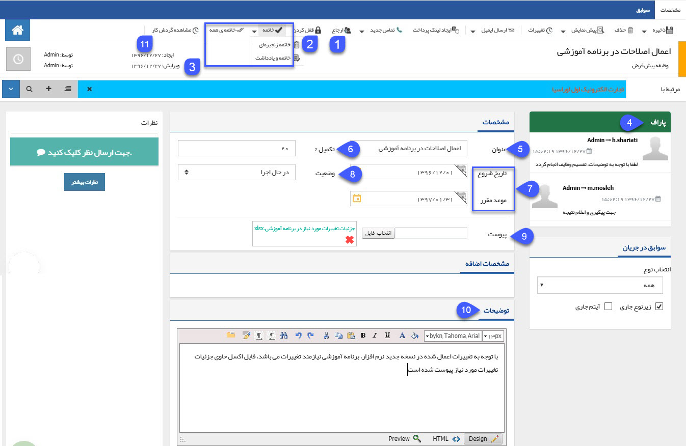
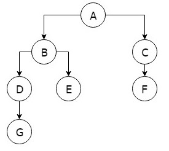
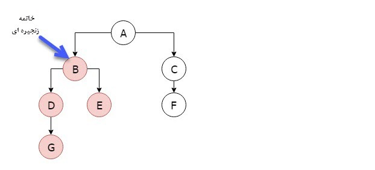
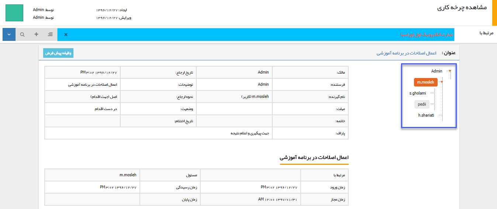

## وظیفه جدید

> مسیر دسترسی:  **صفحه‌ی هویت** >**تب سوابق** > **وظیفه جدید** 

با استفاده از این آیتم می توانید یک وظیفه (Task) برای خود یا کاربر دیگری در نرم افزار ایجاد کنید. این وظیفه ابزار بسیار توانمندی است که به کاربر اجازه می دهد در خصوص هر موضوع مانند پیگیری یک مورد خاص، یا یک درخواست از مدیر یا نیاز به یک راهنمایی در خصوص یک مورد، یک وظیفه را برای کاربر یا کاربران دیگر نرم افزار ارسال کند و پاسخ مناسب به صورت مکتوب و مستند دریافت نماید. وظیفه ها به مدیریت شدن کارها و شفاف سازی سیستم کاری کمک شایانی می کنند. هر کاربری که وظیفه به او ارجاع داده شود می تواند آن را در لیست پیگیری ها و وظایف، [ویجت پیگیری](https://github.com/1stco/PayamGostarDocs/blob/master/help%202.5.4/home/widget/Follow-up-today/Follow-up-today.md) هاو همچنین قسمت[ وظیفه،پیگیری ](https://github.com/1stco/PayamGostarDocs/blob/master/help%202.5.4/home/widget/Cardboard/Task-tracking/Task-tracking.md)در کارتابل مشاهده کند.

> نکته مهم: لطفا ابتدا قسمت[ اطلاعات مشترک سوابق ](https://github.com/1stco/PayamGostarDocs/blob/master/help%202.5.4/Integrated-bank/Database/Records/Joint-record-information/Joint-record-information.md)را مطالعه کنید.

> نکته: وظیفه جزء آیتم هایی است که نیاز ندارد حتما به یک هویت متصل شود. (یعنی وظیفه بدون اتصال به هویت قابل ذخیره کردن است.) اما در نظر داشته باشید که اگر وظیفه را به هیچ پروفایلی متصل نکنید، در صورتی که وظیفه را در کارتابل خود نداشته باشید نمی توانید آن را در سوابق هیچ کدام از هویت ها مشاهده کنید و تنها راه پیدا کردن وظیفه مورد نظر، قسمت [تاریخچه](https://github.com/1stco/PayamGostarDocs/blob/master/help%202.5.4/Customer-relationship-management/CRM%20History/CRM%20History.md) CRM می باشد.

 

1. ارجاع: در صورتی که می خواهید وظیفه را به کاربر یا گروهی از کاربران  دیگر نرم افزار تخصیص دهید این گزینه را انتخاب کنید. لطفا قسمت[ ارجاع ](https://github.com/1stco/PayamGostarDocs/blob/master/help%202.5.4/Integrated-bank/Database/Records/New-task/Reference/Reference.md)را مطالعه کنید .

2. قفل کردن: میتوانید زمان هایی که نیاز به کار کردن بر روی وظیفه ندارید آن را به حالت قفل شده در بیاورید. وظیفه قفل شده قابلیت ارجاع به دیگران را ندارد، برای خارج کردن وظیفه از حالت قفل شده در صورت اینکه قفل کننده آن وظیفه خودتان باشید میتوان با کلیک بر روی آزاد کردن، وظیفه قفل شده را از این حالت خارج کنید.

3. خاتمه دادن: هر کاربر پس از انجام دادن کار مرتبط با خودش باید وظیفه را خاتمه دهد تا این وظیفه از کارتابلش خارج شود. وظیفه را به چهار حالت می توان به حالت خاتمه در آورد:

  خاتمه: این وظیفه را برای کاربری شما به حالت خاتمه یافته در می آورد و دیگر آن را در قسمت وظایف در دست اقدام در کارتابل مشاهده نخواهید کرد
 خاتمه و یادداشت: وظیفه را به حالت خاتمه یافته در می آورد و اجازه می دهد که یک یادداشت در پاراف این وظیفه به عنوان توضیحات خاتمه وارد کنید.
   خاتمه زنجیره ای: زنجیره ارجاعات کاربری شما را به حالت خاتمه یافته در می آورد. یعنی وظیفه از کارتابل شما و تمامی کاربرانی که از طریق ارجاعات شما این وظیفه را دریافت کرده اند خارج خواهد شد
  خاتمه همه: این وظیفه را برای تمامی کاربران به حالت خاتمه یافته در می آورد.
  
  > نکته: توجه داشته باشید که "خاتمه زنجیره ای" و "خاتمه همه" نیاز به داشتن مجوز مربوطه دارد و برای هر کاربری قابل استفاده نیست.

مثال: فرض کنید کاربر A وظیفه را به کاربر B,C ارجاع دهد، کاربر B همان وظیفه را به کاربر D,E و کاربر C آن را به کاربر F ارجاع دهد، همچنین کاربر D نیز آن را به کاربر G ارجاع دهد. در صورتی که کاربر B خاتمه زنجیره ای را بزند، این وظیفه از کارتابل خودش و کاربران D,E,G خارج خواهد شد. اما اگر خاتمه همه را بزند این وظیفه از کارتابل همه کاربران خارج خواهد شد. فلوچارت مربوط به ارجاعات ذکر شده در این مثال را مشاهده کنید:

4. پاراف: ارجاعات مرتبط با کاربری شما (ارجاعات قبل و بعد از شما) در قسمت پاراف مشاهده خواهد شد که هر کدام از قسمت های آن شامل موضوع ذکر شده در آن ارجاع (کاری که باید انجام شود)، زمان ارجاع و کاربر ارجاع دهنده و کاربر دریافت کننده می باشد. در مثال بالا کاربر B ارجاعات A → B ،  B → D،  B → E و D → G را می تواند در قسمت پاراف مشاهده کند، اما ارجاعات  A → C  و C → F را مشاهده نمی کند.

5. عنوان: اگر وظیفه را ایجاد می کنید عنوان مناسبی را برای وظیفه در نظر بگیرید تا بتوانید از طریق این عنوان موضوع وظیفه را به خوبی دریابید.

6. درصد تکمیل: همانطور که از نام آن مشخص است می توان عددی از 0 تا 100 را انتخاب نمایید تا میزان پیشرفت وظیفه را مشخص کنید.

7. تاریخ شروع/موعد مقرر: در صورتی که این وظیفه باید در زمان مشخصی شروع شود این تاریخ را تنظیم نمایید. همچنین در صورتی که این وظیفه در تاریخ موعد مشخصی باید انجام شود این تاریخ را تنظیم نمایید.

8. وضعیت: وضعیت انجام این وظیفه را مشخص کنید، این لیست در حالت پیشفرض می تواند گزینه های شروع نشده، درحال اجرا، انجام شده و ... را اختیار کند، لازم به ذکر است مانند تمامی ایتم های لیستی می توانید برای ویرایش و یا اضافه کردن وضعیت جدید به این گزینه ها به مدیریت آیتم های سیستم مراجعه کنید.

9. پیوست: می توانید فایلی در ارتباط با  وظیفه در این قسمت پیوست نمایید.

10. توضیحات: توضیحات و هدف کلی مرتبط با این وظیفه را در این قسمت درج کنید.

11. گردش کار: در صورتی که مجوز "مشاهده کامل گردش کار" را برای آیتم وظیفه داشته باشید، می توانید در این قسمت تمامی ارجاعات این وظیفه یا به اصلاح نحوه گردش این وظیفه بین کاربران را به صورت درختی مشاهده کنید

