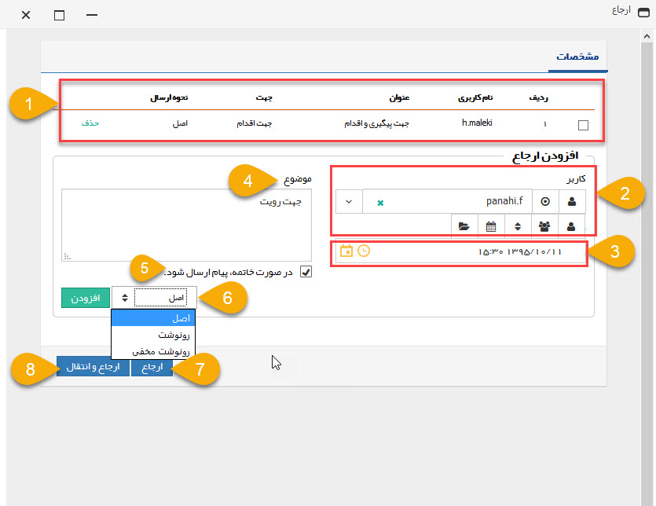

##  ارجاع وظیفه

برای ارجاع وظیفه به کاریران دیگر از دکمه ارجاع در نوار ابزار وظیفه استفاده کنید، پس از کلیک بر روی این دکمه پنجره زیر نمایش داده خواهد شد. ابتدا بایستی نام کاربر، گروه، سمت، دپارتمان یا حکم مورد نظر برای ارجاع این وظیفه انتخاب کنید، مهلت،موضوع و نوع ارسال مرتبط با این ارجاع را وارد کنید و روی دکمه افزودن کلیک کنید. پس از تکمیل اطلاعات مرتبط با تمام ارجاعات از دکمه ارجاع یا ارجاع و انتقال استفاده کنید

> نکته: توجه داشته باشید در صورتی که وظیفه به صورت رونوشت یا رونوشت مخفی برای شما ارسال شده باشد، قابلیت ارجاع به کاربران دیگر را ندارد.

1. لیست ارجاعات: هر کاربر یا گروهی که برای ارجاع انتخاب شده باشند در این قسمت نمایش داده می شوند.

توجه داشته باشید که ارجاع یک وظیفه می تواند به صورت ترکیبی از حالت های گروهی و تکی باشد.

2.  کاربر/کاربران دریافت کننده وظیفه: نام کاربر یا گروهی که می خواهید وظیفه برای آنها ارسال شود را انتخاب کنید.

با کلیک کردن بر روی علامت آدمک 5 راه انتخاب کاربران را در اختیار شما قرار می دهد:

·  الف) کاربر(علامت آدمک): امکان انتخاب یک کاربر را به شما می دهد.

·  ب) گروه کاربری(علامت 3 آدمک): اجازه می دهد یک گروه کاربری را برای ارجاع وظیفه انتخاب کنید.

نکته: برای تغییر این گروه ها به قسمت [مدیریت گروه ها و کاربران](https://github.com/1stco/PayamGostarDocs/blob/master/help%202.5.4/Settings/Manage-groups-and-users/Manage-groups-and-users.md) مراجعه کنید.

·  ج) سمت: می توانید یک سمت کاربری (مثلا تمامی سرپرست فروش ها) را برای ارجاع انتخاب کنید. در این حالت تمامی کاربرانی که دارای این سمت باشند برای ارسال وظیفه انتخاب خواهند شد.

نکته: برای تغییر این سمت ها به قسمت مدیریت شعب - دپارتمان و سمت مراجعه کنید.

· د) دپارتمان: می توانید یک دپارتمان (برای مثال دپارتمان مالی) را برای ارجاع انتخاب کنید. در این حالت این وظیفه برای تمامی کاربرانی که تحت آن دپارتمان کار می کنند ارسال خواهد شد.

> نکته: برای تغییر این دپارتمان ها به قسمت مدیریت شعب - دپارتمان و سمت مراجعه کنید.

و) حکم: می توانید یک حکم پرسنلی (برای مثال کاربرانی که حکم مدیر فروشی دارند.) را برای ارجاع انتخاب کنید. در این حالت تمامی کاربرانی که شامل آن حکم می شوند، برای ارجاع وظیفه انتخاب خواهند شد.

> نکته: برای تغییر این حکم ها به قسمت   مدیریت حکم های پرسنلی    مراجعه کنید

3. مهلت: زمانی که وظیفه باید به انتها برسد را مشخص کنید. (این زمان در لیست پیگیری های فرد دریافت کننده وظیفه نمایش داده می شود.)

4. موضوع: پارافی که برای گروه یا کاربری که انتخاب کرده اید را بنویسید. (به زبان ساده یعنی این کاربر یا گروهی که در مرحله دوم انتخاب کرده اید چه کاری در خصوص این وظیفه باید انجام دهد.)

5. پیام خاتمه: در صورت خاتمه پیدا کردن این وظیفه یک پیام به کاربری که این وظیفه را ارجاع داده است ارسال می کند. این پیام می تواند پیامک، ایمیل، پیام شبکه اجتماعی و یا یک پیام داخل سیستمی باشد.

> نکته: این پیام ها را در قسمت مدیریت پیام های سیستم می توانید تنظیم کنید.

6. نوع ارسال: ارسال به سه صورت می تواند انجام شود:

الف) اصل: این وظیفه را با قابلیت ارجاع دوباره برای کاربر یا گروه انتخاب شده می فرستد.
ب) رونوشت: تنها یک کپی از این وظیفه را برای کاربر یا گروه انتخاب شده ارسال می کند و این رونوشت قابلیت ارسال دوباره ندارد.
ج) رونوشت مخفی: یک کپی از این وظیفه برای کاربر یا گروه انتخاب شده می فرستد و در این حالت اگر سایر کاربران قسمت گردش کار این وظیفه را باز کنند، ارسال این رونوشت را نخواهند دید. مگر مجوز مرتبط با مشاهده ارجاع های مخفی مرتبط با این نوع از وظیفه را داشته باشند

7. ارجاع: به لیستی که از کاربران تهیه کرده اید وظیفه را ارجاع می دهد و یک نسخه از این وظیفه در کارتابل شما نیز باقی می ماند.

8. ارجاع و انتقال: به لیستی از کاربران که تهیه کرده اید وظیفه را ارجاع می دهد و این وظیفه را از کارتابل شما خارج می کند.

