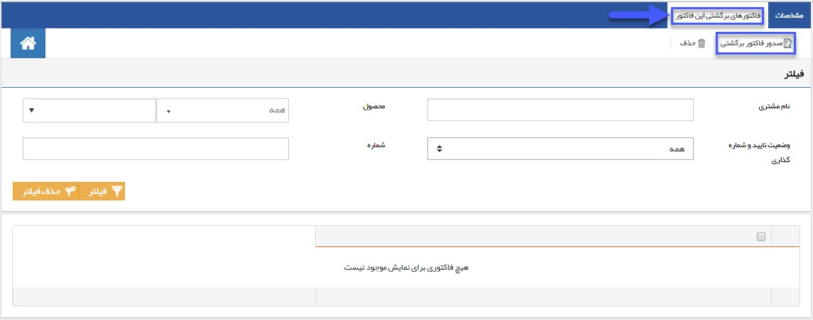
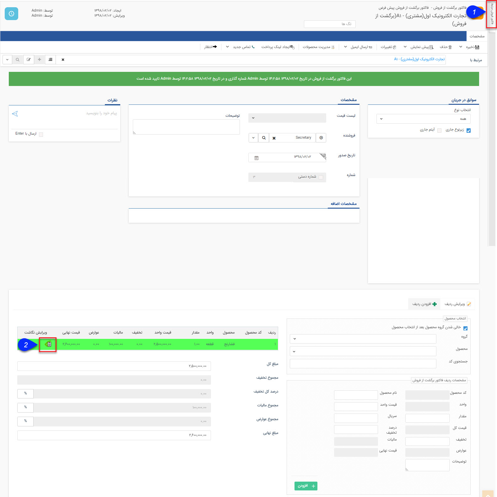

## فاکتور برگشت از فروش / برگشت از خرید

>  مسیر دسترسی:  **صفحه‌ی هویت** >**تب سوابق** > **فاکتور برگشت از فروش جدید/فاکتور برگشت از خرید جدید**

می توان برای کالا های برگشت خورده از فروش، فاکتور برگشت از فروش صادر کرد برای این منظور میتوان از فاکتور فروش آن یک فاکتور برگشت از فروش صادر کرد یا میتوان یک فاکتور برگشت از فروش را به یک فاکتور فروش متصل کرد، این نوع از فاکتور مشتری را به اندازه مبلغ آن بستانکار می کند . (اگر از انبار داری سریالی استفاده می شود باید رسید مرجوعی ثبت شود )

نکته مهم: لطفا ابتدا قسمت[ اطلاعات مشترک سوابق ](https://github.com/1stco/PayamGostarDocs/blob/master/help%202.5.4/Integrated-bank/Database/Records/Joint-record-information/Joint-record-information.md)را مطالعه کنید.

برای تمامی فاکتورهای تایید شده طبق شکل بالا می توان از طریق تب "فاکتورهای برگشتی این فاکتور" ، یک فاکتور برگشت جدید را صادر کرد.

1. فاکتور فروش مرتبط: در صورتی که فاکتور برگشتی را از روی فاکتور فروش صادر کرده باشید، در این قسمت فاکتور فروش مرتبط نمایش داده می شود و در غیر این صورت می توانید از بین فاکتورهای صادر شده برای مشتری، یکی از فاکتورها را برای نگاشت روی این فاکتور برگشت از فروش انتخاب کنید.

2. ویرایش نگاشت: به ازای هر ردیف محصول، می توانید از طریق دکمه های موجود در این ستون، نگاشت فاکتور فروش مرتبط را ویرایش کنید، در واقع مشخص کنید که این برگشت از فروش مرتبط با کدام فاکتور می باشد. با کلیک بر روی دکمه ویرایش نگاشت به ازای هر محصول، تمامی فاکتورهای فروش تاییده شده مشتری که این محصول در آن ها موجود باشد نمایش داده می شوند و می توانید یکی از آن ها را انتخاب کنید

> نکته: در صورتی که فاکتور برگشتی را از روی فاکتور فروش صادر کرده باشید، تمامی محصولات با همان تعداد ثبت شده در فاکتور فروش، در فاکتور برگشتی نگاشت می شوند، اما می توانید آن ها را ویرایش کنید (به طور مثال زمانی که از یک محصول 100 عدد فروخته باشید، اما مشتری بخواهد 10 تا را مرجوع کند). همچنین می توانید ردیف های دیگری را به فاکتور برگشتی اضافه کنید.

> نکته: در صورتی که محصولات ثبت شده در فاکتور برگشتی را به هیچ کدام از فاکتورهای فروش متصل نکنید، در[ گزارشات افتراق](https://github.com/1stco/PayamGostarDocs/blob/master/help%202.5.4/Management-and-reports/Sales-reports/Differentiation-reports/Differentiation-reports.md) نرم افزار نمایش داده خواهند شد.

