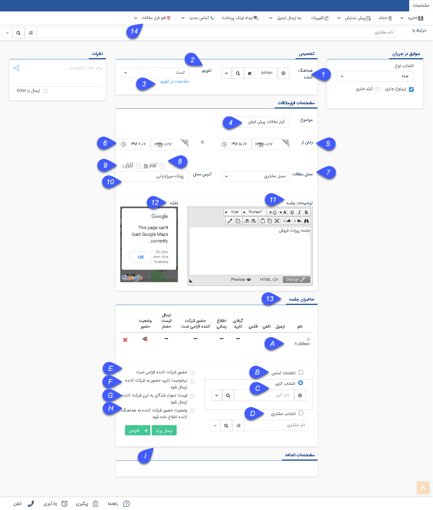
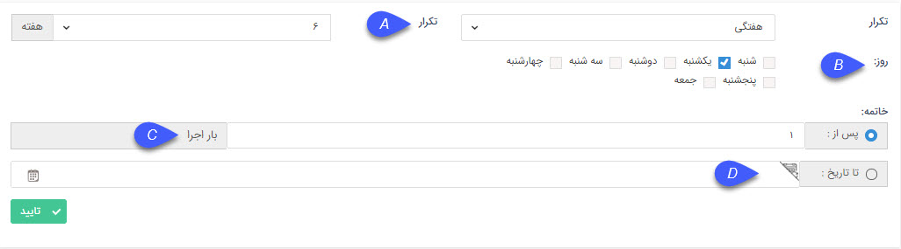
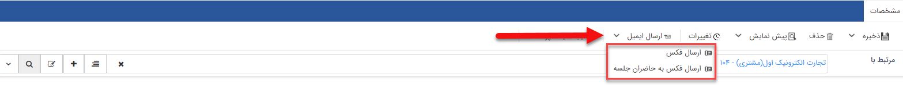
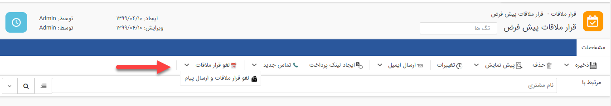

## قرار ملاقات

قرار ملاقات ابزار توانمندی است که امکان تنظیم کردن قرار ملاقات های درون سازمانی و برون سازمانی را دارد. دو بخش مهم یک قرار ملاقات، مکان و بازه زمانی قرارملاقات است، با استفاده از این آیتم میتوان برای کاربران، مخاطبان و مشتریان قرار ملاقاتی تنظیم کرد.

لازم به ذکر است امکان ایجاد یک قرار ملاقات از نوع قرار ملاقات های ایجاد شده در بخش شخصی سازی crm وجود دارد.

در صورت تهیه ماژول قرار ملاقات پیشرفته، نرم افزار به صورت خودکار خالی بودن مکان قرار ملاقات (اتاق های تعریف شده توسط کاربر) و همچنین زمان کاربر یا کاربران شرکت کننده را بررسی میکند و همچنین می توان از این طریق به کاربران و مخاطبان دعوت شده در صورت نیاز، پیام اطلاع رسانی یا درخواست تعیین وضعیت حضور ارسال کنید و حضار در جلسه را پیش از برگزاری جلسه مشخص کنید.

> نکته مهم: لطفا ابتدا قسمت[ اطلاعات مشترک سوابق ](https://github.com/1stco/PayamGostarDocs/blob/master/help%202.5.4/Integrated-bank/Database/Records/Joint-record-information/Joint-record-information.md)را مطالعه کنید.

> نکته: برای تغییر پیام هایی که در قرار ملاقات ارسال می شود، به قسمت [مدیریت پیام های سیستم ](https://github.com/1stco/PayamGostarDocs/blob/master/help%202.5.4/Basic-Information/Manage-system-messages/Manage-system-messages.md)مراجعه کنید.

> نکته: برای دیدن لیست قرار ملاقات ها به قسمت [تقویم کاری من ](https://github.com/1stco/PayamGostarDocs/blob/master/help%202.5.4/Customer-relationship-management/My-work-calendar/My-work-calendar.md)مراجعه کنید.

1. هماهنگ کننده: کاربری که مسئولیت هماهنگی جلسه را به عهده دارد تعیین کنید. توجه داشته باشید که پیام های اعلام وضعیت حضور شرکت کنندگان به این کاربر ارسال می شود.

2. تقویم: می توانید تعیین کنید که این قرار ملاقات در کدام تقویم تنظیم شود. توجه داشته باشید که دسترسی به تقویم های تعریف شده نیاز به مجوز دارد.
 
> نکته: برای ساخت و ویرایش تقویم ها و تعیین دسترسی کاربران به این تقویم ها به[ مدیریت تقویم ها](https://github.com/1stco/PayamGostarDocs/blob/master/help%202.5.4/Basic-Information/Calendar-management/Calendar-management.md) مراجعه کنید.

3. مشاهده در تقویم: با کلیک بر روی این گزینه این قرار ملاقات را در تقویم مرتبط آن می توانید مشاهده کنید.

4. موضوع: موضوع قرار ملاقات را تعیین کنید. (برای مثال جلسه داخلی، پرزنت فروش یا جلسه پروژه x)

5. زمان از: تاریخ و ساعت شروع قرار ملاقات را تعیین کنید.

6. تا: تاریخ و ساعت پایان قرار ملاقات را تعیین کنید.

7. محل ملاقات: محل ملاقات را تعیین کنید. این لیست بر اساس اتاق هایی که در قسمت[ مدیریت اتاق ها ](https://github.com/1stco/PayamGostarDocs/blob/master/help%202.5.4/Basic-Information/Room-management/Room-management.md)ایجاد کرده اید ساخته می شود. توجه داشته باشید که اگر اتاق مورد نظر در زمانی که انتخاب کرده اید توسط قرار ملاقات دیگر رزرو شده باشد، نرم افزار اجازه ایجاد این قرار ملاقات را نخواهد داد. ( این قابلیت نیاز به ماژول قرار ملاقات پیشرفته دارد.)

> نکته: بدیهی است در صورت تنظیم محل قرار ملاقات بر روی گزینه های سایر و محل مشتری، بررسی خالی بودن آنها صورت نمیگیرد.

8. تمام روز: با فعال کردن این گزینه تمام روز به این قرار ملاقات تخصیص داده خواهد شد.

9. تکرار: با استفاده از این گزینه می توانید قرار ملاقات خود را به صورت تکرار شونده درآورید. (مناسب برای قرار ملاقاتهایی که هفته های متوالی در یک زمان انجام می شوند.)

در نظر داشته باشید که اگر قرار ملاقات تکرار شونده تنظیم کنید. این قرار ملاقات به عنوان اصلی و تمامی تکرارهای آن به عنوان فرعی در نظر گرفته می شوند. میتوانید قرار ملاقات های فرعی را حذف کنید اما نمی توانید روی آنها تکرار تنظیم کنید. اگر قرار ملاقات اصلی را تغییر دهید و یا حذف کنید، تمامی قرار ملاقاتهای فرعی را تغییر می دهد و یا حذف می کند.

9.1 .الگوی تکرار این قرار ملاقات را مشخص کنید، به طور مثال در شکل بالا این قرار هر 6 هفته تکرار خواهد شد.

9.2 . روز: روزهایی از هفته که باید این قرار ملاقات در آنها برگزار شود را مشخص کنید.

9.3.خاتمه(پس از:): تعداد اجرا را می توانید مشخص کنید. (برای مثال اگر روی 3 قرار دهید، این قرار ملاقات تا 3 بار در روزهایی که در مرحله قبل تعیین کرده اید تکرار خواهد شد.)

9.4. خاتمه(تا تاریخ:): در صورتی که تعداد دفعات برای تکرار مشخص نکردید، تاریخ اتمام تکرار قرار ملاقات را مشخص کنید.

در واقع شرط خاتمه این تکرار می تواند یکی از گزینه های 9.3 یا 9.4 است.
10. آدرس محل: آدرس محلی که قرار ملاقات در آن صورت می گیرد را وارد کنید. (برای مثال محل کارفرما، یا ...)

11. توضیحات جلسه:  توضیحات بیشتری را در مورد قرار ملاقات در این بخش ذکر نمایید که صورتجلسه یا خدمت ارائه شده در چه حوزه ای است و اگر شرکت کننده نیاز به همراه داشتن پیش نیاز خاصی هستند از این طریق در جریان قرار بگیرند.

12. نقشه: می توانید محل قرار ملاقات را بر روی نقشه گوگل تعیین نمایید. (برای استفاده از این نقشه نیاز به دسترسی به اینترنت دارید.)

13. حاضران جلسه: در این قسمت باید حاضران جلسه ( کسانی که باید در این قرار ملاقات شرکت کنند)را تعیین کنید.

 a. لیست حاضران: لیست افرادی که در این قرار ملاقات دعوت شده اند را نمایش می دهد.

 b. انتخاب کاربر: از میان کاربران نرم افزار، یک شرکت کننده در این قرار ملاقات را می توانید تعیین کنید.

 c. انتخاب مشتری: از میان مخاطبان و سرنخ های ثبت شده در بانک اطلاعاتی می توانید شخص یا شرکتی را به عنوان یکی از حاضرین این قرار ملاقات تعیین کنید.

 d. اطلاعات تماس : در صورتی که فرد دعوت شده جزو کاربران و هویت های موجود در بانک اطلاعاتی نباشد می توانید نام و اطلاعات تماسی آن را برای قرار گرفتن در لیست شرکت کنندگان این قرار ملاقات وارد کنید.

 e. حضور شرکت کننده الزامی است: با فعال کردن این گزینه شرکت کننده انتخاب شده به صورت قطعی در این قرار ملاقات قرار می گیرد و دیگر در زمان این قرار ملاقات نمیتوان برای او یک قرار ملاقات دیگر تعیین کرد.

 f. درخواست تایید حضور به شرکت کننده ارسال شود: با فعال کردن این گزینه به شرکت کننده انتخاب شده یک پیام ارسال خواهد شد و درخواست تعیین وضعیت حضور را از شرکت کننده خواهد کرد. (برای تغییر و تعیین این پیام به قسمت [مدیریت پیام های سیستم](https://github.com/1stco/PayamGostarDocs/blob/master/help%202.5.4/Basic-Information/Manage-system-messages/Manage-system-messages.md) مراجعه کنید.)
 
 > نکته : لازم به ذکر است این پیام تنها از طریق نوع رسانه هایی ( ایمیل و پیامک و .. )که برای آنها در بخش مدیریت پیام های سیستم، متن پیام تنظیم کرده باشید، ارسال میگردد  و شرکت کننده می تواند از طریق پیامک (که حاوی کدی است که به صورت خودکار وضعیت او را مشخص می کند)، یا ایمیل (که حاوی لینک هایی است که وضعیت او را تعیین می کند.) می تواند به این پیام پاسخ دهد. در نظر داشته باشید که در کارتابل هر کاربر یک تب قرار ملاقات موجود است و در صورتی که شرکت کننده جزو کاربران پیام گستر باشد قرار ملاقات هایی که برای او ارسال شده اند از طریق کارتابل قابل پاسخگویی، رویت و تعیین وضعیت حضور است.
 
  G.لیست شرکت کنندگان به این شرکت کننده ارسال شود: با فعال کردن این گزینه لیست تمامی شرکت کنندگان برای این کاربر ارسال خواهد شد.

 H.وضعیت حضور شرکت کننده به هماهنگ کننده اطلاع داده شود: با انتخاب این گزینه اگر وضعیت حضور این شرکت کننده تایید یا رد شود، یک پیام برای هماهنگ کننده ارسال خواهد شد.

 I .افزودن و ارسال پیام دعوت و ارسال پیام لغو: با کلیک بر گزینه افزودن، کاربر یا فرد انتخاب شده به لیست اضافه می شود. پس از ذخیره قرار ملاقات از طریق دکمه ارسال پیام میتوانید یک پیام به لیست شرکت کنندگان ارسال می شود. توجه کنید که این پیام در اولین ارسال پیام دعوت و در دفعات بعدی، لیست تغییرات قرار ملاقات را ارسال می کند. اگر پیام لغو را ارسال کنید یک پیام برای لغو قرار ملاقات به لیست شرکت کنندگان ارسال می کند. برای تغییر و تعیین این پیام ها به قسمت مدیریت پیام های سیستم مراجعه کنید.

همچنین این امکان وجود دارد که برای شرکت کنندگان جلسه فکس ارسال کنید.

با کلیک روی ارسال فکس به حاضران جلسه و مشخص کردن متن مشخص، برای شرکت کنندگان فکس ارسال می شود.

14. برای لغو قرارملاقات می توانید از دکمه لغو قرارملاقات از بخش ریبون استفاده کنید، در صورتی که می خواهید پیام کنسلی قرارملاقات به مدعوین جلسه ارسال شود می توانید
 از دکمه‌ی لغو قرارملاقات و ارسال پیام، موجود در این قسمت استفاده کنید.
 
 
 
 

