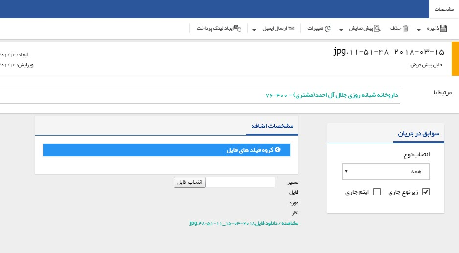

## فایل جدید

در صورت در اختیار داشتن فایلی از مشتری با هر فرمتی، می توانید با انتخاب گزینه فایل جدید، فایل را به پروفایل مشتری اضافه نمایید .

به طور مثال رزومه یا کاتالوگ یک شرکت و مواردی مشابه می تواند گزینه های خوبی برای پیوست به پروفایل شرکت باشد .

> نکته مهم: لطفا ابتدا قسمت<a href="file%3A%2F%2F%2FC%3A%5CUsers%5CH.abasi%5CDesktop%5Chelp%5Cmd%20help%5CIntegrated-bank%5CDatabase%5CRecords%5CJoint-record-information%5CJoint-record-information.md" target="_blank"> اطلاعات مشترک سوابق</a> را مطالعه کنید.

