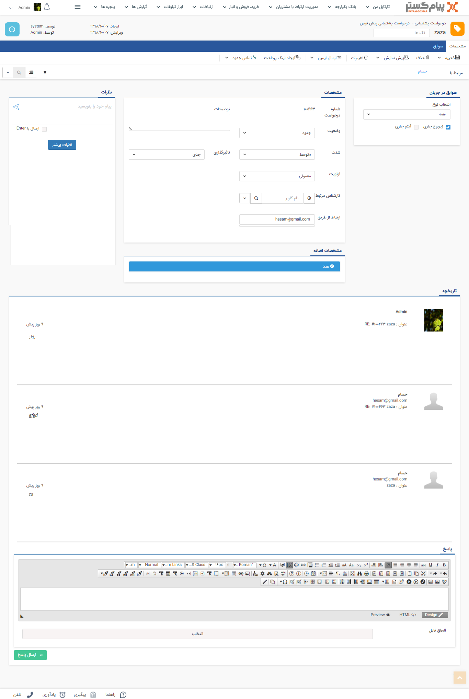

## درخواست جدید 

> مسیر دسترسی:  **صفحه‌ی هویت** >** تب سوابق** > **فرصت جدید** 

درخواست در واقع پاسخ دهی به ایمیل ها بر روی یک خط خاص و مدیریت ایمیل های آن خط محسوب می شود، به طوری که که هر ایمیل ارسال شده بر روی آن خط شماره ای به صورت خودکار دریافت می کند و ارسال کننده ایمیل می توانند ایمیل را از طریق شماره آن پیگیری نماید.

می توانید برای هویت مورد نظر یک درخواست جدید (Ticket) را ایجاد و یا ویرایش کنید. توجه داشته باشید که ابتدا باید در قسمت شخصی سازی، انواع مدل های درخواست هایی که مد نظرتان است را باید ساخته باشید. درخواست علاوه بر اینکه امکان ایجاد توسط کاربران را دارد، می تواند از طرف  هویت هم از طریق ارسال ایمیل به آدرسی ایمیلی که این نوع درخواست روی آن تنظیم شده است، ایجاد گردد.

برای ساخت درخواست جدید به[ مدیریت درخواست ها ](https://github.com/1stco/PayamGostarDocs/blob/master/help%202.5.4/Settings/Personalization-crm/Manage-requests/Manage-requests.md)مراجعه کنید.

> نکته مهم: لطفا ابتدا قسمت[ اطلاعات مشترک سوابق ](https://github.com/1stco/PayamGostarDocs/blob/master/help%202.5.4/Integrated-bank/Database/Records/Joint-record-information/Joint-record-information.md)را مطالعه کنید.

1. شماره درخواست: شماره درخواستی که سیستم به درخواست اختصاص داده است را نمایش می دهد. هویت می تواند از طریق این شماره درخواست خود را پیگیری کند. توجه داشته باشید که امکان تخصیص شماره دستی به درخواست وجود ندارد.

2. وضعیت: وضعیت فعلی درخواست پشتیبانی را نمایش می دهد.

3. شدت وتاثیرگذاری: می توان شدت و تاثیر گذاری این درخواست را تعیین کرد . 

4. اولویت: فیلد اولویت براساس دو فیلد شدت و تاثیرگذاری مطابق ماتریس اولویت ،مقدار دهی میگردد.(برای تعریف ماتریس اولویت به مدیریت درخواست ها مراجعه کنید.)

> نکته : فیلد الویت در درخواست ها قابل ویرایش نیست و براساس ماتریس الویت مقدار دهی میشود.

5. کارشناس مرتبط: در صورتی که پاسخگویی به این پروفایل بر عهده شخص خاصی باید باشد، کارشناس مرتبط با درخواست را مشخص نمایید.

6. ارتباط از طریق: آدرس ایمیلی که پاسخها به آن ارسال می شود را نمایش می دهد. در واقع اگر درخواست از طرف مخاطب ثبت شده باشد، آدرس ایمیلی که از طریق آن درخواست خود را ثبت کرده است در این فیلد نمایش داده خواهد شد و اگر کاربران سیستم بخواهند درخواست را ثبت کنند، آدرس ایمیلی که در پروفایل هویت وارد شده است در این قسمت به صورت خودکار وارد خواهد شد، اما میتوانید آن را تغییر ده

> نکته: توجه داشته باشید که ارتباط بین شما و هویت در آیتم درخواست تنها از طریق ایمیل می باشد و تکمیل این فیلد برای ثبت درخواست(ticket ) ضروری می باشد.

7. توضیحات: برای نوشتن توضیحات بیشتر می توانید از این قسمت استفاده نمایید.

8. تاریخچه: متن درخواست های تحویل گرفته شده از طریق ایمیل و ارسال شده  بر اساس تاریخ نمایش داده می شود.

9. ارسال پاسخ: در انتهای صفحه می توانید پیام جدیدی را تنظیم و ارسال نمایید. این پیام از طریق ایمیل به هویت ارسال خواهد شد، همچنین می توانید به پیام خود فایل دلخواهی را پیوست نمایید

> نکته : اگر روی درخواست چرخه ای فعال باشد و چرخه به مرحله پایان خود رسیده باشد،امکان ثبت پاسخ بر روی درخواست وجود ندارد.

