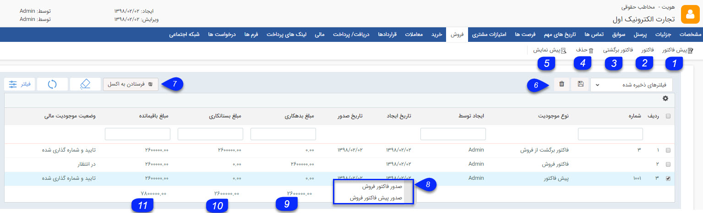

## فروش

در این قسمت تمامی پیش فاکتورها، فاکتورها و فاکتورهای برگشت از فروش ثبت شده برای مشتری را می توانید مشاهده کنید، می توانید برای جستجوی سوابق مورد نظر خود از فیلترهای مختلف استفاده کنید. همچنین می توانید سوابق فروش جدید برای مشتری ایجاد کنید.

> نکته : از بخش تنظیمات روی لیست، میتوان پارامتر های مد نظر برای نمایش در این لیست انتخاب کرد و براساس آن خروجی گرفت.

1. می توانید یک پیش فاکتور فروش جدید برای مشتری ایجاد کنید.

2. می توانید یک فاکتور فروش جدید برای مشتری ایجاد کنید.

3. می توانید یک فاکتور برگشت از فروش جدید برای مشتری ایجاد کنید.

4 . حذف: می توانید آیتم های انتخاب شده را حذف کنید.

5. پیش نمایش : می توانید پیش نمایش چاپ فاکتور و یا پیش فاکتور انتخاب شده را مشاهده کنید.

6. فیلترهای پیشرفته : می توانید برای پیدا کردن فاکتور و یا پیش فاکتور مورد نظر از[ فیلترهای پیشرفته ](https://github.com/1stco/PayamGostarDocs/blob/master/help%202.5.4/Customer-relationship-management/Advanced-filter/Advanced-filter.md)استفاده کنید.

7. فرستادن به اکسل : با استفاده از این دکمه می توانید اطلاعات پیش فاکتور و فاکتورهای انتخاب شده را در قالب یک فایل اکسل دریافت کنید.

8. راست کلیک : با راست کلیک بر روی یک پیش فاکتور می توانید یک پیش فاکتور یا فاکتور از روی آن صادر کنید و با راست کلیک بر روی یک فاکتور می توانید فاکتور برگشت از فروش ایجاد کنید.

9. مجموع بدهکاری: مجموع مبالغ پیش فاکتورها و فاکتورهای فروش ثبت شده برای مشتری را محاسبه می کند.لازم به ذکر است که  مبلغ موجود در پیش فاکتور تاثیری روی مانده حساب مشتری ندارد و مشتری را بدهکار نمی کند مبلغ بدهکاری آن همواره صفر است .

 می توانید با استفاده از فیلترهای پیشرفته، تمامی پیش فاکتورها یا فاکتورهای مشتری را جستجو کرده و مجموع مبالغ آن ها را در این ستون مشاهده کنید.

10. مجموع بستانکاری: مجموع مبالغ فاکتورهای برگشت از فروش ثبت شده برای مشتری را محاسبه می کند.

11. مجموع باقی مانده : **حالت آزمایشی**