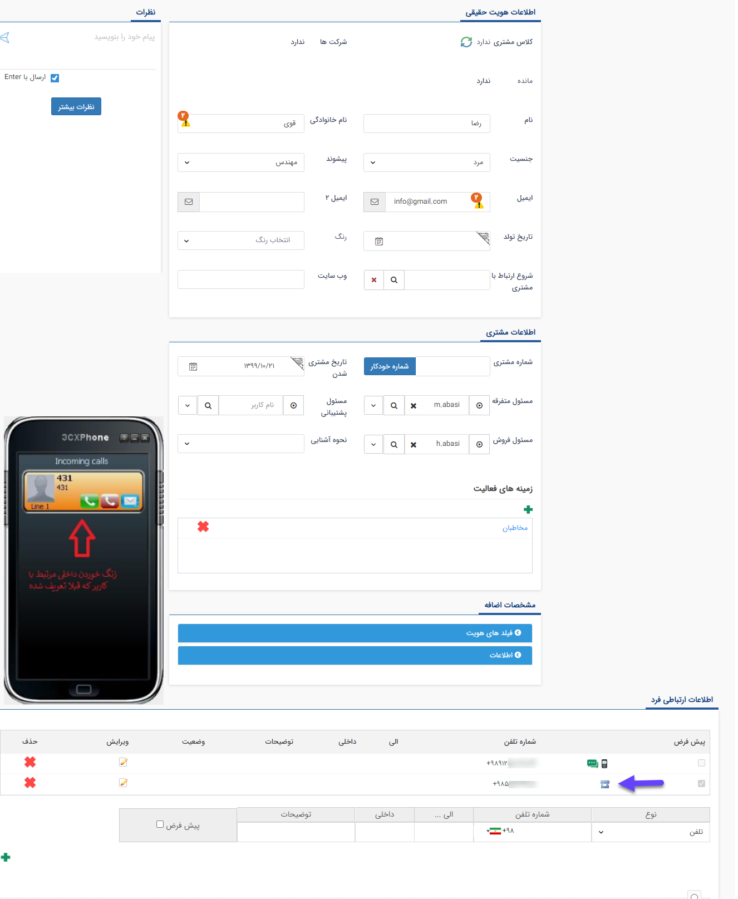

## برقراری تماس با یک کلیک 

در صورتیکه سیستم تلفنی تنظیم شده در نرم‌افزار ویپ باشد، با استفاده از قابلیت تماس با یک کلیک، می‌توان در پیام‌گستر با هویت مورد نظر تماس برقرار کرد. 

بدین منظور باید داخلی متناظر با کاربر در پیام‌گستر تعریف شده باشد  و کاربر مجوز "برقراری تماس تلفنی" را داشته باشد (برای مطالعه بیشتر در رابطه با تعریف داخلی و تعریف مجوزها به بخش مدیریت گروه‌ها و کاربران مراجعه کنید.).

در بخش اطلاعات ارتباطی هویت کافی است بر روی علامت تلفن یا موبایل کنار شماره تماس کلیک شود، شماره مرتبط، از پیام گستر به سرویس تلفنی و از طریق سرویس تلفنی در صورت درست بودن تنظیمات با ویژگی orginate به سیستم ویپ منتقل میشود. سپس داخلی کاربر روی IPPhone یا نرم افزار تلفنی زنگ خورده و کاربر باید آن را پاسخ دهد تا شماره گیری انجام شود. .( این مورد باید در نظر گرفته شود که حتما باید داخلی کاربر روی نرم افزار تلفنی برای مثال  3cx تنظیم شده باشد.)

