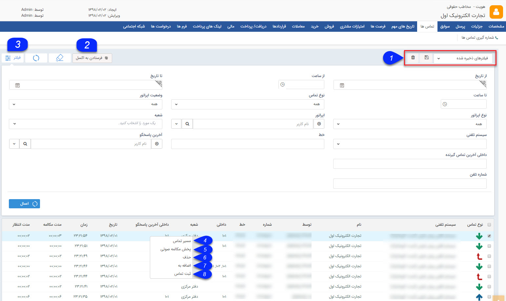

## تماس ها

در صورتی که شماره تلفن تماس گیرنده در مشخصات عمومی پروفایل ذخیره شده باشد، تماس گرفته شده در این صفحه نمایش داده می شود.

نوع تماس می تواند ورودی(فلش سبز رنگ)، خروجی(فلش آبی رنگ) و از دست رفته (فلش قرمز رنگ) باشد. همچنین تاریخ، زمان و مدت مکالمه نیز نمایش داده می شود .

در این صفحه امکان مشاهده لیست تماس های برقرار شده با سیستم تلفنی ثبت شده در نرم افزار فراهم می شود .

نوع تماس می تواند ورودی(فلش سبز رنگ)، خروجی(فلش آبی رنگ) و از دست رفته (فلش قرمز رنگ) باشد. همچنین تاریخ، زمان و مدت مکالمه نیز نمایش داده می شود .

1. نوع فیلتر: می توان فیلترهای انتخاب شده را با یک نام مشخص ذخیره کرد تا بتوان به سرعت از آن استفاده کرد.

2. خروجی اکسل: می توانید از سابقه تماس های این هویت یک خروجی اکسل تهیه کنید.

3. فیلترهای پیشرفته: می توانید برای پیدا کردن سابقه تماس مورد نظر از فیلترهای پیشرفته استفاده کنید.

 با کلیک راست روی هر یک از تماس ها، گزینه های زیر در دسترس خواهد بود .

4. مسیر تماس:  با استفاده از این آیتم می توانید مشاهده کنید که چه داخلی هایی پاسخگوی این تماس بوده اند و مدت مکالمه هر کدام به چه میزان بوده است.

5. پخش مکالمه صوتی: در صورتی که سخت افزار ضبط مکالمه برای شما نصب و راه اندازی شده باشد، می توانید با داشتن مجوز "مدیریت تماس های ضبط شده" به مکالمات ضبط شده از این طریق گوش دهید.

6. حذف: می توانید سابقه تماس مورد نظر را حذف نمایید.

7. اضافه به:  می توانید تماس را به سابقه هویت دیگری نیز اضافه نمایید.

8. ثبت تماس:  می توانید تماس را در سوابق هویت ثبت نمایید.

توجه: در صورتی که در هنگام تعریف کاربران در مدیریت گروه ها و کاربران ، شماره داخلی آن ها را وارد نمایید. نام کاربر پاسخگو را در مسیر تماس و یا لیست تماس ها در مدیریت ارتباط با مشتریان نمایش داده میشود