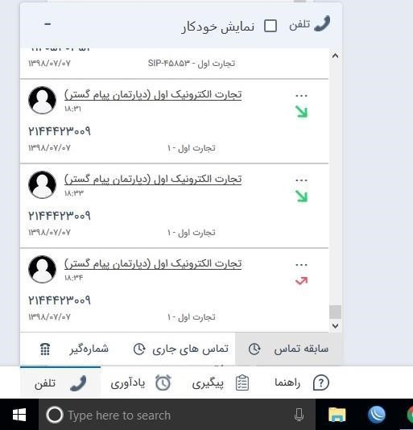

## مشاهده‌ی تماس‌ها در نوار تلفن

در نوار ابزار تلفن امکان مشاهده‌ی تماس‌ها در بخش تماس‌های جاری و سابقه‌ی تماس‌ها وجود دارد.

**تماس‌های جاری:** هنگامی تماس در این قسمت نمایش داده میشود که تماس درحال انجام باشد یعنی در حال زنگ خوردن باشد یا با داخلی در حال مکالمه باشد.

در صورت محدود شدن تماس ها بر اساس داخلی، زمانی تماس در قسمت تماس جاری نمایش داده می شود که سیستم تلفنی حتما ویپ باشد و تنظیمات مربوطه (محدود کردن مشاهده تماسها براساس داخلی – تعریف داخلی مرتبط برای کاربر – مجوز مشاهده تماس های دریافتی) انجام شده باشد.

**سابقه تماس:** تماس هایی که در قسمت تماسهای جاری می باشد پس از اتمام تماس در قسمت سابقه تماس قرار می گیرد

> **نکته مهم:** در سیستمهای تلفنی ویپ به محض قطع شدن تماسی که در قسمت تماس جاری قرار دارد به قسمت سابقه تماس منتقل میشود.

 در سیستمهای سانترال در صورتی که تنظیمات ضبط مکالمات تلسا هم در سرویس تلفنی داشته باشد به همین صورت می باشد(چون قطع شدن تماس به وسیله تلسا تشخیص داده میشود) اما در صورت نداشتن این تنظیمات با تاخیر این مورد صورت میگیرد.
 
 در سابقه تماس، تماسهای اتمام یافته، براساس زمان به صورت نزولی نمایش داده میشود.

> **نکته مهم:** با رفرش شدن صفحه یا زدن Ctrl+F5، کلیه سوابق تماس پاک میشود و این مورد جزو رفتار سیستم می باشد.

