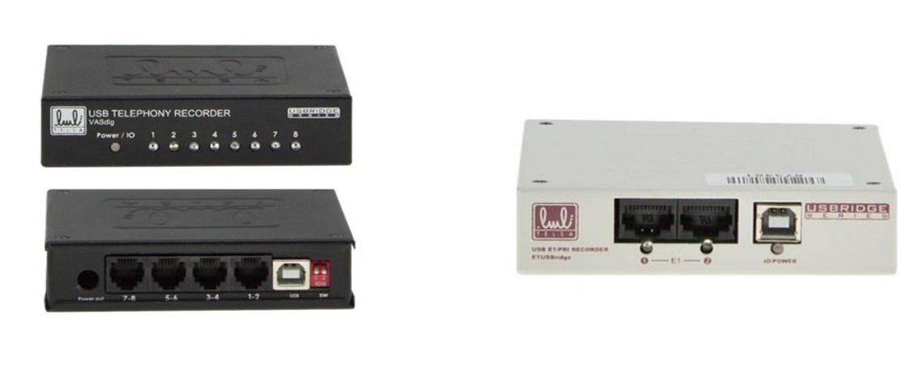
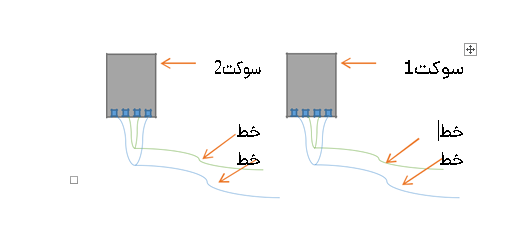

## ضبط مکالمات سانترال

 برای ضبط مکالمات روی مراکز سانترال و خطوط مستقیم از دستگاههای جانبی ضبط مکالمات استفاده میشود که یک نمونه از آن که توسط سرویس تلفنی پیام گستر ساپورت میشود دستگاه تلسا می باشد.
 
 
 
نحوه راه اندازی آن به این صورت است که قبل از ورود هر کدام از خطوط شهری آنالوگ، که به سانترال یا سگال وصل می شود از همان خط هم باید به دستگاه تلسا وصل شود تا در هنگام برقراری تماس و با استفاده از نرم افزاری که برای دستگاه تلسا روی سیستم نصب میشود مکالمات همزمان ضبط شوند تا با تنظیماتی که در سرویس تلفنی انجام میشود مکالمات قابلیت دانلود شدن از طریق پیام گستر را داشته باشد.(برای دانلود مکالمات در پیام گستر نیاز به ماژول ضبط مکالمات می باشد)

> **نکته:** درایور دستگاه تلسا فقط روی سیستم عاملهای 32 بیتی ساپورت میشود و باید از نصب آن روی سیستم عاملهای 64 بیتی خودداری شود، زیرا در این سیستم عامل ها دستگاه تلسا شناسایی نمی شود. 

> **نکته:** به دلیل اینکه سرویس تلفنی پیام گستر برای نصب نیاز به net 4.7.2  دارد، نصب تلسا بر روی ویندوز های 7 ، 10 ، 8.1  32 بیتی انجام میشود ( ویندوز  2008 32 بیتی ساپورت نمی شود.) 

دستگاه تلسا به ازای هر دو خط یک ورودی دارد، در نتیجه هر دو خط در یک سوکت قرار گیرد. همچنین ترتیب خطوط ورودی به تلسا اهمیت دارد. مانند شکل زیر:

> همچنین نصب دستگاه تلسا روی سیستمهای مجازی توصیه نمی شود.

