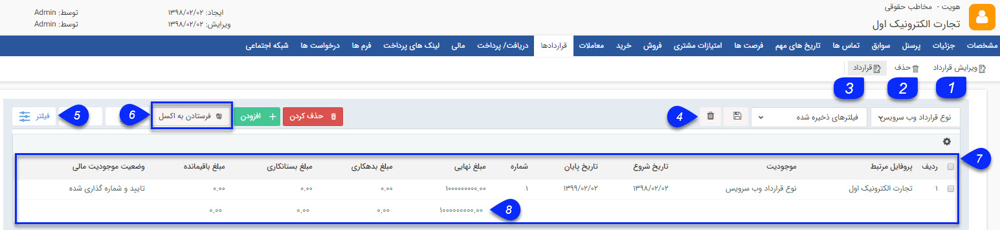

## قراردادها

در این قسمت سابقه قراردادهای مخاطب را می توانید مشاهده کنید و در صورت نیاز قرارداد جدیدی برای او ثبت کنید و یا قراردادهای ثبت شده را ویرایش و حذف کنی

1. ویرایش: می توانید قرار داد دلخواه را ویرایش کنید.

2. حذف: میتوانید قرار دادهای انتخاب شده را حذف نمایید.

3. قرارداد جدید: می توانید یک قرار داد جدید برای این مخاطب ایجاد نمایید.

4. نوع فیلتر: می توانید  فیلترهای پر کاربرد خود را با یک نام مشخص ذخیره کرد تا بتوان به سرعت از آن استفاده کرد.

5. فیلترهای پیشرفته: می توانید برای پیدا کردن قرارداد مورد نظر از فیلترهای پیشرفته استفاده کنید.

6. فرستادن به اکسل: با استفاده از این دکمه می توانید اطلاعات قراردادهای انتخاب شده را در قالب یک فایل اکسل دریافت کنید.

7. جدول قراردادها: در این جدول می توانید تمامی قراردادهای ثبت شده برای مخاطب را را بر اساس فیلدهای مرتبط با قرارداد (ستون های جدول) مشاهده کنید. میتوانید از بخش تنظیمات روی این جدول انتخاب کنید که چه پارامتر هایی از قرارداد روی این لیست نمایش داده شود.برای آشنایی بیشتر با این پارامتر ها به صفحه راهنمای .  قرارداد جدید مراجعه کنید.

8. مجموع نهایی: جمع مبالغ وارد شده در قراردادهای مخاطب را نمایش می دهد .