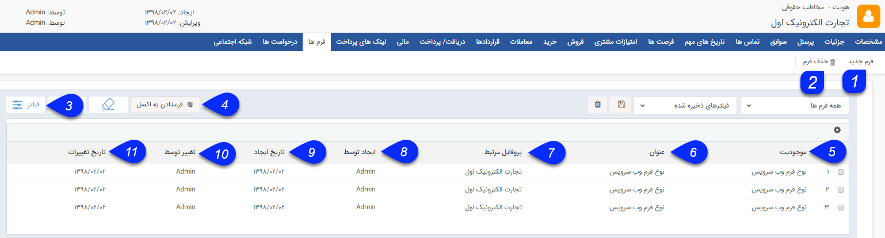

## فرم ها

> مسیر دسترسی:  **بانک یکپارچه** >**بانک اطلاعاتی** > **صفحه‌ی اصلی هویت** > **صفحه‌ی فرم‌ها** 

فرم های مختلف ایجاد شده برای هویت را می توانید در این قسمت مشاهده کرده و در صورت نیاز فرم جدیدی برای این هویت ایجاد کنید.

در صورتی که ماژول مدیریت فرم ساز را تهیه کرده باشید، می توانید فرم های موجود در فرآیندهای شرکت خود را در شخصی سازی CRM پیام گستر طراحی و پیاده سازی نمایید .[ (راهنمای مدیریت فرم ها](https://github.com/1stco/PayamGostarDocs/blob/master/help%202.5.4/Settings/Personalization-crm/Form-management/Form-management.md) )

نکته: فرم می تواند سوابق مختص به خود را داشته باشد. برای این حصول میتوان با راست کلیک کردن روی فرم و افزودن سابقه، یک سابقه به فرم متصل کرد و  در بخش سوابق میتوان این سابقه را به عنوان زیر مجموعه فرم مشاهده کرد و در صورت حذف فرم می توان آن سوابق را به هویت متصل کرد.

نکته: فرم از سوابقی است که بدون اتصال به پروفایل یک هویت قابل ذخیره کردن است.

1. فرم جدید: می توانید فرم دلخواه خود را از بین فرم های تعریف شده در شخصی سازی برای این هویت ایجاد کنید.

2. حذف فرم: می توانید فرم های انتخاب شده را حذف کنید.

3.  فیلترهای پیشرفته: می توانید برای پیدا کردن فرم مورد نظر از فیلترهای پیشرفته استفاده کنید.

4. فرستادن به اکسل: با استفاده از این دکمه می توانید اطلاعات  فرم های انتخاب شده را در قالب یک فایل اکسل دریافت کنید و خروجی بگیرید.

5. نوع: نوع فرم مورد نظر را نمایش می دهد.

6. عنوان فرم: نام فرم ایجاد شده را نمایش می دهد.

7. نام شرکت/سازمان: نام  هویت مرتبط با فرم را نمایش میدهد.

8. ایجاد توسط : کاربر ایجاد کننده فرم را نمایش میدهد.

9. تاریخ ایجاد: تاریخ ایجاد فرم را نمایش میدهد.

10. تغییر توسط: آخرین کاربر ویرایش کننده فرم را نمایش می دهد.

11. تاریخ تغییرات: آخرین تاریخ ویرایش فرم مورد نظر را نمایش می دهد.

> نکته:   با کلیک راست بر روی یک یا چند فرم موجود در لیست می توانید اقدام به افزودن سابقه جدید مرتبط با این فرم ایجاد کرد یا ویرایش گروهی کنید.

