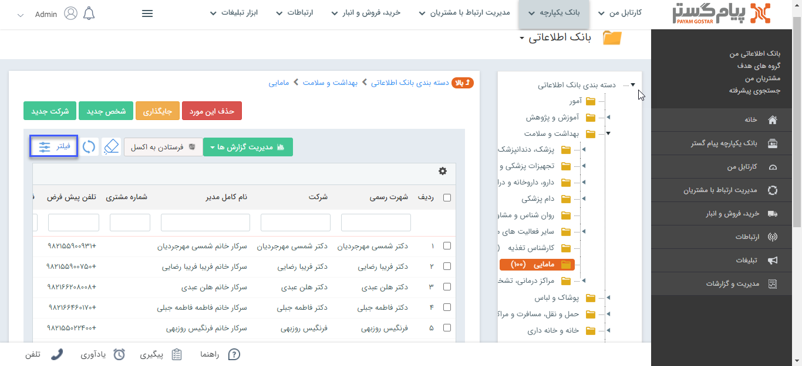

## لیست هویت‌ها در بانک اطلاعاتی

> مسیر دسترسی:  **بانک یکپارچه** >**بانک اطلاعاتی**

در بانک اطلاعاتی می‌توان با کلیک بر روی دسته بندی‌های دارای عضو، لیست هویت‌های موجود در آن دسته بندی را مشاهده کرد.

با استفاده از فیلترهای موجود امکان جستجوی هویت موردنظر از لیست وجود دارد. 

