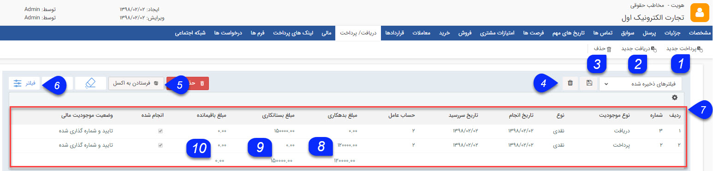

## دریافت/پرداخت

در این صفحه می توانید تمامی دریافت/پرداخت های ثبت شده برای مخاطب را مشاهده کنید. در صورت نیاز یک دریافت/پرداخت جدید ثبت کنید و یا دریافت/پرداخت های ثبت شده را ویرایش و یا حذف کنید.

1. پرداخت جدید: پرداخت جدیدی را می توانید برای مخاطب ایجاد کنید، پرداخت مخاطب را به میزان مبلغ موجود در آن بدهکار میکند. (تنظیمات این نوع همانند دریافت جدید است.)

2. دریافت جدید: می توانید دریافت جدید  برای مخاطب ایجاد کنید، دریافت مخاطب را به مقدار مبلغ موجود در آن بستانکار میکند.

3. حذف: می توانید دریافت و یا پرداخت های انتخابی را حذف کنید.

4. فیلترهای پیشرفته: می توانید برای پیدا کردن پرداخت و یا دریافت مورد نظر از فیلترهای پیشرفته استفاده کنید.

5. نوع فیلتر: می توانید فیلترهای پرکاربرد خود را با یک نام مشخص ذخیره کرد تا بتوان به سرعت از آن استفاده کرد.

6. فرستادن به اکسل: با استفاده از این دکمه می توانید اطلاعات پرداخت ها و یا دریافت های انتخاب شده را در قالب یک فایل اکسل دریافت کنید.

7. جدول دریافت و پرداخت ها: در این جدول می توانید تمامی دریافت/پرداخت های ثبت شده برای مخاطب را بر اساس فیلدهای مرتبط با آن ها (ستون های جدول) مشاهده کنید. از بخش تنظیمات میتوانید از لیست پارامتر های مرتبط با دریافت و پرداخت، پارامتر های موردنظرتان را برای نمایش در لیست تعیین کنید.

برای آشنایی بیشتر با این فیلدها به صفحه راهنمای دریافت جدید مراجعه کنید.

8. مجموع بدهکاری: با استفاده از این دکمه می توانید مجموع مبالغ وارد شده در پرداخت های ثبت شده برای مخاطب را به سادگی محاسبه کنید.

9. مجموع بستانکاری: با استفاده از این دکمه می توانید مجموع مبالغ وارد شده در دریافت های ثبت شده برای مخاطب را به سادگی محاسبه کنید.

10. مبلغ باقی مانده : **حالت آزمایشی**