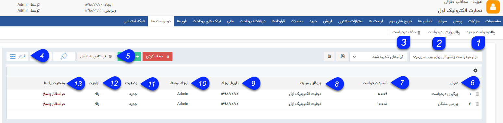

## درخواست ها

در صورتی که ماژول مدیریت درخواست ها را تهیه کرده باشید ، می توانید لیست  درخواست هارا که  از طریق  ایمیل از هویت دریافت شده است و همچنین درخواست هایی که کاربران برای آن هویت در نرم افزار ثبت کرده اند  را در این قسمت  مشاهده نمایید. ([راهنمای مدیریت درخواست ها](https://github.com/1stco/PayamGostarDocs/blob/master/help%202.5.4/Settings/Personalization-crm/Manage-requests/Manage-requests.md))

> نکته: درخواست می تواند سوابق مختص به خود را داشته باشد. این سوابق به عنوان زیر مجموعه درخواست نمایش داده شده و در صورت حذف درخواست می توان آنها را به سوابق مخاطب منتقل کرد.

1.  درخواست جدید: می توانید یک[ درخواست جدید](https://github.com/1stco/PayamGostarDocs/blob/master/help%202.5.4/Integrated-bank/Database/Records/new-request/new-request.md) را برای مخاطب ایجاد کنید.

2. ویرایش درخواست: می توانید درخواست دلخواه خود را ویرایش کنید.

3. حذف درخواست: می توانید درخواست مورد نظر خود را از سابقه مخاطب حذف نمایید.

4.  فیلترهای پیشرفته: می توانید برای پیدا کردن درخواست مورد نظر از[ فیلترهای پیشرفته](https://github.com/1stco/PayamGostarDocs/blob/master/help%202.5.4/Customer-relationship-management/Advanced-filter/Advanced-filter.md) استفاده کنید.

5. فرستادن به اکسل: با استفاده از این دکمه می توانید اطلاعات  درخواست ها را در قالب یک فایل اکسل دریافت کنید.

6. موضوع: عنوان ایمیلی که مخاطب برای درخواست خود وارد کرده است (یا عنوانی که کاربر برای درخواست در هنگام ثبت وارد کرده است) را نمایش میدهد.

7. شماره درخواست : شماره درخواست توسط سیستم به صورت خودکار ایجاد می گردد را نمایش می دهد.

8. نام شرکت/سازمان: نام هویت مرتبط با این درخواست را نمایش می دهد.

9. تاریخ ایجاد : تاریخ ایجاد درخواست را نمایش می دهد.

10. ایجاد توسط: ایجاد کننده درخواست را نمایش میدهد.

11. وضعیت: وضعیت فعلی درخواست پشتیبانی را نمایش میدهد.

> نکته: درخواست هایی که وضعیت آنها "جدید" باشد در این لیست با فونت برجسته (بولد شده Bold) نمایش داده می شوند.

12. اولویت: اولویت وارد شده برای پاسخگویی به درخواست را در این قسمت نمایش می دهد.

13. وضعیت پاسخ: نشان می دهد که آیا پاسخی در جواب این درخواست از طریق ایمیل ارسال شده است و یا خیر.

14. فیلترهای ذخیره شده: می توانید فیلترهای انتخاب شده را با یک نام مشخص ذخیره نمود تا بتوان به سرعت از آن استفاده کرد.

> نکته:  با کلیک راست بر روی هریک از درخواست های موجود در لیست می توانید برای درخواست مورد نظر افزودن سابقه و ویرایش گروهی انجام دهید.

> نکته: برای آشنایی با  فیلترهای اختصاصی سوابق درخواست ها به [مدیریت ارتباط با مشتریان ](https://github.com/1stco/PayamGostarDocs/blob/master/help%202.5.4/Customer-relationship-management/Customer-Relationship-Management.md)مراجعه کنید.

