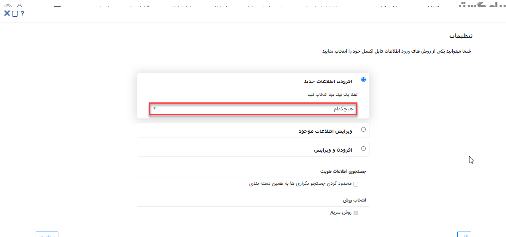
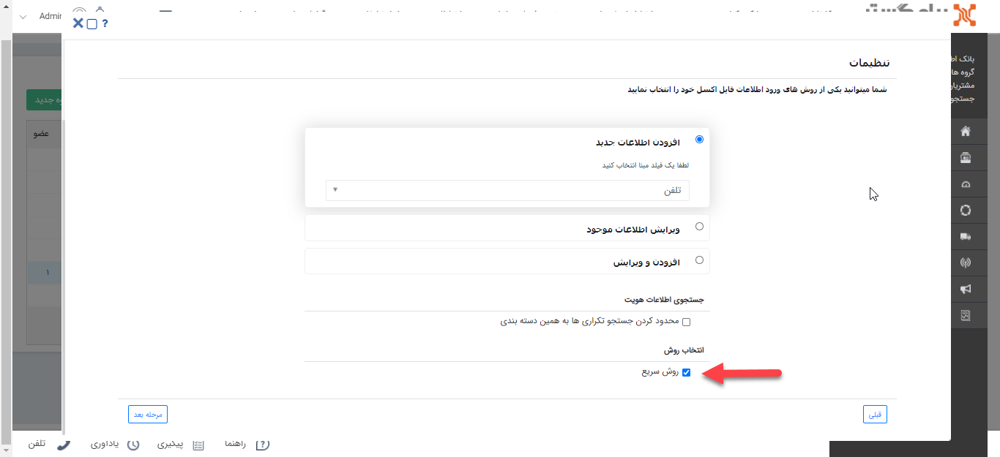
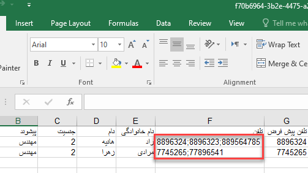

## ورود اطلاعات هویت‌ها از طریق اکسل

در این راهنما مراحل ورود اطلاعات، نکات و فرمت صحیح اطلاعات برای ورود هویت‌ها از طریق اکسل توضیح داده شده است.

### فرمت صحیح ورود اطلاعات از طریق اکسل

*فیلد تاریخ:* روز/ماه/سال

*فیلد چک باکس: true /false، * بلی/خیر، yes/no، 0/1

*فیلد کاربر:* نام کاربری یا کلید کاربر

*فیلد رنگ:* نام رنگ

*فیلد ساعت:* 00:00

*شماره مشتری:* براساس قالب شماره گذاری آن نوع موجودیت

*فیلد جنسیت:* مرد/ زن، female /male و 1/ 2 (1: مرد، 2: زن)

*فیلدهای مربوط به تلفن:* "نوع تلفن" )تلفن، موبایل، فکس و تلفکس)، "شماره تلفن"، "الی"، "داخلی"، "توضیحات" و "پیش‌فرض" (با مقدار true/false،yes/no،1/0)

*فیلدهای مربوط به آدرس:* "نوع آدرس"(نشانی)، "منطقه"، "صندوق پستی"، "کد پستی"، "آدرس"، "کشور، استان و شهر"( ورود هر 3 فیلد کشور، استان و شهر به صورت همزمان) و "پیش فرض"(با true/false)

*فیلد لیستی:* 

*  ورود مقادیر فیلدهای لیستی بصورت یکپارچه : در این روش برای اضافه کردن چند شماره تماس یا چند آدرس برای یک هویت، بایستی شماره تماس‌ها و آدرس‌‎ها با کاراکتر ";" از یک دیگر جدا شوند.(این روش تنها برای ورود اطلاعات شماره تماس‌ها و آدرس‌ها می‌باشد.)

درنظر داشته باشید که در این روش اولین شماره و اولین آدرس بعنوان پیش فرض خواهند بود. همچنین در این حالت فقط می توان "شماره تلفن" وارد کرد و در صورت نیاز به ورود "داخلی و الی" نباید از این روش استفاده نمود.

* ورود مقادیر فیلدهای لیستی بصورت جداگانه در ردیف‌های اکسل: می بایست به ازای هر مقدار لیست، رکورد مربوطه در فایل اکسل تکرار گردد. همچنین در این حالت، اطلاعات فیلد رکورد آخر به همراه تمام مقادیر فیلد لیستی آن که در رکوردهای مربوطه وارد شده است، در سیستم وارد می¬گردد. مثال فیلد لیستی: لیست عدد، لیست متن، اطلاعات تماس و آدرس های هویت

**1.مرحله اول(بارگذاری فایل)**

در گام اول نوع و زیر نوع آیتم انتخاب شده نمایش داده می‌شود.

اگر لیست آیتم‌ها بر روی نمایش همه(برای مثال همه‌ی قراردادها) باشد، در این گام زیر نوع بصورت خودکار نمایش داده می‌شود که می‌توان آن را ویرایش کرد.

در این مرحله می‌توانید فایل اکسل نمونه‌ای را دانلود کنید، این فایل شامل تمامی فیلدهای نوع آیتم انتخاب شده می‌باشد که با وارد کردن اطلاعات خود در فایل نمونه و ایمپورت آن می‌توانید ورود اطلاعات از طریق اکسل را با فرمت صحیح انجام دهید.

نکته : فیلدهای اضافه از نوع Html، برچسب، تصویر، رنگ، فایل، کمپین، فیلدهای لیستی و فیلد آیتم‌های crm (جز فیلد شرکت/شخص) در فایل نمونه قابل مشاهده نمی‌باشند.

در این مرحله فایل اکسل خود را انتخاب یا از طریق drag & drop آپلود کنید، با کلیک بر روی مرحله بعد وارد مرحله دوم شوید.

**2.مرحله دوم(تنظیمات)**

**1)افزودن اطلاعات جدید:** با انتخاب این روش آیتم های موجود در فایل اکسل به نرم‌افزار اضافه می‌شوند.

در این مرحله می‌توانید یکی از فیلدهای شماره مشتری، تلفن، موبایل و ایمیل را به عنوان مبنای شناسایی انتخاب کنید. تا براساس آن جستجوی تکراری بودن انجام شود، در صورت تکراری نبودن مقدار مبنای انتخاب شده، آن آیتم به نر‍‌م‌افزار اضافه می‌شود.

همچنین در این روش امکان انتخاب گزینه‌ی هیچکدام به عنوان مبنا وجود دارد، در صورت انتخاب هیچکدام به عنوان مبنای شناسایی، تمامی هویت‌های موجود در اکسل به بانک اطلاعاتی اضافه خواهد شد و بررسی تکراری بودن اطلاعات تنها از طریق تنظیمات اعمال شده در تنظیمات کلی بخش سیستم انجام خواهد شد. 

**2)ویرایش اطلاعات موجود:** در این روش براساس فیلدی که به عنوان مبنا انتخاب شده است، جستجوی تکراری بودن انجام می‌شود و در صورت تکراری بودن مقدار مبنای انتخاب شده، آیتم دارای این اطلاعات ویرایش می شود.

با انتخاب چک باکس " فقط فیلد های خالی پر شوند " تنها فیلدهای خالی آیتم در حال ویرایش مقداردهی می‌شوند.

**3)افزودن و ویرایش:** در این روش براساس فیلد مبنای انتخاب شده جستجو انجام میشود، در صورت تکراری بودن اطلاعات آن فیلد، آیتم دارای این اطلاعات ویرایش می‌شود و در صورت تکراری نبودن، آیتم جدید به نرم‌افزار اضافه می شود.

با انتخاب چک باکس " فقط فیلد های خالی پر شوند " تنها فیلدهای خالی آیتم در حال ویرایش مقدار دهی می‌شوند.

*روش ورود فیلدهای لیستی:* با فعال کردن چک باکس "ورود مقادیر بصورت یکپارچه"  امکان ورود اطلاعات فیلدهای لیستی شماره تماس‌ها و آدرس‌ها بصورت یکپارچه با استفاده از کاراکتر ";" فراهم می‌گردد. 

لازم به ذکر است در صورت استفاده از این روش دیگر فیلدهای تلفن، موبایل، فکس، تلفکس و آدرس به عنوان فیلدهای لیستی درنظر گرفته نخواهند شد و در گام سوم در فیلدهای ماشین نمایش داده می‌شوند.

همچنین در این روش نیز اگر فیلد تلفن یا موبایل به عنوان مبنا انتخاب شده باشد، باید ستونی با نام تلفن پیش‌فرض یا موبایل پیش‌‍فرض در اکسل تعریف گردد  تا مبنای جستجوی تکراری ها قرار گیرد.

در حالت ویرایش هویت، مقادیر لیستی جایگزین مقادیر قبلی می‌شوند، بنابراین در صورتی که نیاز است مقادیر جدید اضافه شوند، بایستی مقادیر قبلی نیز در اکسل تکرار گردند و در صورت عدم تکرار مقادیر قبلی، آن مقادیر از نرم‌افزار حذف می‌گردند. 

توجه شود که در صورت عدم فعالسازی چک باکس " ورود مقادیر بصورت یکپارچه "،  ورود اطلاعات فیلدهای شماره تماس‌ها و آدرس‌ها باید از روش ورود مقادیر فیلدهای لیستی بصورت جداگانه در ردیف‌های اکسل انجام شود.

**3.مرحله سوم(نگاشت فیلدها)** 

در مرحله سوم سرستون‌های فایل اکسل در بخش فیلدهای شما نمایش داده می شود، و فیلدهای موجود در آیتم در بخش فیلدهای ماشین شما نمایش داده می شود.

با drag & drop فیلدها، امکان نگاشت آنها با فیلد های سیستم وجود دارد.

فیلدهای هم نام بصورت خودکار نگاشت می‌شوند و همچنین با انتخاب "نگاشت فیلدهای هم نام" امکان نگاشت وجود دارد.

شما می‌توانید نگاشت مورد نظر خود (به جز نگاشت فیلدهای لیستی) را با استفاده از "ذخیره نگاشت" ذخیره کنید و درصورت نیاز از لیست نگاشت‌ها آن را انتخاب کنید.

در لیست نگاشت های من امکان ویرایش یا حذف نگاشت ذخیره شده وجود دارد.

لازم به ذکر است امکان نگاشت "یک" فیلد لیستی در هر بار ورود اطلاعات وجود دارد، برای این کار فیلد لیستی مورد نظر را از لیست انتخاب کرده و نگاشت فیلد را انجام دهید.

نکته: در صورتیکه فیلدی در سیستم دارای مقدار پیش فرض باشد در این بخش قابل مشاهده و ویرایش می‌باشد، همچنین می‌توانید برای فیلدها در این بخش مقدار پیش‌فرض تعریف کنید تا در صورت خالی بودن این فیلد در فایل اکسل، در نرم‌افزار فیلد با این مقدار پیش‌فرض، مقداردهی شوند.

**4.مرحله چهارم(شروع بارگذاری)**

در صورت مشکل در بارگذاری اطلاعات، خطای مرتبط در این گام نمایش داده می‌شود و فایل اکسلی شامل آیتم‌های دارای خطا قابل دریافت می‌باشد، که پس از اصلاح خطاها بارگذاری مجدد فایل انجام شود.

در منوی گزارش‌ها، بخش وضعیت عملیات انبوه می‌توان نتایج ورود اطلاعات را مشاهده کرد، همچنین در صورت بروز خطا، می توان از این بخش فایل اکسلی شامل آیتم‌های دارای خطا و علت خطای رخ داده دریافت نمود.

*نکات مربوط به ورود اطلاعات از طریق اکسل*

•	امکان ورود اطلاعات فیلدهای از نوع فایل، تصویر، html، کمپین، برچسب، لیست مرتبط، فیلد آیتم‌های سی آر ام (جز فیلد شخص/شرکت)، فیلد اضافه از نوع رنگ، فیلد لیستی از نوع فایل، فیلد لیستی از نوع کاربر/گروه و فیلد لیستی آیتم سی آر ام از طریق اکسل وجود ندارد.

•	در صورت انتخاب گزینه‌ی هیچکدام، امکان افزودن فیلد لیستی وجود ندارد. زیرا مبنایی برای شناسایی هویت تکراری انتخاب نشده است، به همین دلیل با انتخاب هیچ کدام، در گام دوم، گزینه "ورود مقادیر به صورت یکپارچه" برای ورود فیلدهای لیستی شماره تماس‌ها و آدرس‌ها بصورت خودکار فعال می‌گردد. 

•	در فایل اکسل فیلدهای مبنا باید باهمان نام تعریف شوند، برای نمونه در صورت انتخاب شماره مشتری به عنوان مبنا، در اکسل هم باید نام ستون شماره مشتری باشد.

•	برای فیلدی که به عنوان مبنا انتخاب شده است و فیلدهای اجباری آن آیتم، می بایست حتما نگاشت انجام شود، در غیر این صورت امکان شروع بارگذاری وجود ندارد.

•	لازم به ذکر است فیلد مبنای انتخاب شده در هر روش، باید در فایل اکسل مقدار دهی شده باشد، در غیر این صورت در گام آخر خطا می‌دهد.

•	در ویرایش اطلاعات موجود باید زیر نوع آیتم در حال ویرایش و زیر نوع آیتم انتخاب شده در گام اول یکسان باشد، در غیر این صورت بارگذاری انجام نمی‌شود.

•	در هنگام ویرایش آیتم‌ها، اگر براساس مبنای انتخاب شده، چندین آیتم در نرم‌افزار وجود داشته باشد و هیچ فیلد لیستی نگاشت نشده باشد، هیچکدام از آیتم‌ها ویرایش نمی‌شوند.

•	فیلدهایی که در صورت ثبت یا ویرایش دستی موجودیت‌ها الزامی می‌باشند، هنگام ثبت یا ویرایش از طریق اکسل هم بصورت الزامی می‌باشند و باید نگاشت شوند و دارای مقدار باشند

•	فیلدهایی از نوع لیست کشویی پیش‌فرض (فیلدهای موجود در مدیریت آیتم‌های سیستم) مانند نوع پرداخت یا روش پرداخت باید مطابق مقادیر موجود در نرم‌افزار مقدار دهی شوند، همچنین اگر در این فیلدها دو مقدار همنام وجود داشته باشد، هنگام بارگذاری اطلاعات اگر این مقدار همنام در اکسل تعریف شده باشد، آن فیلد در نرم‌افزار مقداردهی نمی‌شود و خطا می‌دهد.

•	اگر جلوگیری از ثبت اطلاعات تکراری در تنظیمات کلی انجام شده باشد (برای مثال جلوگیری از ثبت نام تکراری) در هنگام ورود اطلاعات از طریق اکسل علاوه بر فیلد مبنا، این اطلاعات هم بررسی می‌گردد و در صورت تکراری بودن، ورود اطلاعات انجام نمی‌شود.

در صورتیکه در نظر دارید تنها یک شماره تلفن )بدون الی، داخلی و ...( تعریف کنید، می توانید از ستون "تلفن پیش فرض" استفاده نمایید. لیکن در حالتیکه می خواهید تلفن را به صورت کامل وارد نمایید یا چندین تلفن برای هویت تعریف کنید، باید از فیلد لیستی تلفن استفاده کنید، در این حالت، اگر فیلد مبنا را تلفن قرار دهید، نیاز است یکی از شماره تلفن ها را هم در ستون "تلفن پیش فرض" برای همه ردیف های مربوط به این هویت ثبت نمایید، تا مبنای جستجوی آن قرار گیرد. موارد فوق برای موبایل نیز صدق می کند.

•	تنها برای تلفن و موبایل، مقادیر "تلفن پیش فرض" و "موبایل پیش فرض" وجود دارد و برای ورود فکس و تلفکس باید از فیلد لیستی تلفن استفاده کنید.

•	در هویت هنگامیکه ایمیل، تلفن یا موبایل به عنوان مبنا انتخاب شوند، باید در اکسل نام آن‌ها بصورت ایمیل پیش فرض، تلفن پیش فرض و موبایل پیش فرض باشد.

•	با توجه به این که اطلاعات کشور، استان و شهر یک لیست مرتبط و براساس اطلاعات وارد شده در قسمت مدیریت کشورها، استان‌ها و شهرها می‌باشند، برای ورود اطلاعات باید هر سه بطور همزمان در اکسل وارد شوند، همچنین در صورت عدم وجود اطلاعات تعریف شده، این اطلاعات به مدیریت کشور، استان و شهر اضافه می‌شود.

•	در هنگام ورود اطلاعات هویت‌ها، در مرحله‌ی دوم در صورت فعال کردن چک باکس " محدود کردن جستجو تکراری ها به همین دسته بندی" بررسی تکراری بودن در تمام بانک اطلاعاتی انجام نمی‌شود و جستجو تنها در دسته بندی انتخاب شده انجام می‌شود.

•	در صورت انتخاب هویت از نوع حقوقی، در مرحله‌ی دوم امکان انتخاب نوع هویت حقیقی برای ورود اطلاعات مدیر آن‌ها وجود دارد.

• 	در هنگام ویرایش، اگر هویت دارای مدیر بود تنها نام، نام خانوادگی و کد ملی مدیر قبلی با اطلاعات مدیر جدید ویرایش می‌شود.

•	در حالت ویرایش هویت، مقادیر لیستی جایگزین مقادیر قبلی می‌شوند، بنابراین در صورتی که نیاز است مقادیر جدید اضافه شوند، بایستی مقادیر قبلی نیز در اکسل تکرار گردند و در صورت عدم تکرار مقادیر قبلی، آن مقادیر از نرم‌افزار حذف می‌گردند. 

**مجوزهای مورد نیاز برای ورود اطلاعات**

*مجوز افزودن شماره مشتری:*
برای افزودن و ویرایش شماره مشتری کاربر باید مجوز تغییر شماره مشتری را روی نوع هویت مربوطه داشته باشد. در غیر این صورت، اگر این فیلد نگاشت شده باشد، مقدار این فیلد افزوده یا ویرایش نمی‌شود.

*مجوز افزودن و ویرایش رنگ هویت:*
برای افزودن و ویرایش رنگ، کاربر باید مجوز ویرایش رنگ را روی آیتم داشته باشد.

*مجوز افزودن شماره تماس‌ها:*
برای افزودن شماره جدید یا ویرایش شماره‌ها کاربر باید مجوز اضافه کردن شماره تماس را روی نوع هویت مربوطه داشته باشد.

در ویرایش هویت به دلیل اینکه شماره‌های جدید جایگزین شماره‌های قبلی می¬شوند، کاربر علاوه بر این مجوز، باید مجوز حذف شماره تماس هم داشته باشد.

کاربر با مجوز تغییر حالت پیش فرض تماس یا نشانی می‌تواند شماره تماس یا آدرس پیش فرض را از طریق اکسل تعیین کند.

*مجوز افزودن نشانی:* 
برای افزودن نشانی جدید یا ویرایش نشانی‌ها کاربر باید مجوز اضافه کردن نشانی داشته باشد.

در ویرایش هویت به دلیل اینکه نشانی‌های جدید جایگزین نشانی های قبلی می‌شوند، کاربر علاوه بر این مجوز، باید مجوز حذف نشانی‌ هم داشته باشد.

*مجوز افزودن اطلاعات جدید:*
 برای افزودن اطلاعات جدید در مرحله دوم کاربر باید مجوز ذخیره اولیه آیتم را درنوع آیتم انتخاب شده داشته باشد.
 
 *مجوز ویرایش اطلاعات موجود:*
  برای ویرایش اطلاعات موجود در مرحله دوم کاربر باید مجوز ویرایش آیتم را در نوع آیتم انتخاب شده داشته باشد.
  
*مجوز افزودن و ویرایش:*
  برای افزودن و ویرایش اطلاعات در مرحله دوم کاربر باید مجوز ذخیره اولیه آیتم و ویرایش آیتم را روی نوع آیتم انتخاب شده داشته باشد.
  
*مجوز ویرایش مرتبط با:* 
کاربر برای ویرایش پروفایل مرتبط با آیتم علاوه بر مجوز ویرایش آیتم باید مجوز ویرایش مرتبط با را برروی نوع فرم داشته باشد.
 
  
  

