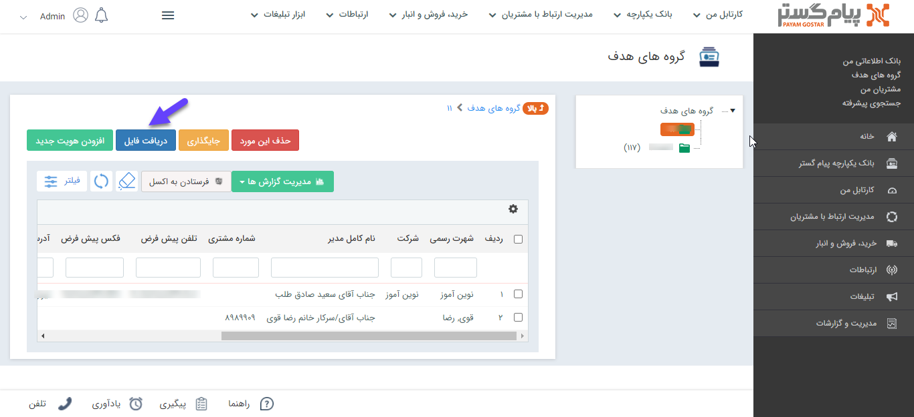
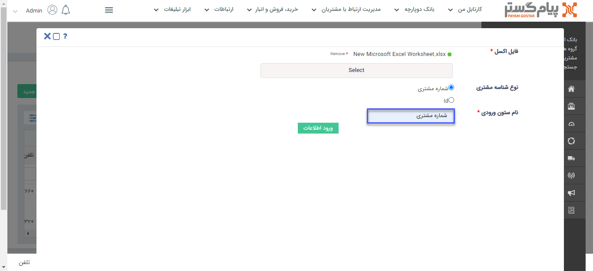

## افزودن اعضا به گروه هدف از طریق اکسل 

مسیر دسترسی: **بانک یکپارچه** > **گروه‌های‌ هدف** > **انتخاب یکی از گروه‌ها** > **دریافت فایل**

اضافه کردن هویت‌های موجود در بانک اطلاعاتی به گروه هدف می‌تواند از طریق اکسل نیز انجام شود. لذا با توجه به اینکه می توان هویت ها را از طریق مرجع شناسایی به گروه هدف وارد نمود، می بایست در ستونی در فایل اکسل، یکی از این مقادیر ثبت شده باشد.

*مرجع شناسایی مشتری:*

1. **شماره مشتری:**  فیلد شماره مشتری موجود در هویت مدنظر می‌باشد، این شماره برای هر هویت منحصر بفرد است.

2. **ID:** ID همان شناسه‌ی هویت می‌باشد که از طریق دریافت خروجی اکسل از هویت می‌توان آن را مشاهده کرد.

نمونه‌ای از فایل اکسل جهت ورود به گروه هدف که دارای اطلاعات شماره مشتری هویت ها می¬باشد، در تصویر زیر قابل مشاهده می ¬باشد.

به منظور ورود اطلاعات، ابتدا باید در بخش گروه هدف، در گروه مورد نظر بر روی دریافت فایل کلیک کنید. 

در این صفحه باید اکسل دارای اطلاعات هویت پیوست گردد، سپس نوع مرجع شناسایی(نوع شناسه مشتری) را که قراراست هویت‌ها براساس آن وارد شوند، انتخاب کنید. 

در فیلد "نام ستون ورودی" باید، "نام" ستونی که در اکسل، شناسه مشتری در آن تعریف شده است، نوشته شود و سپس ورود اطلاعات انجام شود. 

طبق این مثال باید فیلد "نام ستون ورودی" با عبارت  "شماره مشتری" مقداردهی شود.

