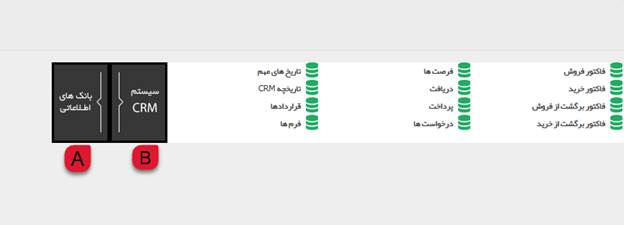
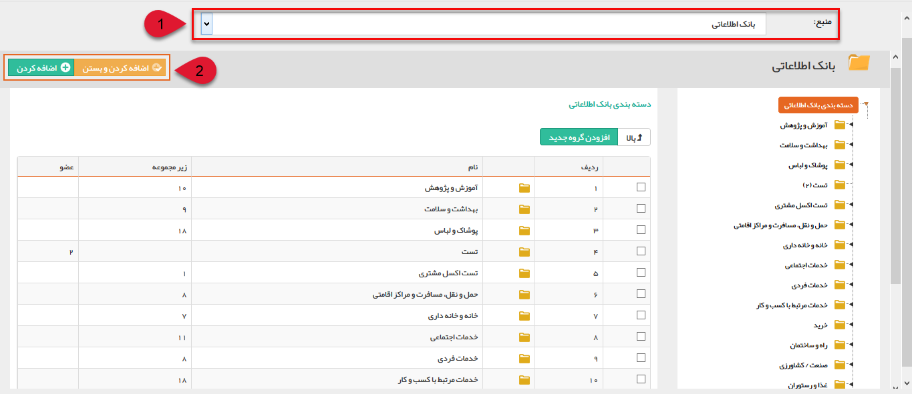

## افزودن اعضا به گروه هدف

 پس از ایجاد گروه یا زیر گروه مورد نظر با استفاده از دکمه "افزودن هویت جدید" می توانید هویت های دلخواه خود را انتخاب نمایید.

با کلیک بر روی دکمه افزودن هویت جدید، پنجره ای به شکل زیر باز خواهد شد. این پنجره این امکان را به شما می دهد که بتوانید هویت های مورد نظر خود را بر اساس سوابق سیستم CRM و یا از بانک های اطلاعاتی انتخاب کنید.

A: برای انتخاب از میان مخاطبان بانک اطلاعاتی از این قسمت می توانید استفاده کنید .

B: در این قسمت میتوانید از بین هویت هایی که دارای سابقه در crm هستند هویت(های)جستجو و انتخاب کنید .

> نکته:با انتخاب گزینه بانک های اطلاعاتی برای انتخاب مخاطبان مورد نظر ، پنجره ای مطابق شکل زیر باز خواهد شد که به شما امکان انتخاب منبع و مخاطبین را می دهد.

1. به کمک لیست بالای صفحه می توانید هویت ها را از منابع مختلف مانند بانک اطلاعاتی،  مشتریان و یا گروه های هدف قبلی ساخته شده انتخاب کنید. همچنین امکان جستجوی پیشرفته در این قسمت نیز قرارداده شده است که می توانید برای پیدا کردن هویت های مورد نظرتان از آن بهره مند شوید .

2. برای اضافه کردن هرکدام از مخاطبان، در هرلایه و هر سطحی که باشند، از دکمه "اضافه کردن و بستن" و یا "اضافه کردن" استفاده ک