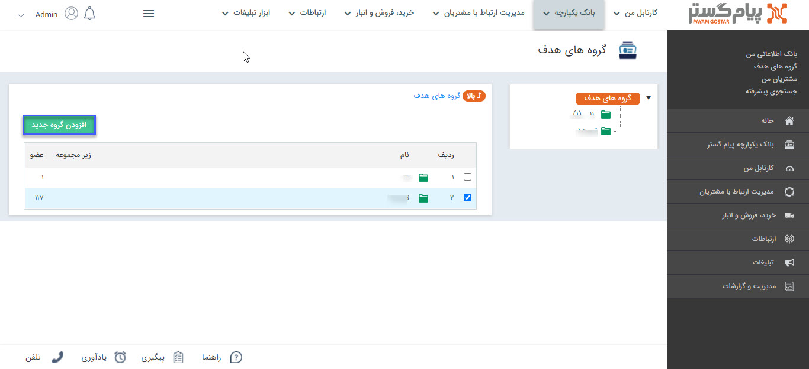
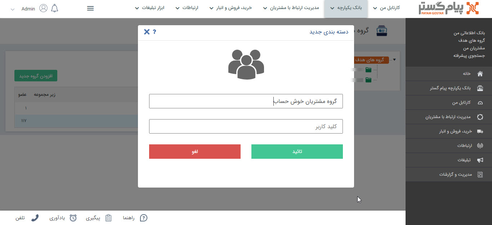

## ایجاد گروه هدف

> مسیر دسترسی:  **بانک یکپارچه**  > **گروه‌های‌ هدف** > **افزودن گروه جدید** 

برای تعریف گروه جدید باید از مسیر ذکر شده بر روی افزودن گروه جدید کلیک کرد.

با انتخاب نام و کلید کاربر می‌توان گروه هدف جدیدی را ذخیره کرد. 

 با کلیک راست بر روی هر گروه می توانید نام آن را تغییر دهید، آن را حذف کنید و یا آن گروه را برای کاربری خود اختصاصی کنید و یا گروه اختصاصی کرده خود را  با انتخاب گزینه تبدیل  به عمومی از حالت اختصاصی خارج کنید .توجه داشته باشید که برای اختصاصی کردن یک گروه هدف باید خودتان آن را ایجاد کرده باشید و یا مجوز مدیر سیستم یا مدیر بانک اطلاعاتی داشته باشید

> نکته: کاربری که یک گروه هدف را تبدیل به اختصاصی می کند فقط خود قادر است، اطلاعات داخل آن را مشاهده نماید. (البته مدیر سیستم و یا مدیر بانک اطلاعاتی از این امر مستثنی هستند و کلیه گروه ها را مشاهده می نمایند.)

