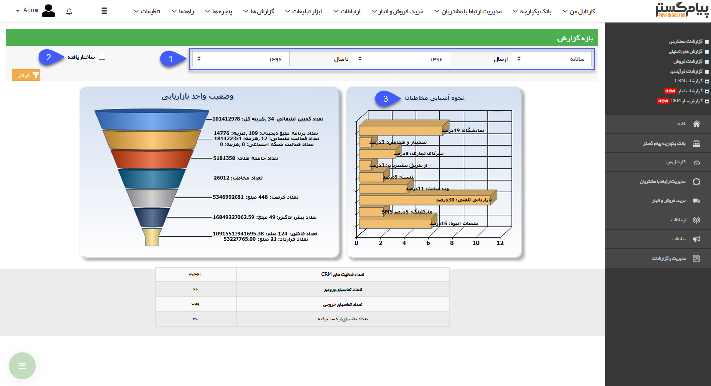
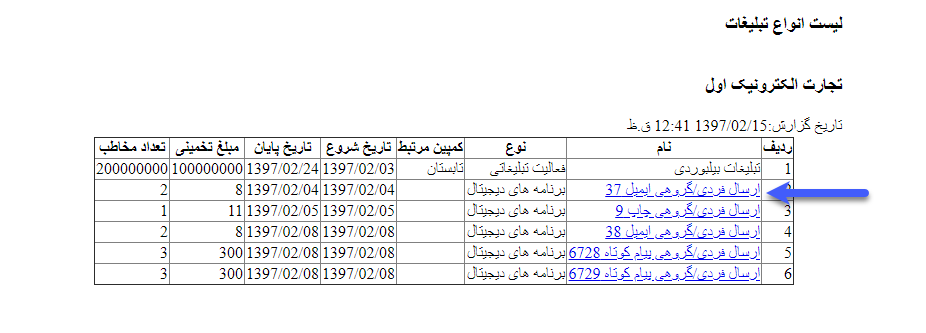

## نمودار وضعیت بازاریابی

در این گزارش با توجه به بازه مشخص شده، می توان بصورت دقیق، درصد نحوه آشنایی مخاطبان را مشاهده کرد و برنامه ریزی دقیقی در برنامه های تبلیغاتی اتخاذ نمود

1. بازه گزارش: بازه زمانی گزارش را تعیین کنید.

2. ساختار یافته: با انتخاب این گزینه نرم افزار تنها آمار مربوط به مخاطبان، فرصت ها، پیش فاکتور و فاکتورهایی را نمایش داده و در گزارش ذکر می کندکه مرتبط با یکی از کمپین های تبلیغاتی شده باشند و از این طریق می توان هزینه ها و منافع کلی یک کمپین تبلیغاتی را به خوبی سنجید .

3. نحوه آشنایی مخاطبان: میزان نحوه آشنایی مخاطبان را بر حسب درصد می توانید مشاهده کنید.

> نکته: با کلیک بر روی هرکدام از ردیف های قیف وضعیت بازاریابی، می توانید جزئیات مربوط به آن را مشاهده نمایید.

همچنین با کلیک بر روی لینک موجود در هریک از ردیف های این جدول، می توانید جزئیات برنامه تبلیغاتی یا آیتم مربوطه (فرصت، پیش فاکتور، فاکتور و...) را مشاهده نمایید.

